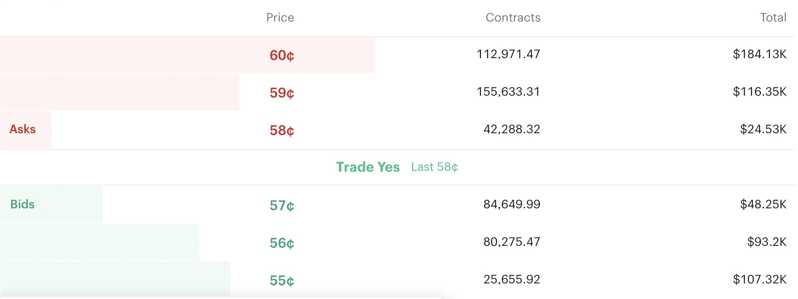

::: {.centered-block}

:::

<br>
It is hard to escape the current ubiquity of the prediction market platform **Kalshi** in the United States. Given my extensive background with the world's leading betting exchange, **Betfair**, I was naturally curious how Kalshi's exchange model compares.

Betfair's arrival on the U.K. betting scene at the turn of the century was truly a game-changer for punters. Most obviously, the novel peer-to-peer format allowed better prices, trading in and out of positions, and more extensive in-running markets. But also, and perhaps more importantly, there actually existed the prospect that you could be a winning punter and not have your account promptly closed, as is the case with high street bookies like William Hill or Ladbrokes.

The American betting landscape is a lot more complicated than Britain's, with piecemeal laws existing across various states due to moral objections, political lobbying and vested interests. In fact, Kalshi just got [sued by the state of New York](https://finance.yahoo.com/markets/options/articles/york-sues-kalshi-illegal-gambling-172947684.html) for running an illegal gambling operation. I'm not getting into all that stuff because I'm ultimately a numbers man; what I am interested in is how does Kalshi compare to Betfair in terms of pricing, liquidity and bet-matching?

The first thing to note is that while Kalshi and Betfair are both betting exchanges, Kalshi frames its bets as **contracts**. I assume this is done to maintain the pretence that a prediction market is more like a financial market than sports betting, even when the contract is on whether or not a football team will win a match. Each contract pays out $1 if the bet wins, and the price of the contract is what is being agreed between the buyer and seller. Simple example: a 50¢ contract means the buyer pays 50 cents for the contract and doubles his money if it wins. So it is easiest to frame this in percentage terms: buying a 50¢ contract means you think the probability is greater than 50%, and selling the contract means you think it is lower than 50%.

Originally, Kalshi offered all markets in price increments of 1¢ (51¢, 52¢, 53¢, etc). At some point, they decided to offer certain larger markets, like the World Cup, in smaller increments (51.1¢, 51.2¢, 51.3¢, etc).

A quick glance at any major market on Kalshi shows that liquidity isn't a problem and gross prices (i.e. before commission) are good. For example, I randomly opened a live baseball game between Philadelphia and Miami and saw that you can buy or sell Philly at 58¢ or 57¢ for large volume. This is equivalent to a spread of 1.724 - 1.754 in decimal prices, or a 101% book.

::: {.centered-block}

:::

<br>
The question is of course, how much do you then have to pay in commission on winning bets? On Betfair, you would have to pay **2%** of your net profit per market. What about Kalshi? The answer is, it depends!

Kalshi uses different rates of commission — or **fees** as they call them — depending on whether you are a **market-maker** or a **price-taker** (I will henceforth refer to these as 'maker' and 'taker'). Whenever a bet is matched between two parties on an exchange, naturally one party was in the market first with their order waiting to be matched (the maker), and the other party subsequently matched it (the taker).

The fees are calculated using the formulae

$$
F_{\text{taker}} = 0.07\cdot C\cdot P(1-P)
$$

$$
F_{\text{maker}} = 0.0175\cdot C \cdot P(1-P)
$$

where $C$ = number of contracts and $P$ = price in decimal form i.e. 50¢ = 0.5.

The formulae for calculating the maker's fee and the taker's fee look complicated but they actually aren't. On Kalshi you pay the fee when the bet is matched, so you are paying commission whether you win or lose. But the $P(1-P)$ part of the formula ensures that your fee reflects both the amount you stand to win and the probability of winning. Fees are smaller nearer to 0¢ and 100¢ than near 50¢, but that's because a) you stand to win a lot less when buying near 100¢ and b) you win less often when buying near 0¢. The end result is that that your long-term commission will be equivalent to a rate of 1.75% for makers and 7% for takers.

To confirm this is correct, I calculated and compared the two methods using R software at three different price levels (see below). Note that this assumes each bet's probability of winning is in line with the price. If you are a profitable bettor then your bets will win more often, meaning your fees paid will end up a bit lower than the equivalent Betfair commission rate, and vice versa for long-term losers. 

```{r}
library(tidyverse)
library(scales)

simulate_exchange_fees <- function(
    n,
    i,
    p,
    price = p,
    contracts = 1,
    kalshi_multiplier = 1,
    seed = NULL
) {
  
  if (!is.null(seed)) {
    set.seed(seed)
  }
  
  if (p < 0 || p > 1) {
    stop("p must be between 0 and 1.")
  }
  
  if (price <= 0 || price >= 1) {
    stop("price must be strictly between 0 and 1.")
  }
  
  # Simulate the number of winning bets in each simulation
  wins <- rbinom(
    n = i,
    size = n,
    prob = p
  )
  
  # Gross profit across all n bets
  gross_profit <- contracts * (wins - n * price)
  
  # ------------------------------------------------------------
  # Kalshi fees
  # ------------------------------------------------------------
  
  kalshi_taker_fee_per_bet <- ceiling(
    kalshi_multiplier *
      0.07 *
      contracts *
      price *
      (1 - price) *
      10000
  ) / 10000
  
  kalshi_maker_fee_per_bet <- ceiling(
    kalshi_multiplier *
      0.0175 *
      contracts *
      price *
      (1 - price) *
      10000
  ) / 10000
  
  kalshi_taker_profit <- (
    gross_profit -
      n * kalshi_taker_fee_per_bet
  )
  
  kalshi_maker_profit <- (
    gross_profit -
      n * kalshi_maker_fee_per_bet
  )
  
  # ------------------------------------------------------------
  # Betfair commission
  # ------------------------------------------------------------
  
  winning_profit_per_bet <- contracts * (1 - price)
  
  betfair_7_profit <- (
    gross_profit -
      wins * winning_profit_per_bet * 0.07
  )
  
  betfair_1_75_profit <- (
    gross_profit -
      wins * winning_profit_per_bet * 0.0175
  )
  
  # ------------------------------------------------------------
  # Combine results
  # ------------------------------------------------------------
  
  simulation_results <- tibble(
    simulation = rep(seq_len(i), times = 4),
    fee_structure = rep(
      c(
        "Kalshi taker formula",
        "Kalshi maker formula",
        "Betfair @ 7%",
        "Betfair @ 1.75%"
      ),
      each = i
    ),
    net_profit = c(
      kalshi_taker_profit,
      kalshi_maker_profit,
      betfair_7_profit,
      betfair_1_75_profit
    )
  )
  
  summary_results <- simulation_results |>
    group_by(fee_structure) |>
    summarise(
      bets = n,
      simulations = i,
      true_probability = p,
      contract_price = price,
      contracts_per_bet = contracts,
      bet_size = contracts * price,
      average_net_profit = mean(net_profit),
      average_profit_per_bet = mean(net_profit) / n,
      median_net_profit = median(net_profit),
      standard_deviation = sd(net_profit),
      probability_of_profit = mean(net_profit > 0),
      .groups = "drop"
    )
  
  list(
    summary = summary_results,
    simulations = simulation_results
  )
}


plot_exchange_results <- function(results) {
  
  plot_data <- results$summary |>
  arrange(average_net_profit)
  
  bet_size <- first(plot_data$bet_size)
  price <- first(plot_data$contract_price)
  number_of_bets <- first(plot_data$bets)
  simulations <- first(plot_data$simulations)
  contracts <- first(plot_data$contracts_per_bet)
  true_probability <- first(plot_data$true_probability)
  
  plot_data |>
  ggplot(
    aes(
      x = reorder(fee_structure, average_net_profit),
      y = average_net_profit
    )
  ) +
  geom_col(
    fill = "#E87500",
    width = 0.7
  ) +
  coord_flip() +
  geom_hline(
    yintercept = 0,
    linetype = "dashed",
    color = "gray40"
  ) +
  scale_y_continuous(
  labels = scales::label_dollar(accuracy = 1),
  expand = expansion(mult = c(0.25, 0.25))
) +
  labs(
    title = paste0(
      "Average net profit from ",
      scales::comma(number_of_bets),
      " bets of ",
      scales::dollar(bet_size),
      " at ",
      100*price,
      "¢"
    ),
    subtitle = paste0(
      scales::comma(contracts),
      " contracts purchased; true probability ",
      scales::percent(true_probability)
    ),
    x = NULL,
    y = NULL
  ) +
  theme_minimal(base_size = 12) +
  theme(
    plot.title = element_text(face = "bold")
  )
}


# ------------------------------------------------------------------
# 1. $100 bets buying at 50%
# ------------------------------------------------------------------

results_50 <- simulate_exchange_fees(
  n = 1000,
  i = 100000,
  p = 0.50,
  price = 0.50,
  contracts = 200,
  seed = 123
)

plot_50 <- plot_exchange_results(results_50)


# ------------------------------------------------------------------
# 2. $100 bets buying at 20%
# ------------------------------------------------------------------

results_10 <- simulate_exchange_fees(
  n = 1000,
  i = 100000,
  p = 0.20,
  price = 0.20,
  contracts = 500,
  seed = 123
)

plot_10 <- plot_exchange_results(results_10)


# ------------------------------------------------------------------
# 3. $100 bets buying at 80%
# ------------------------------------------------------------------

results_90 <- simulate_exchange_fees(
  n = 1000,
  i = 100000,
  p = 0.80,
  price = 0.80,
  contracts = 125,
  seed = 123
)

plot_90 <- plot_exchange_results(results_90)

```

```{r}
#| fig-width: 8
#| fig-height: 2.5
#| echo: false
#| warning: false

plot_50
plot_10
plot_90
```

So how bad is 7% commission? If a market is a coin flip (e.g. an NFL or NBA handicap market) then buying at 50¢ on Kalshi would be buying at 51.75¢ after the taker fee. This is equivalent to 1.932 decimal or -107 in American odds. It's not amazing value, but it's good enough that a recreational punter will accept it for the convenience of a single app where they can bet on seemingly anything — especially if they live in a large state like California or Texas where there are no other legal options.

The proposition for makers is, of course, much more favourable, as the 1.75% commission makes the same bet equivalent to 1.983 decimal or -101.8 in American odds. 

To illustrate the long-term effect of commission, the below chart shows the profit distribution after 1,000 bets for a punter who has an edge: he is consistently buying bets at 50¢ that have a 52% chance of winning. This may not sound like much of an edge but this would put you in elite territory in any high-liquidity market!

```{r}
library(tidyverse)
library(scales)

compare_profit_distributions <- function(
    n = 1000,
    bet_size = 100,
    price = 0.50,
    true_probability = 0.52
) {
  
  # Number of contracts purchased per bet
  contracts <- bet_size / price
  
  # Gross profit before fees
  gross_win <- contracts * (1 - price)
  gross_loss <- -contracts * price
  
  # ------------------------------------------------------------
  # Kalshi fees per bet
  # ------------------------------------------------------------
  
  kalshi_taker_fee <- ceiling(
    0.07 *
      contracts *
      price *
      (1 - price) *
      10000
  ) / 10000
  
  kalshi_maker_fee <- ceiling(
    0.0175 *
      contracts *
      price *
      (1 - price) *
      10000
  ) / 10000
  
  # ------------------------------------------------------------
  # Net outcomes under each fee structure
  # ------------------------------------------------------------
  
  outcome_data <- tibble(
    fee_structure = c(
      "No fees",
      "Kalshi maker (1.75%)",
      "Betfair (2%)",
      "Kalshi taker (7%)"
    ),
    profit_if_win = c(
      gross_win,
      gross_win - kalshi_maker_fee,
      gross_win * (1 - 0.02),
      gross_win - kalshi_taker_fee
    ),
    profit_if_loss = c(
      gross_loss,
      gross_loss - kalshi_maker_fee,
      gross_loss,
      gross_loss - kalshi_taker_fee
    )
  ) |>
    mutate(
      expected_profit_per_bet =
        true_probability * profit_if_win +
        (1 - true_probability) * profit_if_loss,
      
      expected_profit =
        n * expected_profit_per_bet,
      
      variance_per_bet =
        true_probability *
          (profit_if_win - expected_profit_per_bet)^2 +
        (1 - true_probability) *
          (profit_if_loss - expected_profit_per_bet)^2,
      
      standard_deviation =
        sqrt(n * variance_per_bet),
      
      # Smallest integer number of wins needed for profit > $0
      minimum_wins_for_profit =
        floor(
          (-n * profit_if_loss) /
            (profit_if_win - profit_if_loss)
        ) + 1,
      
      # Exact binomial probability of finishing above $0
      probability_above_zero =
        pbinom(
          minimum_wins_for_profit - 1,
          size = n,
          prob = true_probability,
          lower.tail = FALSE
        )
    )
  
  # ------------------------------------------------------------
  # Normal approximations to the profit distributions
  # ------------------------------------------------------------
  
  x_min <- min(
    outcome_data$expected_profit -
      4 * outcome_data$standard_deviation
  )
  
  x_max <- max(
    outcome_data$expected_profit +
      4 * outcome_data$standard_deviation
  )
  
  x_values <- seq(
    from = x_min,
    to = x_max,
    length.out = 2000
  )
  
  distribution_data <- outcome_data |>
    select(
      fee_structure,
      expected_profit,
      standard_deviation
    ) |>
    crossing(net_profit = x_values) |>
    mutate(
      density = dnorm(
        net_profit,
        mean = expected_profit,
        sd = standard_deviation
      )
    )
  
  # ------------------------------------------------------------
  # Plot
  # ------------------------------------------------------------
  
  distribution_plot <- distribution_data |>
    ggplot(
      aes(
        x = net_profit,
        y = density,
        color = fee_structure,
        fill = fee_structure
      )
    ) +
    geom_area(
      alpha = 0.08,
      position = "identity"
    ) +
    
    # Darker vertical line at zero
    geom_vline(
      xintercept = 0,
      color = "#222222",
      linewidth = 1
    ) +
    
    geom_line(linewidth = 1.2) +
    
    # Dashed lines show expected profit
    geom_vline(
      data = outcome_data,
      aes(
        xintercept = expected_profit,
        color = fee_structure
      ),
      linetype = "dashed",
      linewidth = 0.7,
      show.legend = FALSE
    ) +
    scale_x_continuous(
      labels = label_dollar(accuracy = 1),
      expand = expansion(mult = c(0.02, 0.02))
    ) +
    scale_y_continuous(
      labels = NULL,
      breaks = NULL,
      expand = expansion(mult = c(0, 0.05))
    ) +
    scale_color_manual(
      values = c(
        "No fees" = "#6A3D9A",
        "Kalshi maker (1.75%)" = "#21C891",
        "Betfair (2%)" = "#3255A4",
        "Kalshi taker (7%)" = "#E87500"
      )
    ) +
    scale_fill_manual(
      values = c(
        "No fees" = "#6A3D9A",
        "Kalshi maker (1.75%)" = "#21C891",
        "Betfair (2%)" = "#3255A4",
        "Kalshi taker (7%)" = "#E87500"
      )
    ) +
    labs(
      title = paste0(
        "Distribution of profit after ",
        comma(n),
        " bets of ",
        dollar(bet_size)
      ),
      subtitle = paste0(
        "Contracts bought at ",
        percent(price, accuracy = 1),
        "; true win probability ",
        percent(true_probability, accuracy = 1),
        ". Dashed lines show expected profit."
      ),
      x = paste0(
        "Net profit after ",
        comma(n),
        " bets"
      ),
      y = NULL,
      color = NULL,
      fill = NULL
    ) +
    theme_minimal(base_size = 12) +
    theme(
      plot.title = element_text(face = "bold"),
      plot.subtitle = element_text(size = 9),
      legend.position = "bottom",
      panel.grid.minor = element_blank()
    )
  
  # ------------------------------------------------------------
  # Formatted results table
  # ------------------------------------------------------------
  
  results_table <- outcome_data |>
    select(
      fee_structure,
      expected_profit,
      standard_deviation,
      probability_above_zero
    ) |>
    mutate(
      expected_profit = dollar(
        expected_profit,
        accuracy = 1
      ),
      standard_deviation = dollar(
        standard_deviation,
        accuracy = 1
      ),
      probability_above_zero = percent(
        probability_above_zero,
        accuracy = 0.1
      )
    ) |>
    rename(
      `Fee structure` = fee_structure,
      `Expected profit` = expected_profit,
      `Standard deviation` = standard_deviation,
      `Probability of profit` = probability_above_zero
    )
  
  list(
    summary = outcome_data,
    table = results_table,
    plot = distribution_plot
  )
}

profit_comparison <- compare_profit_distributions(
  n = 1000,
  bet_size = 100,
  price = 0.50,
  true_probability = 0.52
)

profit_comparison$plot

profit_comparison$table |>
  knitr::kable(
    align = c("l", "r", "r", "r")
  )
```

<br>
In the fantasy scenario of zero fees, the expected profit after 1,000 bets is +$4,000 with an 89.1% probability of being in profit. At 1.75% the expected profit drops to +$3,125, and Betfair's 2% commission eats up more than a quarter of your long-term profits as the expected +$4,000 drops to $2,960. But on Kalshi's 7% fees your expected profit would be only +$500 with a 56.3% chance of being ahead and 43.7% probability of being down overall.

So this begs the question: why ever be a taker? 

1. **Recreational punters**. Some people just aren't price sensitive, or they can't be bothered to waste time shopping around for the best price. If I'm being honest, this is my approach to lots of things in life! It would be exhausting to try and secure the best price every time I pay for something, so I totally understand this behaviour.

2. You have a big edge thanks to some **new information**. If you found out about some major event (e.g. a goal or a big injury) more quickly than anyone else, then obviously you are happy to pay 7% fees if you know that the market is dramatically wrong and the price is likely to change imminently. Fill your boots!

3. You have a special rebate deal (more on that shortly).

In the absence of the above, it seems like anyone with the goal of making a long-term profit on Kalshi is forced into being a market-maker. The disadvantage for makers is that you may not get matched, or you may only get matched because of some new piece of information (see 2. above). Because of these factors, **queue position** becomes very important: if you are at the back of a very long queue then it becomes less likely that you get matched in the normal course of events, whereas if a goal or major injury occurs then you are absolutely definitely getting matched straight away, and you won't be happy about it.

There's another major difference between Kalshi and Betfair's commission that has a huge effect on strategy. Kalshi charges a fee on every single bet, whereas Betfair only charges commission on your **net** position when the market is settled. This makes trading or micro-trading strategies a lot more viable on Betfair than on Kalshi. 

For example, suppose you buy 10,000 contracts at 50¢ and sell them back at 53¢. Congratulations, you just made $300!  On Betfair you would pay 2% commission on this $300, so your net win is $294. On Kalshi you would pay fees on both the buy AND the sell, so for makers the net win would be $300 - $43.75 - $43.59 = $212.66 while for takers it would be $300 - $175 - $174.37 = a net LOSS of $49.37!

```{r}
library(tidyverse)
library(scales)

contracts <- 10000
buy_price <- 0.50
sell_price <- 0.53
betfair_commission <- 0.02

gross_profit <- contracts * (sell_price - buy_price)

kalshi_taker_fees <- (
  0.07 * contracts * buy_price * (1 - buy_price) +
  0.07 * contracts * sell_price * (1 - sell_price)
)

kalshi_maker_fees <- (
  0.0175 * contracts * buy_price * (1 - buy_price) +
  0.0175 * contracts * sell_price * (1 - sell_price)
)

betfair_fees <- gross_profit * betfair_commission

commission_table <- tibble(
  commission_structure = c(
    "No fees",
    "Betfair (2%)",
    "Kalshi maker (1.75%)",
    "Kalshi taker (7%)"
  ),
  gross_profit = gross_profit,
  fees = c(
    0,
    betfair_fees,
    kalshi_maker_fees,
    kalshi_taker_fees
  )
) |>
  mutate(
    net_profit = gross_profit - fees
  ) |>
  mutate(
    across(
      c(gross_profit, fees, net_profit),
      ~ dollar(.x, accuracy = 0.01)
    )
  ) |>
  rename(
    `Commission structure` = commission_structure,
    `Gross profit` = gross_profit,
    `Fees` = fees,
    `Net profit` = net_profit
  )

commission_table |>
  knitr::kable(
    align = c("l", "r", "r", "r")
  )
```

<br>
Although on the face of it Betfair are leaving a lot of money on the table by only charging commission on net winnings, it does have a couple of advantages. Firstly, a trading strategy allows you to place much larger stakes as there is less of your bank at risk, assuming you can trade out if the price goes against you (this is a BIG assumption). And secondly, when you execute your second trade there is another party to that bet, so you are recycling money back into the market. It's like the multiplier effect in economics. So maybe this approach is good for the ecosystem? I don't have the answer to that, but I suspect it's something that will vary depending on the liquidity and volatility of each particular market. 

Finally, let's address the elephant in the room. There are big players operating in the market with a huge advantage: **rebate deals**. In exchange for adding large volume, some organizations sign Market Maker deals which effectively give them much lower fees per bet than the average punter. This obviously puts them in a strong position as they may be able to execute 'taker' trades without the prohibitive costs. I won't pretend to know all the inner workings of these deals, and I should also point out that Kalshi has other [incentive programs](https://help.kalshi.com/en/collections/18616618-programs-promotions) to encourage liquidity.

Originally this was just some private research as I was considering whether Kalshi is worth my time & effort to see if it could be a viable income source. I realised this might be of interest to others, so I turned it into this article. So, is Kalshi worth it? I'm going to say yes overall, simply because of the amount of money sloshing around from price-insensitive, inexperienced Americans. And there's never any harm in keeping your tools sharp of course; I've been out of the game for a few years but it's always good to be ready for the next opportunity.

What about the Kalshi ecosystem? Is that amenable to long-term health? That's not my area of expertise, but I'm sure Kalshi recruited people with industry experience and came up with this very deliberate two-tiered fee system. There's obviously a first-mover advantage with these things and everyone is familiar with Kalshi now, so it feels like they will have to either mess it up or get banned by the government, otherwise the ceiling is very high. I've only had a few bets so far — fortunately (aftertiming alert) one of those was on Spain to win the World Cup — but I'm going to continue having a play around with it and see what happens. Small stakes to begin with, of course. Please bet responsibly! And if anyone with more experience of Kalshi has anything to add, I would love to hear it. 



© 2026 John Knight. All rights reserved.