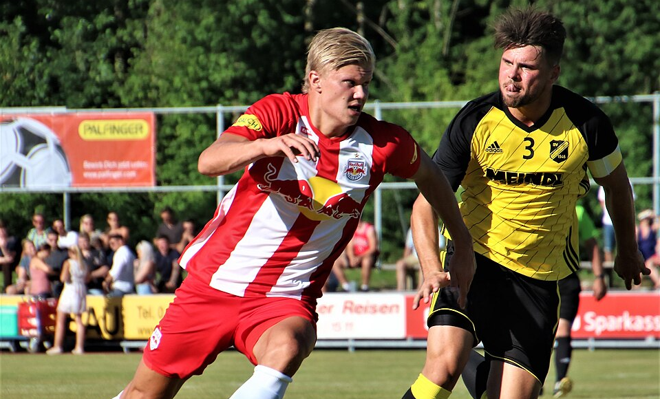
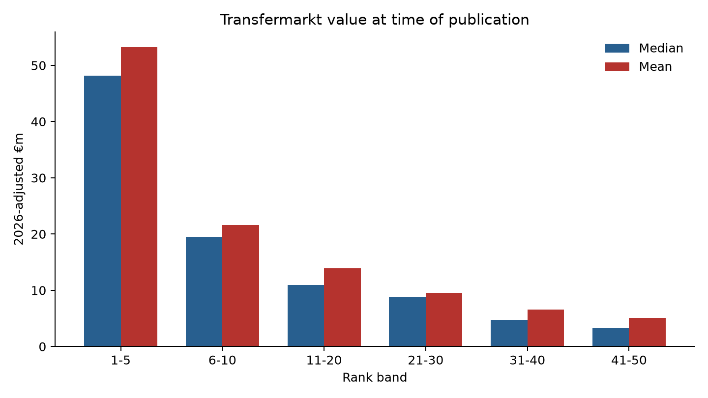
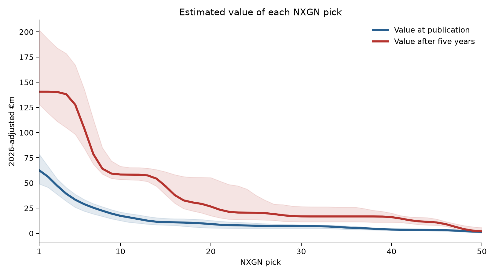
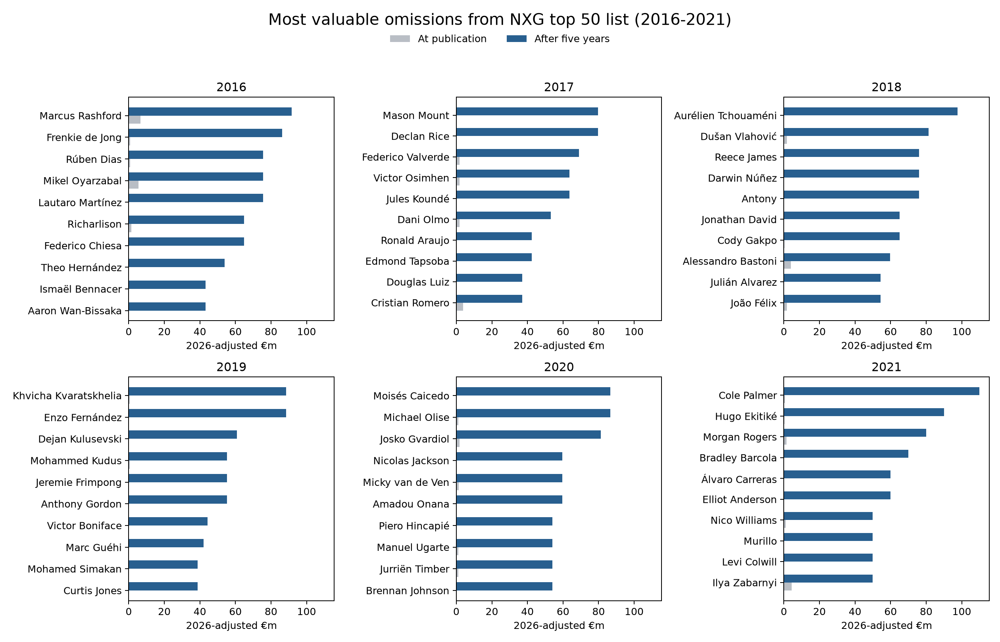
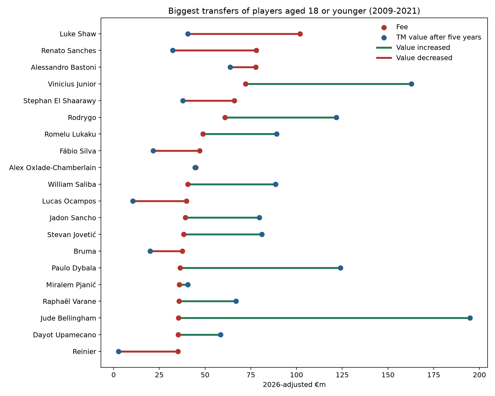
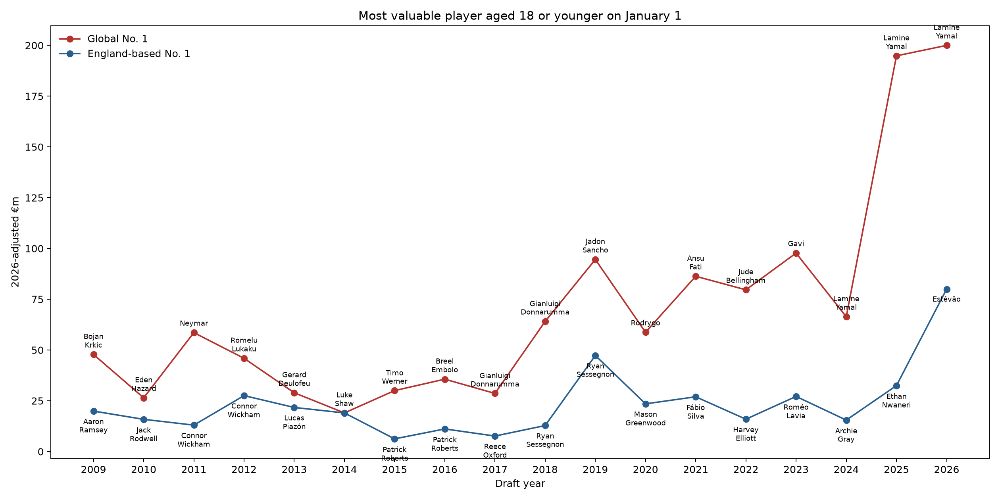

::: {.centered-block}

<em>Erling Haaland playing for RB Salzburg (Wikimedia Commons)</em>
:::

As a football (soccer) fan, one aspect of American sports that I'm a bit jealous of is the **draft**. Not because I want bad teams to be rewarded -- that part is ridiculous -- but I think the annual speculation would be a lot of fun. Who would have been the top picks in years gone by? Who would be the huge busts and the undrafted superstars? And how much would a high draft pick be worth in trades?

For the last decade, [goal.com](https://www.goal.com/) has been publishing its **NXGN** list containing the top 50 players aged 18 or younger on the 1st of January. This is just their subjective ranking, of course, but it does give us a snapshot of how each player was seen at the time rather than with the benefit of hindsight.

*(Note that some players can be aged 19 by the time the list is published around March).*

```{r}
#| echo: false
#| warning: false
#| message: false

library(readr)
library(dplyr)
library(lubridate)
library(gt)

nxgn <- read_csv(
  "nxgn_transfermarkt.csv",
  col_types = cols(
    edition = col_character(),
    publication_date = col_date(),
    date_of_birth = col_date(),
    .default = col_guess()
  )
)

top_players <- nxgn |>
  filter(rank == 1) |>
  mutate(
    last_birthday =
      date_of_birth %m+% years(age_on_publication),
    age_days =
      as.integer(publication_date - last_birthday),
    age = sprintf(
      "%d years, %d days",
      age_on_publication,
      age_days
    )
  ) |>
  transmute(
    edition,
    player = goal_name,
    club = goal_club,
    age
  )

unranked_2023 <- tibble(
  edition = "2023",
  player = "List unranked",
  club = "—",
  age = "—"
)

bind_rows(top_players, unranked_2023) |>
  arrange(desc(edition)) |>
  gt() |>
  cols_label(
    edition = "Year",
    player = "Player",
    club = "Club",
    age = "Age"
  ) |>
  tab_options(
    table.width = pct(100),
    table.font.size = px(12),
    data_row.padding = px(3)
  ) |>
  tab_header("#1-Ranked Player in NXGN Top Prospects List 2016-2026")
  
```

It's a mixed list containing superstars (Yamal, Bellingham, Donnarumma), disappointments (Fati, Sancho) and some that fall in-between (Rodrygo, Tielemans). 

Ignoring the specifics of how an actual global draft would work, let's pretend that the NXGN list represents the first 50 picks in a draft each year. 18 seems like the right age for a football draft -- players are still largely just young prospects with potential rather than established first-teamers at the top level. 

To get a sense of the value of each pick I used the last published [Transfermarkt](https://www.transfermarkt.co.uk) values prior to each year's publication. These were inflation-adjusted to 2026 equivalents by taking the median of the top 500 Transfermarkt values each year and fitting a cublic smoothing spline to the logarithm of the medians.

Below we can see the median and mean value when we group picks 1-50 into various bands. Immediately we can see that a top 5 pick is worth dramatically more than lower picks.

::: {.centered-block}

:::

But those are the valuations at the time the list was published -- it would be reasonable to think NXGN's order will just reflect the same consensus used to generate Transfermarkt values. What we are really interested in for these young players is their *future* value. The following plot compares two curves: one models the value of each pick at time of publication, and the other models the value of the player five years later. To emphasise, these values are all normalised to 2026 levels, so an increase doesn't simply reflect inflation.

::: {.centered-block}

:::

It appears that a top-5 pick is very valuable, with a forecast value of more than €125m after five years. After the top 5 the value drops off quite quickly, and beyond the 15th pick the curve is relatively flat -- having the 40th pick isn't worth much more than the 20th pick.

It's also noticeable that players at all levels are expected to be more valuable after five years. An obvious conclusion would be that young players are undervalued, so just buy all the young players! But this misses an important point: football recruitment is not a free market. Smaller clubs do not have the leverage to simply hold onto a player forever, and among buying clubs there is often a "preferred bidder" that the player wishes to join, or a small group of rich & successful clubs that would be considered. So the big clubs are in a strong position and can sign the best young talent for relatively good value.

## Which picks were the biggest busts?

- **Reinier Jesus** (#4 pick in 2020). Just after his 18th birthday, signed with Real Madrid for €30 million. Bounced around Europe on various loans before moving back to Brazil on a free transfer in 2025. Currently valued at only €2m.
- **Gio Reyna** (#3 pick in 2021). Another *great American hope* who broke into the Dortmund side at the age of 17. Struggled to follow that up and after a disappointing season with Borussia Monchengladbach he has just joined Strasbourg for the grand fee of €3m.
- **Ansu Fati** (#2 pick in 2020, #1 pick in 2021). Seemingly the next Barcelona phenom when he debuted for the club at 16 years of age. Injuries have blighted his career and he recently joined Monaco for €11m after a mediocre loan season.
- **Alban Lafont** (#4 pick in 2017). Became a regular starter in Ligue 1 at the age of 16, which is absurdly young for a goalkeeper. Has had a respectable career with more than 300 starts in Ligue 1 and Serie A, as well as 4 caps for the Ivory Coast, but never kicked on to the anticipated levels. Now playing in Turkey with Amedspor.
- Other notables: **Justin Kluivert** (#1 in 2018), **Callum Hudson-Odoi** (#3 in 2019), **Breel Embolo** (#2 in 2016) and **Mason Greenwood** (#3 in 2020). Not dreadful players by any means, but none of them reached the anticipated heights for a variety of reasons. 

## Which low picks were steals?

- **Erling Haaland** (#33 pick in 2019). It feels like someone with Haaland's physical tools was always an inevitable superstar, but NXGN ranked him well down the list in 33rd, just behind Rhian Brewster and Emile Smith-Rowe.
- **Bukayo Saka** (#15 pick in 2020). Saka was starting regularly for Unai Emery's Arsenal at 18, which nowadays would mark you as an elite prospect, but it was a poor Arsenal side which perhaps dampened the hype a bit.
- **Julian Alvarez** (#37 pick in 2019). Alvarez was a relatively late bloomer, not establishing himself in the River Plate XI until the age of 20. Even at Manchester City he had to play second fiddle to Haaland, and it is only now that he is being viewed on the elite level as he tries to force a move away from Atletico Madrid. 

## Undrafted players

There are also a large number of valuable players who didn't make the top 50, reinforcing the idea that beyond the top handful of prospects player-development is a bit of a lottery. Here are the most valuable undrafted players (using their value five years later) from each of the NXGN editions from 2016 to 2021. I restricted this to players aged 18, because it's a bit harsh to expect them to include someone at age 15 who became a star player by 20.

::: {.centered-block}

:::

It's surprising to see that players like **Frenkie De Jong**, **Declan Rice** or **Joao Felix** did not make the top 50 because they all feel like they emerged at a young age. But it just shows, when we strip away the benefit of hindsight, it is not inevitable which 18-year-olds will be the next generation's best players. Felix is especially surprising because by the age of 19 he had already broken into the Benfica team and been transferred to Atletico Madrid for €126 million! Things can develop very quickly.

## What about actual transfers of young prospects?

As mentioned earlier, the NXGN ranking is just a subjective list. Let's take a look at some actual players who were bought for large fees before the age of 19, and whether their Transfermarkt value five years later was higher or lower than the transfer fee.

::: {.centered-block}

:::

It's a mixed bag: of the 20 players shown, half decreased in value and half increased. In fairness, Oxlade-Chamberlain and Pjanic *barely* decreased, while some of the increases were very large, so it does seem like the 20 purchases were successful in the aggregate.

The most expensive 18-year-old was **Luke Shaw** whose move from Southampton to Manchester United is equivalent to more than €100m in 2026. Shaw has had a respectable career: over 200 appearances for United and 34 caps for England. But he has struggled with injuries and it's not the return you hope for when investing such a huge amount in a left-back.

The NXGN prospects list only dates back to 2016 but if we use Transfermarkt values to determine our "pick" order, we can go back a little further. We can also assess who the top pick would have been each year, not only in a global draft, but also in a draft among England-based players only.

::: {.centered-block}

:::

Surprisingly, Luke Shaw is the only England-based player since 2009 who has been the most valuable 18-year-old in the world. The overall list of English #1 picks is underwhelming; Shaw is actually one of the more successful outcomes compared to the other youngsters, some of whom didn't even establish themselves at the top level.

One prominent aspect of this chart is just what an outlier **Lamine Yamal** is. As the Messi & Ronaldo era comes to an end, it seems nicely set up for Yamal to take over as the world's clear superstar. It's also notable that Chelsea's **Estevao** is the most valuable young prospect in English football for some time; at time of writing it's not easy to see where he will fit into Xabi Alonso's formation, but talent has a way of finding its way to the top and it will be a surprise if Chelsea decide to let him go.

## Takeaways

So it seems like if you can get one of the top 5 prospects in world football, great. You are probably onto a winner. Beyond that, it becomes a bit more of a lottery: just get as many tickets as you can, and see which ones win.

NXGN's 2026 top five are therefore interesting to watch. Email your club, and tell them to snap these players up! Except, bad news...the big clubs already have them:

```{r}
#| echo: false
#| warning: false
#| message: false

library(readr)
library(dplyr)
library(lubridate)
library(gt)

nxgn <- read_csv(
  "nxgn_transfermarkt.csv",
  col_types = cols(
    edition = col_character(),
    publication_date = col_date(),
    date_of_birth = col_date(),
    .default = col_guess()
  )
)

nxgn |>
  filter(edition == "2026", rank <= 5) |>
  mutate(
    last_birthday =
      date_of_birth %m+% years(age_on_publication),
    age_days =
      as.integer(publication_date - last_birthday),
    age = sprintf(
      "%d years, %d days",
      age_on_publication,
      age_days
    )
  ) |>
  transmute(
    rank,
    player = goal_name,
    club = goal_club,
    age,
    value_at_publication_eur
  ) |>
  arrange(rank) |>
  gt() |>
  cols_label(
    rank = "Rank",
    player = "Player",
    club = "Club",
    age = "Age",
    value_at_publication_eur = "Transfermarkt Value"
  ) |>
  fmt_currency(
    columns = value_at_publication_eur,
    currency = "EUR",
    decimals = 0
  ) |>
  tab_options(
    table.width = pct(100),
    table.font.size = px(12),
    data_row.padding = px(3)
  ) |>
  tab_header("NXG Top 5 Prospects 2026")
```




© 2026 John Knight. All rights reserved.

