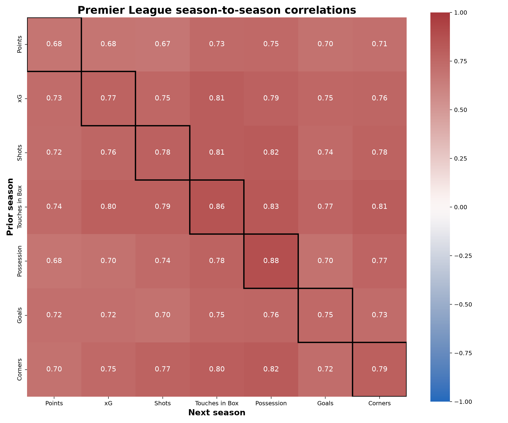
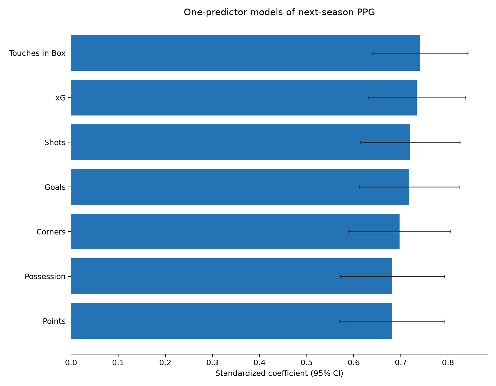
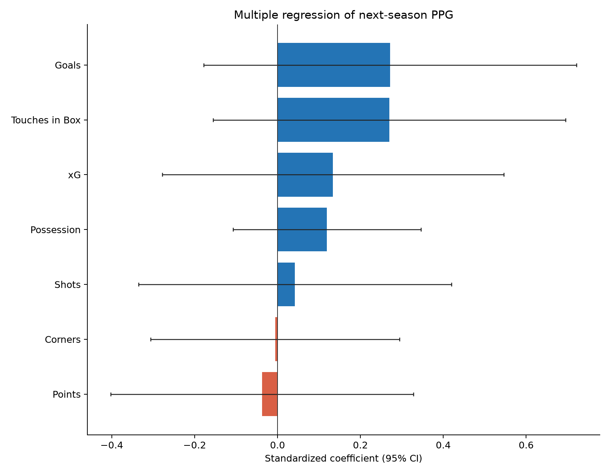
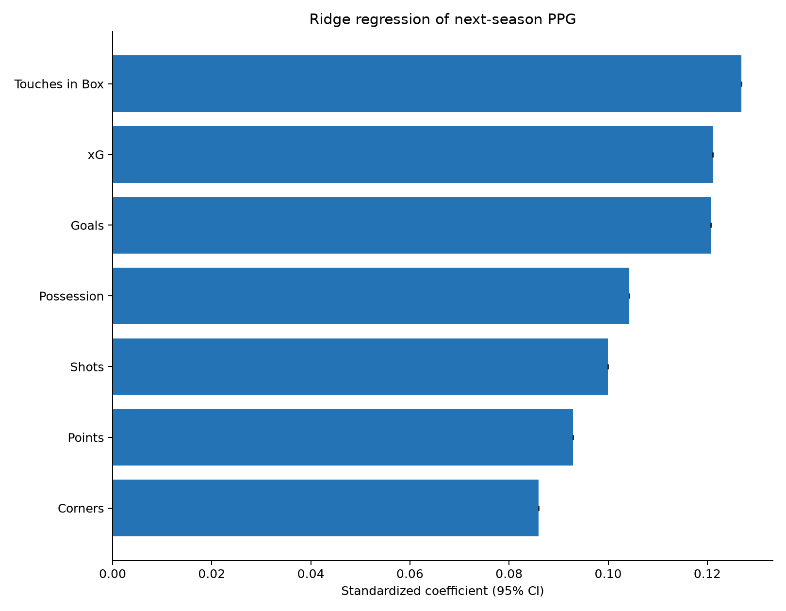
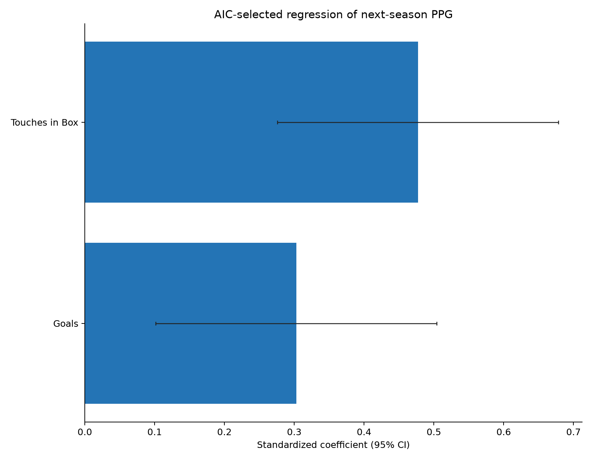
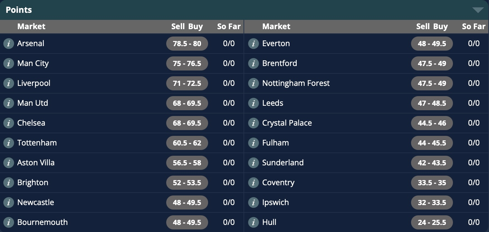
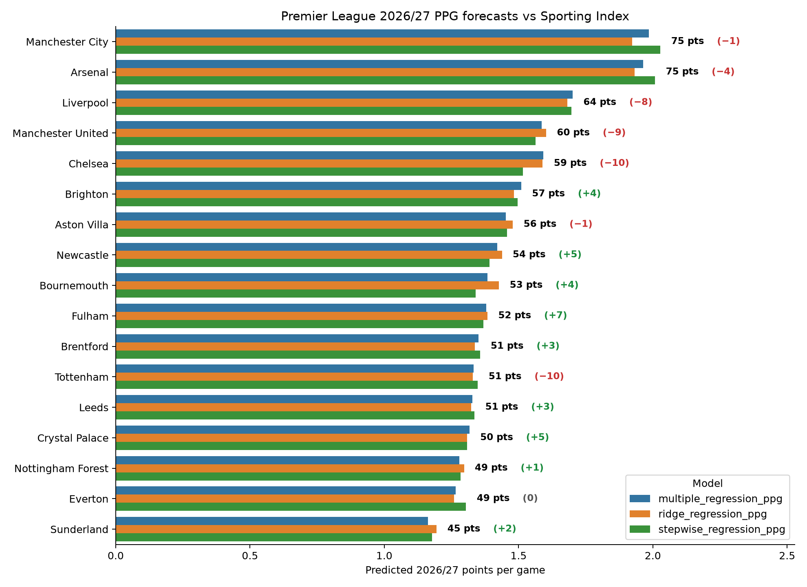

The new **Premier League** season is approaching, and we will soon be bombarded with season previews and projections. But how should we project a team's future performance? We have last year's league table as a starting point, but we also have various match stats that might offer more information than the number of points each team got last season. Which of those stats carries the most signal?

I looked at Premier League seasons going back to 2014/15 and used seven stats from each season (points-per-game, goal difference, xG difference, shots %, corners %, touches in the box %, and possession %) to predict the following season's points for each team.

Firstly, it is always interesting to create a **correlation matrix** to see how each stat correlates with each other stat (including with itself). In the correlation matrix below, the cells along the diagonal are marked with black borders — these are the self-correlation scores that show how well each stat predicts *itself* in the following season.

::: {.centered-block}

:::

Interestingly, the stats that predict themselves most reliably are **possession** and **touches in the box**, which may both reflect style of play rather than just team quality. And it is notable that the stat that is least predictive of itself is **points per game**!

A starting point to measure the effect of each statistic is by running a separate univariate regression using each of the seven measures on its own to predict teams' points-per-game in the following season.

::: {.centered-block}

:::

Interestingly, what we see here is that any individual metric is going to give you a roughly similar level of performance. Most people are aware that xG is a more useful measure than a team's share of corners; and yet, if you only knew the share of corners for each game, you still wouldn't be far off! There is a lot of crossover between all these stats because ultimately, if you are dominating a match then you will dominate all these stats.

What is more interesting is when we apply all these stats simultaneously to predict the following season's points. There are different ways to do this within a regression framework; I tried three methods:

- Multiple linear regression
- Ridge regression
- Stepwise feature selection

A **multiple regression** is where all variables are chucked in and a best fit is achieved. This is the simplest approach but can involve problems of **multicollinearity**: if two variables carry the same signal then you can get funny results where one of them may have a negative coefficient even though it has a positive association with the response variable. We can see this effect below — clearly each team's points would not be a negative predictor of their points the next year, but that is how the model comes out because points are so heavily related to all the other predictors.

::: {.centered-block}

:::

Interestingly, goals and touches in the box are the two dominant predictors. One might have expected xG to be top, but xG has crossover with both goals and touches in the box (a good reflection of territorial dominance) and once you have included those two measures, xG contains less additional value.

**Ridge regression** involves a penalty that shrinks coefficients towards zero, which reduces overfitting and is better at handling correlated predictors. The results of the ridge regression can be seen below. 

::: {.centered-block}

:::

The results of the ridge regression are more smooth, with each of the seven predictors contributing a reasonable chunk of the final estimate. Touches in the box come out on top, followed by xG and then goals. There is no doubt that these are the "big three" of simple football stats when you want a general idea of team quality.

The final regression used **stepwise feature selection**. This is where you add and remove variables to and from the model and see which combination gives the best results. In this context, "best" can be judged in various ways, but I used something called the Akaike Information Criterion (AIC). Interestingly, the optimal model was very simple, using just touches in the box and goals. 

::: {.centered-block}

:::

Now that we have these models, the natural question is how would they forecast the approaching 2026/27 season? And how do those forecasts compare to the betting markets? I looked at the current season point spreads from Sporting Index. For the uninitiated, spread betting involves a variable risk where you buy or sell at a price and the amount won or lost will vary based on the final result. So for example if you buy Arsenal's points at 80 for £100 a point and they finish the season with 70 points, you lose £1,000. 

::: {.centered-block}

:::

Below are the mean projections for each team using the three models. Despite the different methods, the forecast for each team does not differ greatly. Again this shows the amount of crossover between all the stats.

::: {.centered-block}

:::

A couple of things stand out. Firstly, the points projections seem far more congested than a typical league table. It would be a mistake to interpret these projections as the league champion getting 75 points and the worst of the teams getting 45 points. These are simply the mean projections for each team; in reality, once variance kicks in, some teams will drastically overperform and others will underperform, and the overall spread will be greater. But it is also an era where the league is far more congested than previously; Arsenal were far less dominant than previous league champions, and the fact Spurs almost got relegated is a demonstration of the Premier League's current depth.

The numbers in parentheses denote the difference between the models' projections and Sporting Index's point spreads. One thing that leaps out is that the **big six** teams (Manchester City, Arsenal, Liverpool, Manchester United, Chelsea, and Tottenham) are all forecast to be worse than the betting spread.

The primary reason for this is that my models omit some important information. The wealthiest teams are more likely to improve (or less likely to get worse) from one season to the next, because a) they tend to spend money recruiting better players each summer and b) an underperformance is more likely to be due to reasons such as injury crises or bad management rather than lack of talent. 

Nonetheless, I think we can look at the disparities and assess some examples where the difference is fair and where it may be challenged. The biggest negative differences between my models and the spreads are **Chelsea** (-10), **Tottenham** (-10), **Manchester United** (-9) and **Liverpool** (-8). 

In the case of Chelsea and Spurs, I believe there are mitigating circumstances. Chelsea were looking reasonably good before Christmas, then suffered from Enzo Maresca's resignation and the dubious appointments of Liam Rosenior and then the interim manager Calum McFarlane. Their season really tailed off when they were arguably the third-best team in the league. And Spurs' problems were well-documented: an astronomical injury list along with one poor manager (Thomas Frank) and one diabolically bad one (Igor Tudor). But the owners have opened the purse strings and a big improvement under Roberto De Zerbi seems likely. It is also a huge advantage for both of these London clubs that they have no European football this season.

Conversely, Manchester United had no Europe *last* season but return to the Champions League slog this year. They had a fair amount of things go their way under Michael Carrick and benefitted from career years for Casemiro (now departed) and player of the year Bruno Fernandes, who is turning 32 next month. 

Liverpool sacked Arne Slot due to last season's underperformance but many of the issues may run deeper than the head coach. Between Mohamed Salah, Ibrahima Konate and Andy Robertson, plus Curtis Jones who by all accounts is likely to depart this month, they have lost more than 8,000 league minutes from last season. Cody Gakpo has also been linked with a move to Spurs and their defensive rock Virgil van Dijk is now 35 years old, while Hugo Ekitike's impressive debut season unfortunately came to an end with a long-term Achilles injury that will keep him out for much of this season. 

Given these factors, it seems like the arguments for selling Liverpool and Man Utd points at 71 and 68 respectively are more solid than those against Chelsea & Spurs.

What about the teams predicted to overperform the spreads? Many of these teams have been negatively affected by player sales (Newcastle, Crystal Palace, Nottingham Forest) and/or manager departures (Newcastle, Bournemouth, Fulham, Crystal Palace). A couple of teams that look like solid buys to me are:

- **Brighton** at 52. I repeated ad nauseam at the back end of last season that Brighton had been really good after re-signing Pascal Gross in the January window. They lost Jan Paul van Hecke to Spurs, but have brought in Pascal Struijk and Luka Vuskovic, and it feels inevitable that some of Brighton's young talent will take a leap forward this season. They are just so well run, and I think one of these years they will suddenly have an unexpected monster season and qualify for the Champions League. Maybe this is the year.

- **Leeds** at 48.5. Leeds were good last year, even though they ended up embroiled in the relegation battle until fairly late on. Daniel Farke made a key system change at half time away to Manchester City in November, and from that point on they played like a top-half side. Tellingly, goalkeeper James Trafford chose Leeds over Newcastle this summer, and that sort of thing can be a decent indicator of which direction clubs are heading. Leeds have wealthy backers, they are a Premier League-sized club and they are here to stay. I can see them finishing in the top half and maybe qualifying for a European spot. 

Including historical team finances and summer transfers would be a good way to improve on these models and I'll look into adding that if I can get the data. In the meantime, I would love to hear any views or feedback. Which teams do you think will over- or under-perform the spreads this year, and why? 



© 2026 John Knight. All rights reserved.