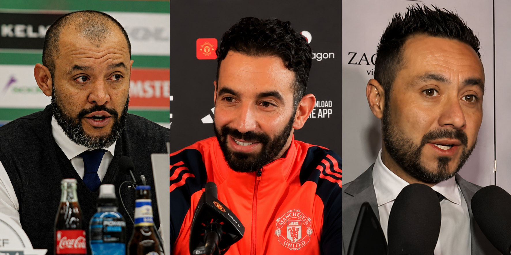
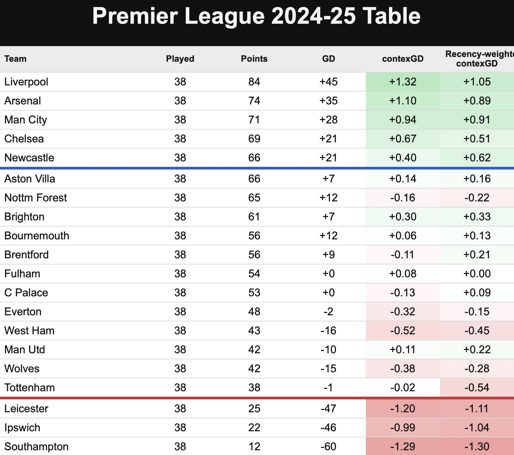
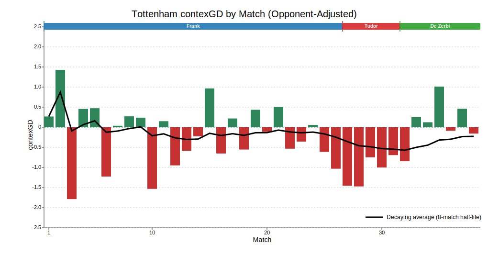
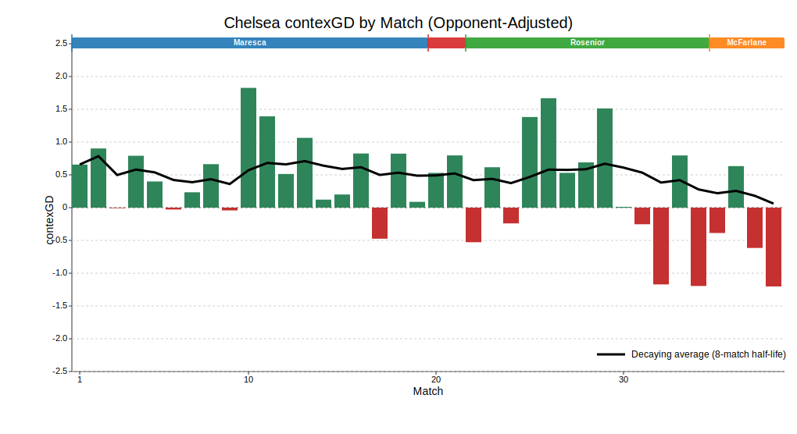

::: {.centered-block}

<em>Nuno Espirito Santo, Ruben Amorim and Roberto De Zerbi. Images from Wikimedia Commons.</em>
:::

I'm starting my review of the 2025-26 Premier League season by looking at managers. Specifically, teams that changed managers either before or during the season, and the associated change in performance or style. 

One of the performance measures you will see is **contexG**. For those who are not familiar with my [contexG](https://open.substack.com/pub/johnknightstats/p/introducing-contexg) model, it is similar to expected goals (xG) but takes into account game state (score, time elapsed, red cards) and certain match stats, and it is trained on future team performance rather than the goals scored in that particular game. 

The value of such a model can be illustrated by looking at the closing table and contexG ratings from the **2024-25** season. The four worst teams who stayed up, according to contexG, were **Tottenham**, **West Ham**, **Wolves** and **Nottingham Forest**—all of whom became the main relegation protagonists in 2025-26.

::: {.centered-block}

:::

Followers of the model would also have been unsurprised by the high finishes for **Brighton**, **Bournemouth** and **Brentford** this season, as well as the resurgence of **Manchester United**. Speaking of whom, that's where I will begin this review:

# Manchester United: Compared to Amorim, Carrick was more defensive, more effective...more fortunate?

As the above table demonstrates, United had finished the previous season more strongly than their 15th-place finish would indicate. Unfortunate to lose the Europa League final to Spurs after outshooting them 16-3, United returned home and took out their frustration on Aston Villa in a surprisingly one-sided home win (even before the Martinez red card) to deny in-form Villa a Champions League spot.

Sesko, Mbeumo, Cunha and Lammens were then signed in the summer for more than £200 million and, with no European football, expectations for the league season were high. Performances were reasonable under **Ruben Amorim** but, despite big edges in shots and xG, he could only manage 1.6 goals per game for and against before being sacked after 20 games. The sacking was typically well-timed by the club's board, coming just as Bryan Mbeumo, Amad Diallo and Noussair Mazraoui returned from AFCON and Bruno Fernandes returned from injury.

Results under **Michael Carrick** were excellent with United getting 2.29 points per game (87 points over a full season). But the underlying stats were not drastically different: contexGD increased modestly from +0.30 to +0.39 and xGD from +0.53 to +0.6.

::: {.centered-block}

:::

```{r}
library(readr)
library(dplyr)
library(tidyr)
library(gt)
library(scales)

manager_summary_2526 <- read_csv("premier_league_2025_26_manager_summary.csv", show_col_types = FALSE)
manager_summary_all <- read_csv("premier_league_2024_25_2025_26_manager_summary.csv", show_col_types = FALSE)

stat_order <- c(
  "n",
  "points_per_game",
  "opp_adj_contexg_diff_mean",
  "goals_mean",
  "opp_goals_mean",
  "xg_mean",
  "opp_xg_mean",
  "shots_mean",
  "opp_shots_mean",
  "touches_share",
  "touches_box_share",
  "progressive_passes_mean",
  "crosses_mean"
)

stat_labels <- c(
  n = "Matches",
  points_per_game = "Points per game",
  opp_adj_contexg_diff_mean = "contexGD (opp-adjusted)",
  touches_share = "Possession %",
  touches_box_share = "Field tilt",
  progressive_passes_mean = "Progressive passes",
  crosses_mean = "Crosses",
  shots_mean = "Shots for",
  opp_shots_mean = "Shots against",
  xg_mean = "xG for",
  opp_xg_mean = "xG against",
  goals_mean = "Goals for",
  opp_goals_mean = "Goals against"
)

percent_stats <- c("Possession %", "Field tilt")
one_decimal_stats <- c("Progressive passes", "Crosses", "Shots for", "Shots against")
reverse_fill_stats <- c("Goals against", "xG against", "Shots against")
soft_red <- "#f4cccc"
neutral_fill <- "#f7f7f7"
soft_green <- "#d9ead3"
dark_red <- "#cf6f6f"
dark_green <- "#7fb77a"

safe_weighted_mean <- function(x, w) {
  valid <- !is.na(x) & !is.na(w)
  if (!any(valid)) {
    return(NA_real_)
  }
  weighted.mean(x[valid], w = w[valid])
}

prepare_manager_data <- function(data, managers, team = NULL) {
  selected_data <- data %>%
    filter(manager %in% managers) %>%
    {
      if (is.null(team)) . else filter(., team == !!team)
    } %>%
    mutate(manager_start_date = as.Date(manager_start_date))

  selected_data %>%
    group_by(manager) %>%
    group_modify(~ {
      weights <- .x$n
      weighted_stats <- stats::setNames(
        lapply(
          setdiff(stat_order, c("n", "points_per_game")),
          function(stat_name) safe_weighted_mean(.x[[stat_name]], weights)
        ),
        setdiff(stat_order, c("n", "points_per_game"))
      )

      tibble(
        manager_start_date = min(.x$manager_start_date, na.rm = TRUE),
        n = sum(weights, na.rm = TRUE),
        points = sum(.x$points, na.rm = TRUE),
        points_per_game = sum(.x$points, na.rm = TRUE) / sum(weights, na.rm = TRUE),
        !!!weighted_stats
      )
    }) %>%
    ungroup() %>%
    arrange(manager_start_date, manager)
}

prepare_team_reference_data <- function(data) {
  data %>%
    group_by(team) %>%
    group_modify(~ {
      weights <- .x$n
      weighted_stats <- stats::setNames(
        lapply(
          setdiff(stat_order, c("n", "points_per_game")),
          function(stat_name) safe_weighted_mean(.x[[stat_name]], weights)
        ),
        setdiff(stat_order, c("n", "points_per_game"))
      )

      tibble(
        n = sum(weights, na.rm = TRUE),
        points = sum(.x$points, na.rm = TRUE),
        points_per_game = sum(.x$points, na.rm = TRUE) / sum(weights, na.rm = TRUE),
        !!!weighted_stats
      )
    }) %>%
    ungroup()
}

team_reference_2526 <- prepare_team_reference_data(manager_summary_2526)

stat_domains <- setNames(
  lapply(stat_order[stat_order != "n"], function(stat_name) {
    range(team_reference_2526[[stat_name]], na.rm = TRUE)
  }),
  stat_labels[stat_order[stat_order != "n"]]
)

make_stat_color_fn <- function(stat_label) {
  stat_range <- stat_domains[[stat_label]]
  low <- stat_range[1]
  high <- stat_range[2]

  if (!is.finite(low) || !is.finite(high)) {
    return(function(x) rep(NA_character_, length(x)))
  }

  if (low == high) {
    return(function(x) rep(neutral_fill, length(x)))
  }

  span <- high - low
  extended_range <- c(low - span, high + span)
  anchor_values <- c(low - span, low, (low + high) / 2, high, high + span)
  anchor_positions <- rescale(anchor_values, from = extended_range)
  anchor_colors <- c(dark_red, soft_red, neutral_fill, soft_green, dark_green)

  if (stat_label %in% reverse_fill_stats) {
    anchor_colors <- rev(anchor_colors)
  }

  palette_fn <- gradient_n_pal(anchor_colors, values = anchor_positions, space = "Lab")

  function(x) {
    scaled <- squish(rescale(x, from = extended_range), c(0, 1))
    palette_fn(scaled)
  }
}

build_manager_table <- function(data, managers, title, labels = NULL, team = NULL) {
  collapsed_data <- prepare_manager_data(data, managers, team = team)
  ordered_managers <- collapsed_data$manager

  if (is.null(labels)) {
    labels <- stats::setNames(ordered_managers, ordered_managers)
  } else {
    labels <- labels[ordered_managers]
  }

  manager_table <- collapsed_data %>%
    select(manager, all_of(stat_order)) %>%
    pivot_longer(-manager, names_to = "stat", values_to = "value") %>%
    mutate(
      stat = factor(stat, levels = stat_order, labels = stat_labels[stat_order])
    ) %>%
    pivot_wider(names_from = manager, values_from = value) %>%
    arrange(stat)

  gt_tbl <- manager_table %>%
    gt(rowname_col = "stat") %>%
    fmt_number(
      columns = all_of(ordered_managers),
      decimals = 2
    ) %>%
    fmt_number(
      columns = all_of(ordered_managers),
      rows = stat == "Matches",
      decimals = 0
    ) %>%
    fmt_number(
      columns = all_of(ordered_managers),
      rows = stat %in% one_decimal_stats,
      decimals = 1
    ) %>%
    fmt_percent(
      columns = all_of(ordered_managers),
      rows = stat %in% percent_stats,
      decimals = 1
    ) %>%
    fmt_missing(
      columns = all_of(ordered_managers),
      missing_text = "NA"
    ) %>%
    cols_label(.list = labels) %>%
    tab_header(title = title) %>%
    cols_align(
      "left",
      columns = "stat"
    )

  for (stat_label in names(stat_domains)) {
    color_fn <- make_stat_color_fn(stat_label)
    for (manager_name in ordered_managers) {
      stat_value <- manager_table[manager_table$stat == stat_label, manager_name][[1]]
      if (is.na(stat_value)) {
        next
      }

      gt_tbl <- gt_tbl %>%
        tab_style(
          style = cell_fill(color = color_fn(stat_value)),
          locations = cells_body(
            columns = all_of(manager_name),
            rows = stat == stat_label
          )
        )
    }
  }

  gt_tbl
}

gt_tbl <- build_manager_table(
  data = manager_summary_2526,
  managers = c("Ruben Amorim", "Michael Carrick"),
  title = "Manchester United 2025-26"
)

gtsave(
  data = gt_tbl,
  filename = "amorim_vs_carrick_table.png"
)

gt_tbl
```

The obvious change Carrick made was a shift from Amorim's 3-4-3, with Bruno Fernandes playing centre-mid, to a 4-2-3-1 with Fernandes in a more advanced role and Kobbie Mainoo forming a double pivot alongside Casemiro. The stats show that this led to a more defensive approach: total xG in games under Carrick was 2.78 compared to 3.35 under Amorim while United's shots, possession and field tilt all decreased.

The parallels between Carrick and **Ole Gunnar Solskjaer** are obvious and it is perhaps a surprise that United have repeated the same pattern of promoting an under-qualified interim to a permanent role after a short period of success. Massively overperforming your numbers, plus having a load of extra Champions League fixtures after a Europe-free season, is a recipe for potential regression. But sometimes football management is about timing, and if United can recruit well this summer (presumably they will spend another £200m or so) while avoiding injuries next season then maybe Carrick will preside over a new era of success. Overall though, it's not hard to see this ending badly. 

# Tottenham Hotspur: From bad, to worse, to just about good enough

Spurs were one of the more intriguing teams coming into the 2025-26 season. After a decent start in 2024-25, a huge injury crisis plus a focus on the Europa League saw them plummet like a stone and finish in 17th place. However, the fact their goal difference was still positive going into the final day is an indication that this was not like your ordinary 17th-placed team. The above 2024-25 table shows their contexGD over the season was -0.02, but when weighted towards recent results it was -0.54.

So which version of Spurs were we going to see in 2025-26 under Thomas Frank? It felt like the possible range of outcomes was wider than most, but the reality under Frank was dismal, bottom-half football. 1.12 points per game (42.6 points over a full season), -0.18 contexGD and near the bottom of the league in shots and xG. In fact, Spurs' results were artificially held up for a time thanks to positive finishing luck and Frank's trademark set piece prowess—surprisingly, they ended the season with as many goals scored from corners as Arsenal.

::: {.centered-block}

:::

```{r}
gt_tbl <- build_manager_table(
  data = manager_summary_2526,
  managers = c("Thomas Frank", "Igor Tudor", "Roberto De Zerbi"),
  title = "Tottenham Hotspur 2025-26"
)

gtsave(
  data = gt_tbl,
  filename = "spurs_managers.png"
)

gt_tbl
```


Another huge injury crisis didn't help matters, but it had become pretty obvious Thomas Frank was not the right man for a club that is associated with attractive, passing football. Igor Tudor came in, ostensibly because of his prior experience with similar "firefighting" assignments in Italy. Tudor was an unexpected and uninspiring appointment but still, it couldn't get any worse could it? 

Well actually, yes it could, and by a huge margin. In the five games under Tudor, Spurs were literally the worst team in the Premier League, gaining a solitary point and averaging -1.07 contexGD—worse than Burnley over the full season. At a time where simplicity seemed like a good idea, Tudor employed weird formations with players out of position: the Fulham away game was a good example as Xavi Simons was played at left-midfield and Conor Gallagher right-midfield in a 4-4-2, with both players completely ineffective and subsequently dropped by Tudor. 

Relegation had now become a very real possibility which meant Tudor was swiftly shown the exit, and Roberto De Zerbi was appointed for the final 7 matches. Early signs were not good as his opening defeat at Sunderland largely followed the Tudor performance trend. But interestingly, having started youngsters Archie Gray and Lucas Bergvall in midfield in that game, neither started again under De Zerbi who opted for the more seasoned Bentancur, Gallagher and Palhinha, as well as Xavi Simons prior to his ACL injury.

Following that shift towards experience, Spurs were actually pretty good to finish the season. Their contexGD under De Zerbi was +0.11 and they were now back to dominating games (62.4% field tilt) largely thanks to a huge improvement defensively, conceding just 7 goals from 7.49 xG across the 7 games.

Of course, part of that defensive improvement could be attributed to the desperation of a relegation fight, and there is no guarantee it will continue into next season. But signs are certainly more positive under De Zerbi than the absolute shambles he inherited.

# West Ham: They just couldn't defend

The general narrative of West Ham this season is that Nuno took over a mess from Graham Potter and eventually turned it around but it was too late to avoid the drop. The season-long contexGD chart below would support that narrative as the first half of the season is dominated by large red bars before small green shoots emerged after the new year.

It is no surprise that Nuno switched to a more counterattacking style relative to Graham Potter with possession dropping from 50.2% to 44.0% and field tilt down to just 40.7%. However, this change did not elicit a defensive improvement: in fact, both xG for and xG against increased dramatically under Nuno as the total xG in West Ham's matches rose from 2.64 to 3.34.

::: {.centered-block}

:::

```{r}
gt_tbl <- build_manager_table(
  data = manager_summary_all,
  managers = c("Graham Potter", "Nuno Espirito Santo"),
  title = "West Ham United 2024-25 & 2025-26",
  team = "West Ham"
)

gtsave(
  data = gt_tbl,
  filename = "west_ham_managers.png"
)

gt_tbl
```

I think this is why it seemed to many observers that West Ham were playing well on the "eye test" which is generally biased towards attacking play. In a game with many chances it seems that both teams have played well, and in a tight 0-0 we say both teams were poor, but that logic isn't really justified—there have been plenty of dull finals between the very best teams in major tournaments.

The notable improvement after the new year could be associated with a couple of personnel changes. Taty Castellanos arrived from Lazio and his all-around game seemed to immediately transform West Ham's attack. Meanwhile, cynics might point to the departure of the much-maligned Lucas Paqueta as also giving the squad a boost. 

West Ham put themselves in position to escape but their final two away defeats seem emblematic: 3-0 at Brentford and 3-1 at Newcastle; with everything on the line they just got shredded open too easily.

The club have announced that Nuno will be staying as manager, which feels like a plus, and despite the likelihood of losing Bowen, Summerville, Fernandes and Castellanos it still feels like West Ham should be able to bounce back at the first attempt. They finished the season with a recency-weighted contexGD of -0.41 which is the highest since Fulham were relegated in 2020-21 with -0.22. Encouragingly for West Ham, the Cottagers then won the Championship with 90 points and a +63 goal difference. 

# Chelsea: Pretty good until the players completely gave up on Rosenior

It's hard setting expectations for Chelsea. They are among the biggest spenders in world football and yet under the new ownership they have gone 12th, 6th, 4th, 10th.

Enzo Maresca had them in reasonable shape: a contexGD of +0.52 is not too far from a title challenge conversation, and a field tilt of 59.3% is much more in line with a team with title aspirations compared to, say, Carrick's United.

::: {.centered-block}

:::

```{r}
gt_tbl <- build_manager_table(
  data = manager_summary_2526,
  managers = c("Enzo Maresca", "Liam Rosenior", "Calum McFarlane (interim)"),
  title = "Chelsea 2025-26",
  labels = c(
    `Enzo Maresca` = "Enzo Maresca",
    `Liam Rosenior` = "Liam Rosenior",
    `Calum McFarlane (interim)` = "Calum McFarlane"
  )
) %>%
  cols_move(
    columns=`Calum McFarlane (interim)`,
    after=`Liam Rosenior`
  )

gtsave(
  data = gt_tbl,
  filename = "chelsea_managers.png"
)

gt_tbl
```

Maresca was sacked for apparently being in discussions to take over from Pep Guardiola at Manchester City, which tells you that a) City, who are fairly well-run, rate him highly, and b) Maresca was happy to jump ship from Chelsea despite the abundance of young talent and money sloshing about.

After the questionable appointment of Liam Rosenior as Maresca's replacement, performances didn't suffer too badly at first. Rosenior experienced two unlikely home draws thanks to Leeds scoring twice from 4 shots and then a Fofana red card (a theme of the season) throwing away two points against Burnley. This was followed by a 4-1 away thrashing of Aston Villa at which point a Champions League spot looked probable.

But then the wheels came off as Chelsea lost their next five matches, culminating in a pathetic defeat at Brighton which made clear the players had given up on the coach. Following Rosenior's sacking, Cole Palmer posted an Instagram meme implying the players were now "free" from the apparently unpopular boss. 

Rosenior's stint actually doesn't look too bad overall, with a fair amount of bad luck including the aforementioned home draws plus a defeat to Manchester United after outshooting them 21 to 4. Unsurprisingly, after downing tools for Rosenior the players didn't pick them back up again for interim manager Calum McFarlane and the season tailed off badly, resulting in a 10th-place finish. Xabi Alonso comes in to tidy up the mess, and it feels like there is plenty of potential to rally this talented squad to an immediate high finish next season as long as the financial situation isn't too dire.

# Nottingham Forest: A mad season ended in safety thanks to prolific finishing down the stretch

A wild season for Nottingham Forest saw four managers, a relegation battle and a European semi-final. Despite flirting with a Champions League finish the previous season, Nuno Espirito Santo was sacked just three games into the season after his relationship with owner Evangelos Marinakis deteriorated. That was followed by the short but disastrous reign of Ange Postecoglou who managed just one point and one goal from his five league matches in charge before also being given the boot.

Sean Dyche came in to steady the ship and did a reasonable job before being sacked after the 0-0 draw at home to Wolves. Ironically, as you can see from the large green bar in the chart below, contexG rated that as Forest's best performance of the entire season. It was an absolute battering: 35 shots, 40 touches in the box, 3.69 xG on Understat...you could hardly blame the manager for those chances not going in. 

::: {.centered-block}

:::

```{r}
gt_tbl <- build_manager_table(
  data = manager_summary_2526,
  managers = c("Nuno Espirito Santo", "Ange Postecoglou", "Sean Dyche", "Vitor Pereira"),
  title = "Nottingham Forest 2025-26",
  team = "Nottingham Forest"
)

gtsave(
  data = gt_tbl,
  filename = "forest_managers.png"
)

gt_tbl
```

But Marinakis is unpredictable, so he replaced Dyche with Vitor Pereira who benefitted from a series of matches in which Forest were prolific finishers: 2 goals from 9 shots at Manchester City, 3 goals from 8 shots at Spurs, 4 goals from 10 shots versus Burnley, 5 goals from 10 shots at Sunderland, and 3 goals from 6 shots at Chelsea. In those five games alone, Forest scored 17 goals from 43 shots, whereas they had scored 0 from 35 in Dyche's finale. As Jimmy Greaves would say, it's a funny old game.

The overall stats don't really show a huge uptick under Pereira. His opponent-adjusted contexG was -0.45 which is the worst of any of the teams who stayed up. Expected goal difference is even worse (-1.47) with possession, field tilt, progressive passes and crosses all the lowest of Forest's four managers. 

It's hard to imagine Forest's financial situation is especially healthy. Having already encountered previous PSR issues, last summer they spent north of £200m with questionable return. Star midfielder Elliot Anderson sounds like he is off to Manchester City and it feels like the outlook for Forest is gloomy. Like other clubs, they will be hoping the gulf between the Premier League and Championship means they could be pretty bad next season but not bad enough to go down as long as none of the promoted clubs "do a Sunderland". 

# Brentford: Andrews replaces Frank, business as usual

Comparing the stats from Thomas Frank in 2024-25 to Keith Andrews in 2025-26, it looks like Brentford just sort of rumbled on doing the same thing under a different coach. They are clearly a well-run club and anyone thinking they will steal Brentford's edge just by appointing their manager will be sorely disappointed. To be honest, I think if Dean Smith was still in charge for all these years, the Bees would probably be in a similar position to where they are now.

The style of play is familiar: Brentford play a passive game, allowing opponents to have more shots than themselves but excelling at high-xg fast breaks and set pieces. After a flirtation with the Champions League race, a disappointing finish meant Brentford actually ended up with fewer points (53) than the previous season (56). Andrews wasn't helped by quite a big finishing underperformance (1.47 goals scored per game from 1.78 xG), and overall it's a creditable effort after losing Mbeumo & Wissa and starting the season among the relegation favourites. Missing out on Europe was a blow, but it means they will get a clear run at the league next season. Another comfy mid-table finish seems likely, with some upside if they get better dice rolls. 

```{r}
gt_tbl <- build_manager_table(
  data = manager_summary_all,
  managers = c("Thomas Frank", "Keith Andrews"),
  title = "Brentford 2024-25 & 2025-26",
  team = "Brentford"
)

gtsave(
  data = gt_tbl,
  filename = "brentford_managers.png"
)

gt_tbl
```

# Wolves: Bad but unlucky under Pereira, then just bad under Edwards

It was an odd start to the season for Wolves as they were bad, but not *2 points from 11 games* bad. Nonetheless, out went Vitor Pereira and former Wolves player Rob Edwards arrived, adding some performative energy on the touchline but ultimately not improving the team. Under Edwards, Wolves retreated into a more defensive shape, with field tilt dipping below 40%. Even against woeful Burnley in the final game, they played on the break with 30% possession. Grim stuff.

```{r}
gt_tbl <- build_manager_table(
  data = manager_summary_2526,
  managers = c("Vitor Pereira", "Rob Edwards"),
  title = "Wolves 2025-26",
  team = "Wolverhampton Wanderers"
)

gtsave(
  data = gt_tbl,
  filename = "wolves_managers.png"
)

gt_tbl
```

# Thumbs up, thumbs down

So which changes worked and which didn't? First the good ones. It's hard to argue that Carrick wasn't good for United, at least in the short-term. The question is whether it was a good idea to keep him permanently, which I guess we will find out next year. Roberto De Zerbi—an appointment many criticised at the time—did an excellent job at Spurs and looks like a good fit to lead them into next season.

On the flipside, Thomas Frank was never a good fit for Tottenham Hotspur, but he looks like Bill Nicholson in comparison to the hapless Igor Tudor who almost got the club relegated. Liam Rosenior, formerly of Strasbourg and Hull City, was an appointment that every man and his uncle knew would turn out poorly at Chelsea. Likewise, nobody expected Ange Postecoglou to come into Forest mid-season and successfully introduce a polar opposite playing style.

The rest of the changes are much of a muchness. I often wonder: what if football teams didn't have managers? Teams would still experience dramatic fluctuations due to good players arriving or leaving, dressing room harmony, injuries, luck, and other random factors. But there is a tendency to attribute all the success or failure of a football club to the manager, echoing the human comfort found in the [Great Man Theory](https://en.wikipedia.org/wiki/Great_man_theory). We like simple explanations for phenomena rather than putting things down to fluke, or a combination of smaller factors, or simply "I don't know".

A paradox exists where good football managers seem like they are incredibly valuable, and yet simultaneously it is very hard to identify who is a good manager. The head coach from Team A does a brilliant job and is poached by the richer Team B, only to then look useless. I don't need to give you an example because I'm sure you can think of 20 examples pretty easily. 

Even **Pep Guardiola** still gets the "but could he do it at a smaller club?" critique, which is fair enough because the challenge of coaching the world's best players is very different to setting up a team to defend against superior opposition. And perhaps therein lies the answer: there aren't necessarily good managers and bad managers, just the right manager for the right club at the right time. 

In my next review, I will take a look at which players have been associated with an increase or decrease in their teams' performance levels. It's a difficult area to find genuine effects, but it should still be interesting to explore. 



© 2026 John Knight. All rights reserved.
