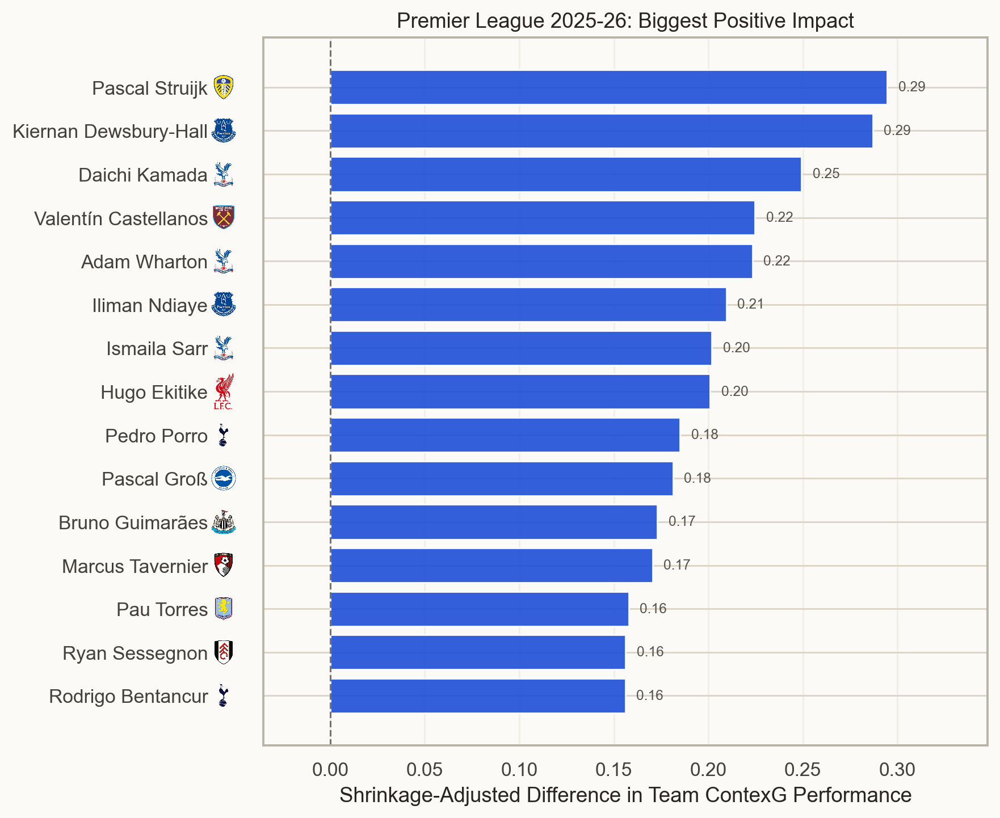
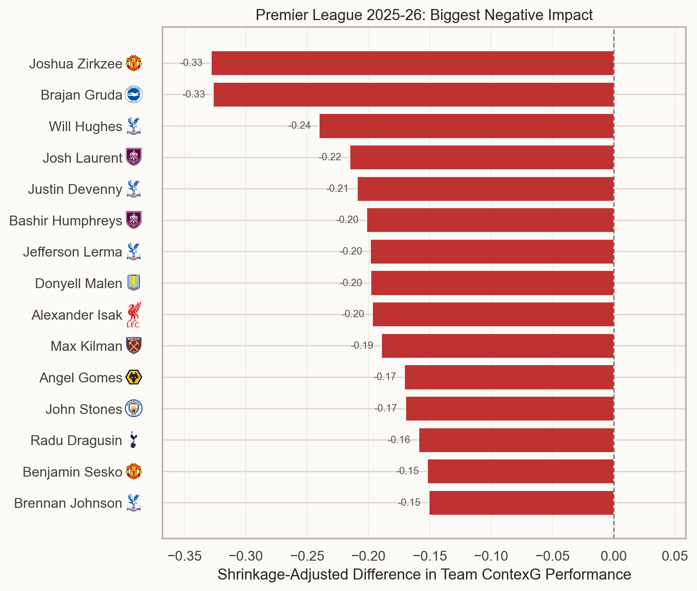
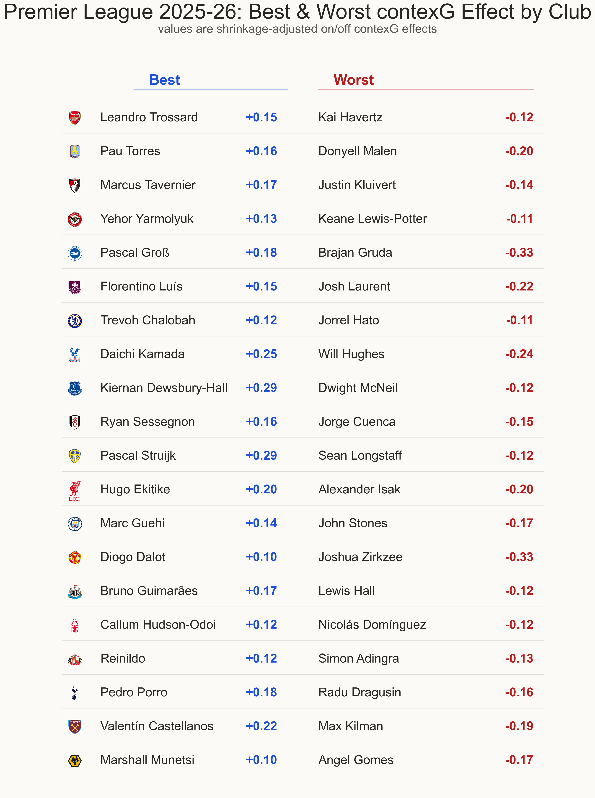

In [part one](https://johnknightstats.substack.com/p/premier-league-2025-26-which-managerial) of my 2025-26 Premier League season review I looked at managers -- particularly teams who had changed manager and how it had affected their performances. After my World Cup hiatus I will now present part two, focusing on players. 

It's not easy to isolate individual player contributions in a fluid team sport like football because many actions may be accumulated at the expense of team play. For example, an attacker may increase his goal involvements by staying forward instead of helping out in defence, or a defender may win more tackles and interceptions by constantly wandering out of position in search of the ball. 

A more simple approach is what I like to call *proof is in the pudding*: does the team play better or worse when Player X is in the team? I used my [contexG](https://substack.com/home/post/p-189499113) ratings for each match and looked at the difference when each player starts or does not start.

Now, I know a lot of people just want to scroll down to the results, so I'll show them first and explain the methodology later.

## Players associated with POSITIVE team effects

::: {.centered-block}

:::

The #1 player was Leeds United's **Pascal Struijk** with an estimated difference of +0.29 goals per game. When I first produced these results at the start of the summer this was unremarkable; it became a lot more interesting when Struijk was purchased by Tony Bloom's shrewd Brighton operation for [somewhere between £15m-20m](https://www.nytimes.com/athletic/7403145/2026/06/30/brighton-sign-pascal-struijk-leeds-transfer/). Struijk started 33 games for Leeds last season and among the five he missed were Leeds' three worst performances of the season according to contexG. Coincidentally, two of these were against Brighton: the 3-0 away defeat in November and the highly fortuitous 1-0 win in the penultimate game of the season. 

Brighton's top player in the model was **Pascal Gross** (+0.18 goals). Following Gross's arrival during the January transfer window, Brighton saw a clear uptick in form and they look strong going into next season. They sold key defender Jan Paul Van Hecke to Spurs in the summer but with the arrival of Struijk along with top Spurs prospect Luka Vuskovic, it would be no surprise if the Seagulls come out smelling of roses.

Second on the list is Everton midfielder **Kiernan Dewsbury-Hall**. He was Leicester's player of the season when winning the Championship before becoming a forgotten man after he joined Chelsea — certainly not the first player to suffer that fate. Dewsbury-Hall had a very solid first season at Everton after an eyebrow-raising £29m transfer, contributing 8 goals and 4 assists. A note of caution is required concerning his +0.29 contexG effect, however, because Dewsbury-Hall's stretch of missed games in December and January almost perfectly overlapped with the injury absence of **Iliman Ndiaye** (+0.21). 

Similar caveats apply to the positive effects of Crystal Palace players **Daichi Kamada**, **Adam Wharton** and **Ismaila Sarr**. Thanks to Palace's Conference League run, Oliver Glasner was quite often resting his best players in the same matches, so it's hard to isolate which of them is the true star (if any) and which are riding on the coattails. But I think it's pretty clear which of the three would currently fetch £100m in the transfer market.

Newcastle fans will be pleased that despite the loss of Anthony Gordon and Sandro Tonali to Barcelona & Spurs, they have (so far) held onto **Bruno Guimaraes** who had a +0.17 contexG effect. With Alexander Isak leaving a year prior, one can't imagine Bruno is thrilled at the situation. He's been linked with Arsenal who made a [derisory offer](https://www.espn.com/soccer/story/_/id/49186659/arsenal-bruno-guimaraes-newcastle-reject-55-million-bid-sources) earlier in the summer, but if a club can stomach a fee nearer to the Tonali one for a player who turns 29 in November, it's not hard to see a deal being struck. 

## Players associated with NEGATIVE team effects

::: {.centered-block}

:::

The biggest negative effect in the league belonged to **Joshua Zirkzee** (-0.33 goals), a player who feels emblematic of Manchester United's woeful recruitment prior to the Ratcliffe takeover of football operations. Zirkzee started in some of United's worst performances of 2025-26: the 0-1 defeat at home to 10-man Everton; the 1-1 draw at home to West Ham; the 1-1 draw at home to Wolves; and the 0-0 draw at Sunderland. It would be a surprise if he remains at the club for a third season.

Second in the negative chart is **Brajan Gruda** (-0.33) who started in a series of disappointing performances for Brighton in the first half of the season before departing on loan to RB Leipzig in January. As noted earlier, Brighton's performances improved markedly after the midseason transfer window which doesn't do Gruda's reputation any favours. He has [returned to Leipzig](https://www.nytimes.com/athletic/7428791/2026/07/07/brighton-leipzig-gruda-transfer-loan/) for another loan in 2026-27 with an obligation to buy if conditions are met. 

Liverpool fans will be concerned, although probably not surprised, at the prominence of **Alexander Isak** with a -0.20 goal effect. Isak only managed 8 league starts for his new club, including defeats in each of the first four. There were mitigating circumstances for Isak as he missed preseason due to the protracted and acrimonious transfer from Newcastle, followed by a broken leg sustained in the act of scoring at Spurs, but a serious improvement will be required next season from a player who cost a whopping £125m.

Much like in the positive player table, multiple Crystal Palace players (**Will Hughes**, **Justin Devenny** and **Brennan Johnson**) appear in the negative table and similar caveats apply as these backups were often fielded together in low-priority matches before key European ties.

## Best and worst effect for each team

::: {.centered-block}

:::

There are a few notable names in the above chart which shows the best and worst player for each team in terms of estimated contexG effect. **Leandro Trossard** led the way for Arsenal but has been [sold to Besiktas](https://www.nytimes.com/athletic/7373011/2026/07/04/leandro-trossard-besiktas-arsenal-transfer-news/). Meanwhile, **Kai Havertz** started 7 games after returning from injury, coinciding with a drop-off in Arsenal's performances — albeit still accumulating enough narrow wins to secure the title.

**Donyell Malen** was on fire for Roma after moving from Aston Villa in January, scoring 14 goals in 18 matches, but he had Villa's most negative effect (-0.20) while they generally played their best football with **Pau Torres** (+0.16) in the lineup.

Liverpool's season was disappointing but **Huge Ekitike** (+0.20) was one of the bright spots and the Reds' season really tailed off after the Achilles injury that will keep him out for a good chunk of next season. 

World Cup winner **Pedro Porro** led Spurs in chances created last season — admittedly not a high bar, but his ball progression and creativity from the right-back position makes up for some suspect defending, and Spurs will be pleased to have tied him down until 2031 amid interest from Manchester City.

Speaking of City, their most negative impact belonged to **John Stones**, now a free agent after being released at the end of the season. Stones' presence in the England squad ahead of the likes of Harry Maguire was surprising to many, and according to reports he is now close to [signing for Inter](https://www.bbc.com/sport/football/articles/cgewgj8qwvjo).

**Max Kilman** had the biggest negative effect for West Ham (-0.19) and he was one of those buys that looked bad at the time and looks even worse now. The £40m signing made the last of his 17 starts in the shambolic defeat at his former club Wolves when the Hammers were 3-0 down at half time. On the flip side, **Taty Castellanos** (+0.22) impressed after joining in the January transfer window, and the sales of Mateus Fernandes and Crysencio Summerville for combined fees of more than £130m open the possibility of keeping Castellanos alongside the likes of Jarrod Bowen in a squad that should be far too strong for the Championship.

## Methodology

As mentioned earlier, these results are based on team-level performance using my contexG model which differs slightly from traditional xG:

- ContexG accounts for game state (goals, red cards).
- The xG for any single shot is capped, because the creation of high-xG chances involves an inherent amount of luck (e.g. goalkeeper spills a long-range shot leaving an open goal).
- ContexG is trained on future team performance, not on whether the shot itself is scored.

For each player, I compared the team's contexG (adjusted for opponent and home advantage) in games where they started versus games where they didn't start.

It's important to note that some players are easier to compare than others, because you need a large sample of games with the player and a large sample without the player in order to make a meaningful comparison. An even split of 19 games played and 19 games missed would be ideal; a player starting all 38 games (or missing them all!) would contain no statistical power whatsoever.

The raw on-off differences were multiplied by an empirical Bayes shrinkage factor to get the final results above. Clearly, there are many factors that can affect a team's performance from one game to the next, and any association with an individual player should be treated cautiously and combined with your prior belief about the player's value. A potentially more accurate model of player value could be built using a more granular minute-by-minute on-off comparison, but this is also prone to overfitting so I would again urge caution and common sense. 

Finally, I just wanted to mention that I had planned to do a lot more content regarding the World Cup but due to a number of family & work commitments I eventually just decided to have a bit of time off from writing & modeling and watched the tournament as a fan. There was plenty of great coverage from Nate Silver, Michael Caley & others, and I don't think World Cup summers will ever be a time where we are lacking good content. I'm feeling recharged and ready to write some new articles as the domestic season approaches.



© 2026 John Knight. All rights reserved.