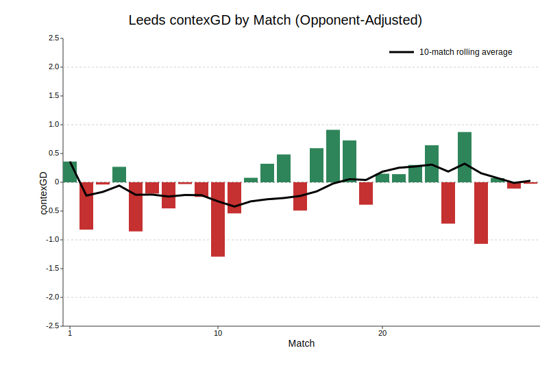

*ContexG is a model I created to reflect a composite score of each team's quality based on match data incorporating game state. For more information, see my [intro article.](https://substack.com/home/post/p-189499113)*

## Bournemouth 0 - 0 Brentford

::: {.centered-block .max-70}

:::

A second consecutive good home performance from Bournemouth where they were unfortunate not to win, and this time against a decent side in Brentford. The Cherries led the xG 2.32‒0.67 (Understat), shots 13‒5, deep completions 12‒4, and penalty box touches 27‒15.

Bournemouth could have had even more xG but Ryan Christie was one-on-one with the keeper, tried to go around him and made a mess of it, which counts for 0 xG. In the second half they hit the post twice and had a goal disallowed, although it was miles offside.

It's not clear to me whether Bournemouth's success is more down to **Andoni Iraola** or some behind-the-scenes shrewdness. Certainly the recruitment has been good but without an obvious figurehead like Bloom or Benham, it is hard to predict whether this trend will continue. I'm surprised they have kept hold of Iraola for this long, and he will surely have some suitors this summer. The style of football seems a lot more open and fluid compared to, say, Thomas Frank, and may be more transferable to a bigger stage?

## Everton 2‒0 Burnley

::: {.centered-block .max-70}

:::

This looks like your classic comfy win for Everton against a very poor Burnley team. It's hard to know what to make of Everton under **David Moyes**; 8th place and in the hunt for Europe is incredible, but are they actually any good? ContexG has them at **‒0.26** for the season, sandwiched between Leeds and Spurs who are both in relegation danger.

There really isn't much separating the peloton of teams in the current Premier League and it feels like there are about 13 teams who could either get relegated or qualify for Europe depending on injuries and other variance. Everton are on the right side of it this season, and Moyes just feels like a nice fit on Merseyside and experienced enough to prevent things spiralling too badly in future when the luck dries up.

There's not much to say about Burnley. Really weird numbers when they got promoted last year with only 16 goals conceded from 38 xG against, and then Man City took their keeper to warm the bench. Hopefully they keep Scott Parker around, because it always seems harsh to sack a manager for the crime of getting promoted to a level where they basically have no chance.

## Leeds 0 ‒ 1 Sunderland

::: {.centered-block .max-70}

:::

I hate handballs. Very rarely do I see a handball and think it was worthy of a penalty kick. This one by Ampadu—sure, the player makes a movement with his arm, but everything looks so much worse in slow motion and the ref didn't give it in real time. It all just feels like a bit of a dice roll that your team occasionally gets as a gift.

Sunderland just keep doing it, don't they? The team who have had borderline relegation metrics all year gave another borderline relegation performance, and got another victory. Only three shots for the Mackems in the whole match, one of which was the penalty that proved to be the match winner.

If that goal had been early in the game then you could just about squint and say they did well to grind out the win. Their defence obviously does get credit for the clean sheet, but scoring when you only had two non-penalty shots is obviously not sustainable. Sunderland will need to spend well in the summer to avoid a relegation battle next year but maybe that's the key to becoming a regular PL team? Hope for some luck in the first season and then get a second year of Premier League TV money to further strengthen the squad.

Leeds will feel aggrieved to have lost this one and still find themselves in the relegation battle, but the performances seem to be good enough. Looking at the below chart, since Daniel Farke switched to a three-man defence after match 13 (Man City away), Leeds have been playing above-average football (ironically, sources show them as reverting to a back four last night‒something to watch). If you offered me an even-money match bet between Sunderland & Leeds next season, I would snap your hand off for Leeds.

::: {.centered-block}

:::

## Wolves 2 ‒ 1 Liverpool

::: {.centered-block .max-70}

:::

A bit of a heist at Molineux as Wolves scored from their first shot of the game in the 78th minute, conceded a Mo Salah equaliser and then scored again from a huge deflection to win it in injury time.

It's Liverpool, so expect a huge inquiry about this defeat, but they were missing their two enormously expensive forwards, they completely dominated the game (47 penalty box touches to 11) and the ball didn't bounce their way.

ContexG has Liverpool as a +0.6 team this season which is a large drop-off from +1.32 last year. It's probably going to be enough for a top 5 spot to keep the cash rolling in, and the question will be whether Wirtz & Isak can find form & fitness to drive them back up towards title-contending levels in their second year. 

From a Wolves perspective, seven points from the last three home games against Arsenal, Aston Villa and Liverpool is pretty remarkable but there was a huge dollop of good fortune involved‒some payback for earlier in the season when absolutely nothing went their way. Nice to restore some pride as the Championship beckons.

## Aston Villa 1 - 4 Chelsea

::: {.centered-block .max-70}

:::

A tough night for Villa as they not only lost a crucial showdown for the top 5 places, but the emphatic nature of the defeat would seem to support the underlying stats which have painted Villa as mid-table quality throughout the season (current season-long contexGD: ‒0.01).

The first half was very one-sided: touches in the box 6‒23, shots 4‒11, xG 0.39‒2.24. And yet Villa almost led at the break: they scored a lovely opener with a clever stepover by Watkins and a cheeky flicked finish by Luiz, before Watkins had a goal VAR'd for offside—one of those unsatisfying decisions where some part of his body is deemed to be a few centimetres offside after much deliberation. 

An exciting development was the sight of Villa leaving four players near the halfway line while defending corners. This is something I and others have been curious about for a while, and hopefully it becomes a successful way to counter the *meat wall*: simply force your opponents to reduce the number of players in the box, unless they want to get shredded on the break.

Chelsea are ranked third in my contexG ratings for the season (+0.64), a little way behind the top two, but with the youngest team in the league (average age 24.8) they seem well-poised to contend for the title over the next few seasons. Whether Liam Rosenior is the right man for that job is dubious, but football management is often about timing, and I think any manager would be rubbing their hands together at the array of young talent in Chelsea's squad. CL qualification will be important to ensure there is still money to spend, and this result made that prospect far more likely.

## Brighton 0 - 1 Arsenal

::: {.centered-block .max-70}

:::

Arsenal's defence was once again the star of the show as they were gifted a soft opening goal in the 8th minute and then stifled Brighton for the rest of the game.

Incredibly, Arsenal managed only **0.01 xG** in the first half, Saka's shot from the edge of the box that took a deflection and nutmegged Verbruggen in goal. Brighton led 30-17 in penalty box touches across the match, only the third time this season Arsenal have 'lost' that category (the others being Manchester United away and Villa away).

Despite Brighton chasing and dominating the game, they created less than 1 xG in total. Coupled with Man City's draw against Forest, the title looks to be almost in the bag now for Arsenal. It's safe to say that a team built on defence and scrappy set piece goals is never going to be the most popular among neutrals, but it's an impressive defence nonetheless (0.87 average contexG against).

## Fulham 0 - 1 West Ham

::: {.centered-block .max-70}

:::

A fairly even game at Craven Cottage where West Ham got the benefit of the two big incidents. The winning goal, scored by man of the moment **Crysencio Summerville**, was gifted by a Bernd Leno howler as he lost the ball outside his area, although Summerville finished nicely.

Earlier in the second half, Fulham had been awarded a penalty for what looked like an obvious foul by Castellanos on Tom Crainey in the act of shooting. However, this was overturned after VAR advised the ref to view his monitor, and the adjudication was in fact that Crainey had kicked Castellanos.

I find this specific type of ruling to be bewildering. If a forward is attempting to shoot, and a defender puts his leg in between the ball and the shooting player's foot, that would strike me as almost the dictionary definition of what constitutes a foul in football. The defender is not in possession of the ball, and the idea that you just have to get in the way of a kick to win a foul seems both nonsensical and dangerous. West Ham conceded a penalty at Newcastle last season in a similar incident involving Anthony Gordon, so perhaps they will feel they are owed this one, but it feels like an area in eed of review.

After being dreadful for most of the campaign, West Ham continue to look like a mid-table quality side since the new year (see below). Aided by Tottenham's horrendous run, bookmakers now have the Hammers more likely to stay up than to go down.

::: {.centered-block}

:::

## Manchester City 2 - 2 Nottingham Forest

::: {.centered-block .max-70}

:::

This result feels emblematic of why Man City aren't going to win the league this season: the fifth time since the new year that City have drawn a PL match they should have won. 

```{r}
# --- contexG attack/defence team summary (CSV + gt) ---
library(dplyr)
library(readr)
library(gt)

IN_CSV  <- path.expand("~/projects/johnknightstats.github.io/posts/pl-review-20260305/city_draws.csv")
OUT_DIR <- path.expand("~/projects/johnknightstats.github.io/posts/pl-review-20260305/datawrapper")
OUT_CSV <- file.path(OUT_DIR, "city_draws.csv")

dir.create(OUT_DIR, recursive = TRUE, showWarnings = FALSE)

tbl <- read_csv(IN_CSV, show_col_types = FALSE) %>%
  mutate(
    `ContexG` = round(`ContexG`, 2),
    `Opp. contexG` = round(`Opp. contexG`, 2)
  )

write_csv(tbl, OUT_CSV)

tbl %>%
  gt() %>%
  tab_style(
    style = cell_text(weight = "bold"),
    locations = cells_column_labels(columns = everything())
  ) %>%
  cols_align(
    align = "center",
    columns = c(Venue, Score)
  ) %>%
  tab_header(
    title = "Manchester City draws",
    subtitle = "Premier League in 2026"
  )
```

City had a couple of good penalty shouts, both of which emphasise the difficult task faced by referees. The first was when Haaland knocked the ball past the keeper and was brought down, but the ref deemed Haaland to have initiated the contact. The later appeal was when Rodri got his shot away but then was fouled by Anderson on the follow-through. I would have given both, but you could poll 100 people and you would get a decent split on each. It's a hard job.

This was big point for Forest at the bottom. There's been a sense that they will drag themselves out of it thanks to the quality in the squad characterised by Morgan Gibbs-White, Elliot Anderson and Murillo, their top three players according to Transfermarkt value and by public sentiment.

And it was individual moments of magic from each of those three that earned Forest a draw. Firstly, Gibbs-White's outrageous backheeled finish, followed by a fine long-range strike from Anderson, and then great anticipation by Murillo to clear a certain goal off the line with almost the last kick of the game.

## Newcastle 2 - 1 Manchester United

::: {.centered-block .max-70}

:::

A really good performance and win from Newcastle—the second time they have performed well with 10 men after the Liverpool game early in the season that they were unfortunate to lose.

For the second consecutive match, Manchester United benefitted from a red card for the opposition. This time it was **Jacob Ramsey**, who received a second booking when he dived to try and win a penalty. Broadly, I enjoy seeing dishonesty punished, although it always feels harsh when there are dozens of diving and playacting incidents every week in the Premier League and then one player is singled out.

A disappointing performance all around from Man Utd as they played the entire second half with a man advantage and still lost the second half xG 0.97‒0.65. Much has been made of the turnaround under Michael Carrick, but I maintain that United were already trending in the right direction under Amorim before the Africa Nations Cup and the injury to Bruno derailed their season over Christmas. 

If you look at the season-long contexG chart, you wouldn't identify a difference between the last eight games under Carrick and the early-season form. That's not to say Amorim should have stayed—clearly there were some serious off-pitch problems going on—but United are better than they were last year and that's probably down to buying good players and having fewer injuries.

::: {.centered-block}

:::

## Tottenham 1 - 3 Crystal Palace

::: {.centered-block .max-70}

:::

This game was decided just before half time when the referee gave a penalty and red card for a tug by Micky Van de Ven as Ismaila Sarr ran onto a through ball. Ironically, the exact same thing happened to Palace in their last game when they were 1-0 up at Old Trafford.

I said in my review of that game that I thought it's far too harsh, and I will echo that opinion here. Surely 0.8 xG (i.e. a penalty kick) is sufficient punishment? Instead, Palace got 0.8 xG, Spurs also went down to 10 men, and just for good measure, Van de Ven will be suspended for the next match. It's an incredibly draconian punishment for a tug on the arm.

Amusingly, since the *double jeopardy* rule means you can't get a penalty and red card if you are "going for the ball", Van de Ven would have been better off just scything Sarr down and taking a yellow card. But a tug on the arm? Off you go.

It was a roller coaster first half as Spurs looked to have gone behind to an unfortunate looping deflection, only for that goal to be fortuitously disallowed as VAR, similar to the Watkins example mentioned earlier, deemed Sarr's face to be slightly offside when the ball was played forward. Spurs scored immediately afterwards to go ahead, before the red card incident which was followed by a further two Palace goals before half time as Igor Tudor, with no senior defenders on the bench, brought on two midfielders for Souza and Kolo Muani, leaving the defence all over the place.

It's hard to judge this game overall as Palace clearly went into comfort mode in the second half. Spurs lost the contexG 1.20‒1.50, which is an improvement for them on recent efforts, but they will need an uptick in performances and fortune if they are going to fend off the other relegation fighters.

```{r}
# --- contexG attack/defence team summary (CSV + gt) ---
library(dplyr)
library(readr)
library(gt)

IN_CSV  <- path.expand("~/projects/johnknightstats.github.io/posts/pl-review-20260305/contexg_attack_defence_team_summary_premier_league.csv")
OUT_DIR <- path.expand("~/projects/johnknightstats.github.io/posts/pl-review-20260305/datawrapper")
OUT_CSV <- file.path(OUT_DIR, "contexg_attack_defence_team_summary_premier_league_2526_datawrapper.csv")

dir.create(OUT_DIR, recursive = TRUE, showWarnings = FALSE)

tbl <- read_csv(IN_CSV, show_col_types = FALSE) %>%
  select(team_name, matches, contexg_diff) %>%
  rename(
    `Team` = team_name,
    `Matches` = matches,
    `contexGD` = contexg_diff
  ) %>%
  mutate(
    Team = if_else(Team == "Wolverhampton Wanderers", "Wolves", Team),
    `contexGD` = round(`contexGD`, 2)
  )

write_csv(tbl, OUT_CSV)

tbl %>%
  gt() %>%
  tab_style(
    style = cell_text(weight = "bold"),
    locations = cells_column_labels(columns = everything())
  ) %>%
  cols_align(
    align = "center",
    columns = c(`Matches`, `contexGD`)
  ) %>%
  fmt_number(
    columns = c(`contexGD`),
    decimals = 2
  ) %>%
  tab_header(
    title = "Premier League 2025-26 contexG Ratings",
    subtitle = "05 Mar, 2026"
  )
```

It's FA Cup action this weekend so I'll be back with my next Premier League review after next week's matches. Highlights include Chelsea v Newcastle, West Ham v Man City, and Liverpool v Spurs. 