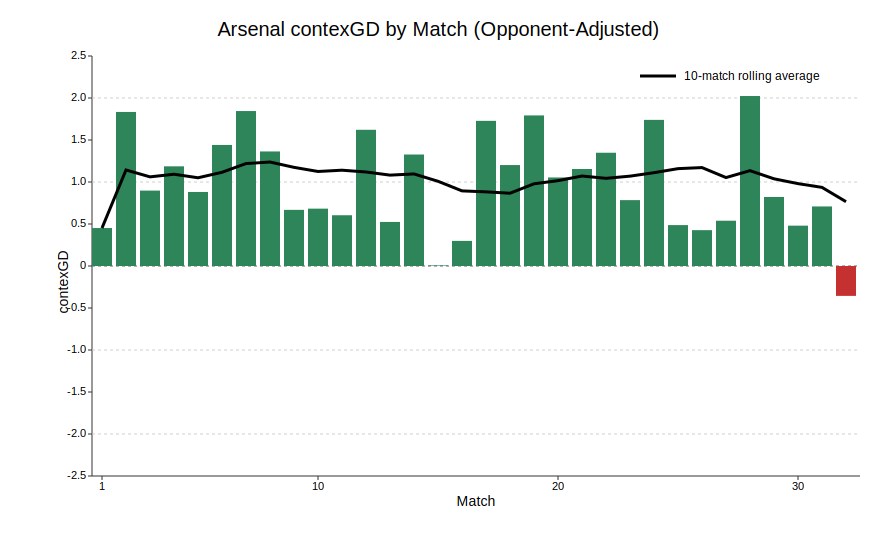
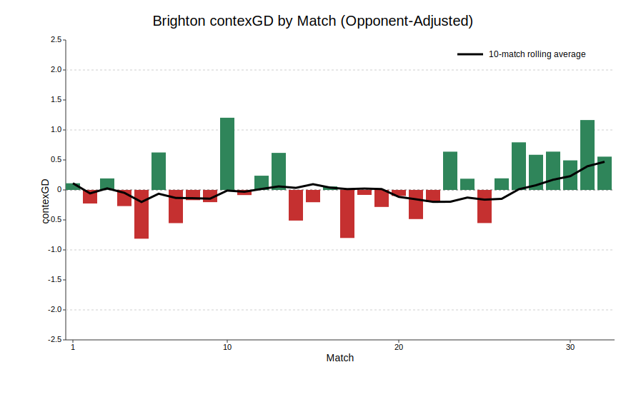

*Nightmare in North London as Spurs and Arsenal lose while West Ham and Manchester City win.*

*See my [intro article](https://substack.com/home/post/p-189499113) for more information on contexG.*

## West Ham 4 - 0 Wolves 

::: {.centered-block .max-70}

:::

A fantastic weekend for West Ham as they moved out of the relegation zone with an emphatic win over Wolves. This felt like Nuno-ball at its best: a fairly even first half with the Hammers going ahead from a corner just before the break, and then in the second half West Ham put on a counterattacking masterclass with 38% possession, two goals on the break and another from a set piece. 

There is no doubt West Ham have seen a distinct improvement since Christmas (see below). Last week's performance at Villa was awful, but aside from that they have generally been playing more like a mid-table side than the shambolic early-season efforts. Perhaps a lesson that new manager bounce sometimes takes a bit of time to bear fruit? 

::: {.centered-block}

:::

## Arsenal 1 - 2 Bournemouth

::: {.centered-block .max-70}

:::

ContexG has this as the worst performance of the season for Arsenal, surpassing the defeat at Aston Villa in December. The headline xG (Understat 3.16-1.39, Fotmob 2.32-1.19) may give the impression of an unlucky defeat but Arsenal benefitted from a comedy handball penalty and created just **0.18 xG** from open play in a game where they never led, playing at home to a Bournemouth side that has conceded the 5th-most goals in the league.

Worryingly for Arsenal this was not out of the blue—for the last couple of months they have been playing more like a team challenging for the CL spots than a title-winner. In the last eight league games only the Spurs match was exceptional, and if we are being honest that game said more about Spurs and Igor Tudor than it did about Arsenal. Throw in the defeats in both domestic cups and some underwhelming performances in soft Champions League ties, and there has to be real concern whether the Gunners are playing well enough to get over the line.

::: {.centered-block}

:::

For context, in the eight previous seasons for which I have contexG ratings, the **average** contexGD of the Premier League champions has been **+1.73**. Arsenal have reached that level in a handful of games but their season-long average is +1.03 and this year's PL does seem bereft of any elite teams.

Man City got past their biggest hurdle with a comfy win at Chelsea and that sets up an epic head-to-head next weekend. In spite of everything, Arsenal are still six points ahead and if they win that game it is basically over.

## Brentford 2 - 2 Everton

::: {.centered-block .max-70}

:::

The spoils were shared in a lively game between two unlikely European challengers. A point apiece does no harm to either team's Europa League hopes but an outside shot at a Champions League place seems even less likely now.

ContexG scored this game 1.82-1.32 in favour of Brentford and they will be frustrated to have conceded an injury-time equaliser. In fairness, both Brentford goals had a touch of fortune about them with Jordan Pickford conceding a penalty by needlessly scything down Kevin Schade as he was heading away from goal, while the second goal deflected in off Igor Thiago.

Everton host Liverpool next week with the chance to go within two points of their local rivals. The Toffees have finished at least 12 points behind Liverpool every year since they last finished higher in 2012-13, and it's always nice when the big local derbies have more at stake than just bragging rights. Should be a cracker.

## Burnley 0 - 2 Brighton

::: {.centered-block .max-70}

:::

I have been highlighting Brighton's marked improvement in recent months—coinciding with the re-signing of **Pascal Gross**—and this run of form continued with a dominant win at Burnley as the Seagulls led for more than half the game and bossed territorially (penalty box touches 15-39; deep completions 3-11). 

Aside from the poor performance at home to Crystal Palace, Brighton have been playing at the level of Champions League challengers rather than the ropey form that had Fabian Hurzeler under pressure a few months ago.

::: {.centered-block}

:::

Brighton did ride a bit of luck in this game with two Burnley goals being disallowed by inches. It was also an unusual day for Mats Wieffer who had one goal in 51 appearances for the Seagulls prior to today and ended up scoring both goals. But this is a very dangerous Brighton side that still has an outside chance of an unlikely Champions League spot.

Brighton travel to Spurs next week and were slight underdogs prior to today's significant injury to Cristian Romero. That moved them to favouritism (currently 2.46 on Pinnacle) but that still feels like a generous price given the current quality of their play, allied with Tottenham's continuing struggles.

## Liverpool 2 - 0 Fulham

::: {.centered-block .max-70}

:::

It's been a disappointing season for Liverpool but that is only by Liverpool's standards. They are still able to routinely dispatch a team like Fulham, amassing an impressive 21 deep completions against a side that can be dogged and hard to break down.

The first half was dominant: 30 touches in the box, 10 shots to 5, and cracking finishes from the forwards on opposite flanks and at opposite ends of their careers, Ngumoha and Salah. 

Fulham dominated territory in the second half with 31 touches in the box compared to Liverpool's 17, but they were trailing 2-0 and only managed one shot on target with 8 of their 15 second-half shots blocked. It's a concern that Liverpool's midfield is unable to kill off a game more convincingly but it was a big three points in the top 5 race with the Reds still facing trips to Everton, Man Utd and Aston Villa as well as the crunch clash against Chelsea at Anfield.

## Crystal Palace 2 - 1 Newcastle

::: {.centered-block .max-70}

:::

Palace leapfrogged Newcastle in the table thanks to an injury-time winner from the penalty spot after a shirt pull by Sven Botman. There's a lot you can get away with as a defender but shirt pulling is difficult for officials to wave off—why do they do it?

It was a tight game with only 2.31 total contexG and Newcastle, well-rested and out of all the cups, again left their three expensive forwards Woltemade, Elanga and Wissa on the bench. Amid some stiff competition from other clubs, Newcastle's summer 2025 window looks especially disastrous and could set the club back years. It remains to be seen whether Eddie Howe will be back next season as the fans who made the long trip to Selhurst Park are surely losing patience with the team now lying in 14th place and unlikely to be playing European football next year.

## Nottingham Forest 1 - 1 Aston Villa

::: {.centered-block .max-70}

:::

Despite starting the day 22 points behind Villa in the table, Forest went off as the betting favourites for this Midlands derby, reflecting a general perception of Villa's overperformance this season as well as Forest's improvement under Vitor Pereira.

ContexG scored this game 1.26-1.42 so it was a reasonable away performance from Villa as Youri Tielemans made his first league start since January. Given results elsewhere it can be seen as a decent point for both sides as it moves Forest further away from Spurs at the bottom, and Villa are now seven points clear of Chelsea in the top 5 race. 

## Sunderland 1 - 0 Tottenham

::: {.centered-block .max-70}

:::

A new manager but it felt like more of the same for Spurs with some bad luck, a key injury and lots of toothless attacking play.

It was a tight game that always felt like the first goal would be crucial, and Sunderland scored what proved to be the winner thanks to an enormous deflection on Nordi Mukiele's shot. This was followed by a bad-looking injury for **Cristian Romero** who went off in tears, no doubt fearing his season is over and World Cup in jeopardy.

In truth, Spurs never really looked like equalising and their contexG score of 0.86 reflects the fact they could only conjure three shots for 0.12 xG after going behind. It doesn't reflect well on **Xavi Simons** that yet another manager has watched him in training and decided he wasn't worth introducing until the 85th minute despite Spurs crying out for some creativity.

With West Ham thrashing Wolves it was about as bad as the weekend could go for Spurs. I mentioned in my [recent article](https://johnknightstats.substack.com/p/simulating-the-remainder-of-the-premier) that I felt like if you wanted to oppose Spurs it was better to do so in individual matches than in the relegation market. And I think this point is well-demonstrated by this weekend's results where the West Ham-Sunderland double would have paid more than 4/1 and yet Spurs are still odds-against to go down. I will try and get an updated simulation out this week but it seems like anyone who opposed Spurs in the relegation market has an opportunity to escape with limited loss in a situation that is now drastically worse than it was before these fixtures.

## Chelsea 0 - 3 Man City

::: {.centered-block .max-70}

:::

What a huge weekend at both ends of the table. Next week's title six-pointer against Arsenal looms large but this was by far the toughest of City's other fixtures and they won the game with three goals in a 17-minute spell just after half time.

This was more like peak Man City as they comprehensively outplayed Chelsea on their own pitch: 64% possession, 46 penalty box touches to 14, and 15 deep completions to 2. 

I wrote in the aforementioned simulation article that even if City won out, Arsenal would still win the title a third of the time because the Gunners still needed to slip up in another fixture, none of which looked especially difficult. But with Arsenal losing to Bournemouth the title is now in City's hands as well as Arsenal's.

## Season-long ContexG Ratings

This week I included each team's contexGD in the second half of the season to illustrate how they are playing in recent months. It is clear that Man City are now the best team in the league while Brighton, as mentioned earlier, are now performing like Champions League contenders. 

Aston Villa and West Ham have also shown significant improvements in performance compared to the first half of the season. Trending in the opposite direction are Newcastle and Spurs. (Note that the ratings in this table are not opponent-adjusted.)

```{r}
# --- contexG attack/defence team summary (CSV + gt) ---
library(dplyr)
library(readr)
library(gt)

IN_CSV  <- path.expand("~/projects/johnknightstats.github.io/posts/pl-review-20260412/contexg_attack_defence_team_summary_premier_league.csv")
IN_CSV_2  <- path.expand("~/projects/johnknightstats.github.io/posts/pl-review-20260412/contexg_attack_defence_team_summary_premier_league_second_half.csv")
OUT_DIR <- path.expand("~/projects/johnknightstats.github.io/posts/pl-review-20260412/datawrapper")
OUT_CSV <- file.path(OUT_DIR, "contexg_attack_defence_team_summary_premier_league_2526_datawrapper.csv")

dir.create(OUT_DIR, recursive = TRUE, showWarnings = FALSE)

tbl_2 <- read_csv(IN_CSV_2, show_col_types = FALSE) %>%
  select(team_name, contexg_diff) %>%
  rename(
    `Team` = team_name,
    `since 1 Jan` = contexg_diff
  ) %>%
  mutate(
    Team = if_else(Team == "Wolverhampton Wanderers", "Wolves", Team),
    `since 1 Jan` = round(`since 1 Jan`, 2)
  )

tbl <- read_csv(IN_CSV, show_col_types = FALSE) %>%
  select(team_name, matches, contexg_diff) %>%
  rename(
    `Team` = team_name,
    `Matches` = matches,
    `contexGD` = contexg_diff
  ) %>%
  mutate(
    Team = if_else(Team == "Wolverhampton Wanderers", "Wolves", Team),
    `contexGD` = round(`contexGD`, 2)
  ) %>%
  merge(tbl_2, by="Team") %>%
  arrange(-contexGD)

write_csv(tbl, OUT_CSV)

tbl %>%
  gt() %>%
  tab_style(
    style = cell_text(weight = "bold"),
    locations = cells_column_labels(columns = everything())
  ) %>%
  cols_align(
    align = "center",
    columns = c(`Matches`, `contexGD`)
  ) %>%
  fmt_number(
    columns = c(`contexGD`),
    decimals = 2
  ) %>%
  tab_header(
    title = "Premier League 2025-26 contexG Ratings",
    subtitle = "12 Apr, 2026"
  )
```

There is still one match to be played on Monday as Manchester United host Leeds in a fixture that always has plenty of needle between the fans. United (Manchester, that is) are pretty much home and hosed in the top 5 race while Leeds will see this as something of a free hit as they still have home games against Wolves and Burnley up their sleeve.

Next weekend is of course the big Man City v Arsenal clash as well as Everton v Liverpool and Chelsea v Man Utd. I will be back next Sunday with my review, but right now it's time for one of my favourite days of the year: Sunday at the Masters! Enjoy.



© 2026 John Knight. All rights reserved.