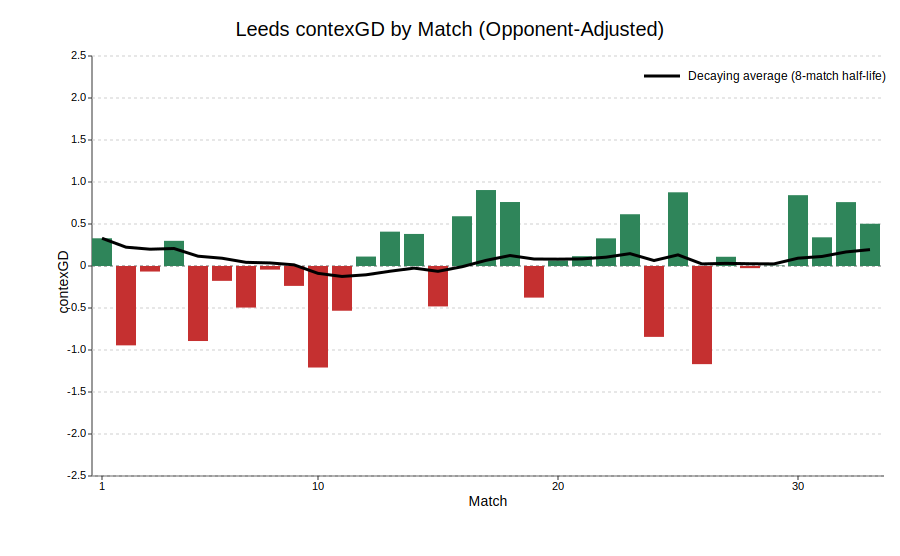

*City odds-on for the league, Spurs odds-on for the drop.*

*See my [intro article](https://substack.com/home/post/p-189499113) for more information on contexG.*

## Brentford 0 - 0 Fulham

::: {.centered-block .max-70}

:::

A fifth consecutive draw for Brentford who have gone off the boil just as they had a realistic shot at a Champions League place. There's still an outside chance for them thanks to Chelsea's recent slide, if Aston Villa can finish 5th and win the Europa League which would give the Premier League an extra CL spot for the 6th-placed team.

Overall it was a reasonable performance from Fulham who shaded the contexG 1.46-1.35 as they dominated territory (12 deep completions to 4) even though Brentford appeared vastly superior on Understat's xG (2.34-0.79). But Fulham didn't manage a single shot on target in the match and had Bernd Leno to thank for a fantastic save in the 90th minute to preserve their point. Not a lot more to add about this stalemate.

## Leeds 3 - 0 Wolves

::: {.centered-block .max-70}

:::

Leeds are just a good team. Not "good for a promoted team"; just *good*. Daniel Farke was pretty close to losing his job after a poor start to the season but he switched formation to a back three at half time away to Man City (match #13) and it changed everything. They have been performing at the level of European challengers and with easy fixtures like this one awaiting them, I would have been shocked if they weren't able to pull away from the relegation zone as they have now done.

::: {.centered-block}

:::

This was a commanding performance from Leeds against a poor Wolves side as they went 2-0 up early and never looked threatened, finally tacking on a late penalty for an emphatic Understat xG of 3.56-0.57. Wolves' mini-renaissance was really just a mirage thanks to some positive finishing luck and they have turned in two woeful performances against relegation threatened sides over the last two weeks. Next week we will see if they make it a hat-trick as they host Spurs.

## Newcastle 1 - 2 Bournemouth

::: {.centered-block .max-70}

:::

**Bruno Guimaraes**' summer transfer fee continues to increase as the Geordies once again looked awful without him in the side. Bournemouth dominated the first half, racking up 2.17 xG and leading 1-0 before Bruno was introduced on the hour mark. Now I'm not saying he changed the game single-handedly but Newcastle had levelled within 7 minutes of his arrival and dominated the remainder of the game with 7 shots to 4, two of those Bournemouth shots being from their winning goal (Fotmob have deemed Evanilson's header to be a shot rather than a pass; dubious if you ask me). 

Newcastle's stark decline in form does seem to have perfectly coincided with Bruno's injury and at age 28 this feels like the summer where he will fancy a bigger challenge and Newcastle will know they need to cash in. He's been linked with Manchester United who are wealthy enough to absorb the lack of resale value, and Bruno seems like a pretty solid investment for a Premier League-ready midfield upgrade. Newcastle fans will be hoping they can reinvest the momney a bit more wisely than last summer's calamitous buys.

::: {.centered-block}

:::

## Tottenham 2 - 2 Brighton

::: {.centered-block .max-70}

:::

The bar was very low for Spurs but they produced a much-improved performance by playing in-form Brighton to an even game (contexG 1.56-1.48). Of course, results are the main thing at this stage of the season and the injury-time equaliser was a devastating blow to their survival hopes, but at least there are signs of life on the pitch after a woeful spell under Igor Tudor that looks like it may end up being the deciding factor in the relegation battle. 

It sort of sums up Tottenham's season that after Cristian Romero's season-ending injury last week it was his replacement Kevin Danso who made the crucial error resulting in Brighton's equaliser. The weird **Xavi Simons** saga continued as he finally started a league game, as everyone had been crying out for, and—lo and behold—he gave a man-of-the-match performance with a goal and an assist, also hitting the post, before suffering from severe cramp and effectively leaving Spurs with 10 men for the last 15 minutes of the game.

Brighton will be disappointed they couldn't take advantage of another Chelsea defeat but they were unfortunate to come up against a much sterner test than the usual dross Spurs have been serving up at home this season. They have the chance to leapfrog Chelsea into 6th place as they host them on Tuesday.

## Chelsea 0 - 1 Man Utd

::: {.centered-block .max-70}

:::

Something of a heist at Stamford Bridge as Manchester United had 4 total shots, only one of which was inside the box, but it went in the net and they survived Chelsea peppering their goal and hitting the woodwork three times to escape with a 1-0 away win.

Chelsea were booed off by their supporters which seems harsh after they had been comfortably the better team against a side who are third in the table. But we are at the point where anyone under 30 doesn't remember pre-Abramovich Chelsea and just thinks they are a club who should hoover up trophies on an annual basis. These ghosts from great eras of the past can haunt many a football club.

Chelsea are now scoreless in four matches since they thrashed Aston Villa 4-1 at the start of March. They thoroughly dominated this contest (40 touches in the box to United's 10) and managed 21 shots but couldn't convert any of them. Liam Delap led the forward line and he now has just one league goal in 24 appearances for the Blues. I still don't think they are far away from being a very good team if they can find some genuine star quality up front (or just keep Estevao fit) as well as injecting a bit more experience and leadership to guide the young talent. But if Chelsea miss out on a Champions League spot, as now seems likely, it remains to be seen whether they can conjure up yet more [accounting shenanigans](https://www.nytimes.com/athletic/7193024/2026/04/13/chelsea-accounts-player-trading-profits/) to avoid having to sell a star player or two this summer.

## Aston Villa v Sunderland

::: {.centered-block .max-70}

:::

A weird game at Villa Park with 7 goals from 25 shots. Really this was a dominant and comfortable home win for Villa except for the bit where Sunderland repeatedly shredded them open for a five-minute stretch at the end of normal time, going from 3-1 to 3-3 and missing a one-on-one with the keeper for a very unlikely victory, before Tammy Abraham popped up with Villa's late winner.

The story of Villa's season was their outrageous overperformance of xG in the first half of the season, scoring a large number of long-range goals and continually finding ways to win by a single goal to mount an unlikely title challenge. That was never going to be sustainable, and after the home thrashing by Chelsea it really looked like a CL place was in jeopardy but they have responded well and although this win was sort of typical—scored in injury time to win by a single goal—this result was thoroughly deserved with contexG scoring it 2.22-0.98.

Champions League football is pretty much in the bag now which means Villa can focus on their forthcoming Europa League semi-final against Nottingham Forest which, given Freiburg or Braga await, feels more like a final. It's clear that England are going to absolutely dominate this competition in forthcoming years which makes the race for European qualification even more enticing given the lure of a trophy and Champions League place to the winners.

## Everton v Liverpool

::: {.centered-block .max-70}

:::

A painful one for Evertonions as the Reds win the first Merseyside derby at the Hill-Dickinson stadium with a 100th-minute Virgil van Dijk goal from a corner. ContexG scored this 1.17-1.67 which, after adjusting for opponent strength and home advantage, is about in line with the season-long performance of both teams: Liverpool in the top 5 but some way off title challengers, and Everton a bottom-half team who have been overperforming the numbers by quite a lot.

Everton went into this game with the chance to move two points behind their neighbours in the table and so the late winner was hugely consequential in solidifying Liverpool's prospects of Champions League football next season with Chelsea, Brighton and Brentford all failing to win. It was far from vintage stuff from the Reds with only 17 touches in the box, and it's been far from a vintage year but at least they will keep that truckload of Champions League cash rolling in as they plan for a summer where they will be moving past the Mo Salah era, and possible the Arne Slot era as well.

One extra note from this game is Liverpool's backup keeper Mamardashvili went off injured, leaving third-choice Freddie Woodman in goal, but it sounds like Mamardashvili's injury is superficial and not long-term.

## Nottingham Forest v Burnley

::: {.centered-block .max-70}

:::

A crucial win for Forest and an emphatic scoreline but not a convincing performance against the league's worst team. The first half was absolutely dreadful and Forest were booed off by their fans having had only three shots and trailing 1-0.

Things turned around in the second half thanks to a Morgan Gibbs-White hat-trick but the final scoreline was very flattering as Forest scored 4 times from just 10 shots. This follows their previous league win at Spurs where they scored 3 goals from 8 shots.

The common narrative is that Vitor Pereira has steadied the ship and pulled Forest away from the relegation zone as well as progressing in Europe. But it feels like that win away to Spurs, who were so poor under the hapless Igor Tudor, is doing a lot of the heavy lifting. 

The below chart shows Forest's recent performances which have not been great according to contexG—ironically, the tall green bar was the draw against Wolves that got Sean Dyche the sack after Forest had 35 shots, the most for any team in a Premier League match this season. 

::: {.centered-block}

:::

Forest's Europa League run has also seen them benefit from a penalty shootout win, a bizarre own goal and an early red card for Porto. I'm not convinced anything has fundamentally changed, but they are now 5 points ahead of Spurs and may only need one more win to be safe.

## Man City v Arsenal

::: {.centered-block .max-70}

:::

The big game of the weekend and the season. It has increasingly become clear that City are the best team in the league and they cemented those credentials with a dominant performance over Arsenal.

The shift in the landscape from the start of the season to now can be illustrated by comparing the statistics from the matchup between these teams back in September. Arsenal dominated that game with 39 touches in the penalty area to City's 7, and 10 deep completions to City's 3. Conversely, in this weekend's clash City led penalty box touches 40-14 and deep completions 15-3.

It certainly wasn't a comfortable win as Arsenal's rare attacks did end up creating a one-on-one, which **Kai Havertz** missed, and Arsenal also hit the woodwork twice via an excellent shot out of nothing from Eberechi Eze and a deflected Gabriel header. There was also the absolute sitter missed by Havertz in injury time which will be replayed both literally on TV as well as metaphorically in the minds of Arsenal fans if they go on to lose the title. It was a miss that somehow seemed emblematic of their season: if Arsenal had a forward line even remotely as good as everything else in their squad, they would have absolutely hosed up in the league. 

But they don't have that, they have Gyokeres and Madueke and Eze and Trossard and Martinelli, and Havertz still recovering from injury and Saka currently missing with one. It's a good set of forwards for most clubs, but when you are challenging to be the best team in the richest league in the world you really need that top drawer talent: players like **Erling Haaland**, who scored the winner with his 23rd goal of the season. 

Only weeks after Arsenal touched 1.11 to win the title (90% probability) we have officially flip-flopped, and City are now trading around 1.72 (58%). City travel to Burnley on Wednesday where a win would move them into first place on goal difference, or goals scored at the least.

Looking ahead, there could be some interesting storylines at the end of the season as the final game sees City face Aston Villa while Arsenal travel to Crystal Palace, so both opponents may be prioritising European finals before or after the game. It would be incredible if goal difference is the decider and one of the opponents fields a severely weakened side, but of course there is a lot of football to be played before then. Every match in isolation looks like an easy result to pencil in but the 11-match accumulator for Arsenal and City to both win all their remaining games is unlikely to come in. It should be an interesting month.

## Season-long ContexG Ratings

```{r}
# --- contexG attack/defence team summary (CSV + gt) ---
library(dplyr)
library(readr)
library(gt)

IN_CSV  <- path.expand("~/projects/johnknightstats.github.io/posts/pl-review-20260419/contexg_attack_defence_team_summary_premier_league_with_latest_decayed_opp_adj.csv")
OUT_DIR <- path.expand("~/projects/johnknightstats.github.io/posts/pl-review-20260419/datawrapper")
OUT_CSV <- file.path(OUT_DIR, "contexg_attack_defence_team_summary_premier_league_2526_datawrapper.csv")

dir.create(OUT_DIR, recursive = TRUE, showWarnings = FALSE)

tbl <- read_csv(IN_CSV, show_col_types = FALSE) %>%
  select(team_name, matches, season_long_contexg_diff, latest_decayed_opp_adj_contexg) %>%
  rename(
    Team = team_name,
    Matches = matches, 
    `Season contexGD` = season_long_contexg_diff,
    `Recency-weighted` = latest_decayed_opp_adj_contexg
  ) %>%
  mutate(
    Team = if_else(Team == "Wolverhampton Wanderers", "Wolves", Team),
    `Season contexGD` = round(`Season contexGD`, 2),
    `Recency-weighted` = round(`Recency-weighted`, 2)
  )

write_csv(tbl, OUT_CSV)

tbl %>%
  gt() %>%
  tab_style(
    style = cell_text(weight = "bold"),
    locations = cells_column_labels(columns = everything())
  ) %>%
  cols_align(
    align = "center",
    columns = c(`Matches`, `Season contexGD`, `Recency-weighted`)
  ) %>%
  fmt_number(
    columns = c(`Season contexGD`, `Recency-weighted`),
    decimals = 2
  ) %>%
  tab_header(
    title = "Premier League 2025-26 contexG Ratings",
    subtitle = "19 Apr, 2026"
  )
```

The final game of the weekend sees Crystal Palace host West Ham on Monday night. Palace have eyes on the Conference League and a few injury concerns, so it remains to be seen how seriously they will focus on this game. A win for the Hammers would leave Spurs 4 points adrift of safety.

Because of next weekend's FA Cup semi-finals, three fixtures have been brought forward to midweek including Burnley v Man City and Brighton v Chelsea. Then the weekend's slate sees Arsenal try to get back to winning ways against Newcastle, while Spurs travel to Wolves in what is surely a must-win match. Enjoy the football, and look out for my latest World Cup article which I will be putting up in the next few days.



© 2026 John Knight. All rights reserved.
