::: {.centered-block}
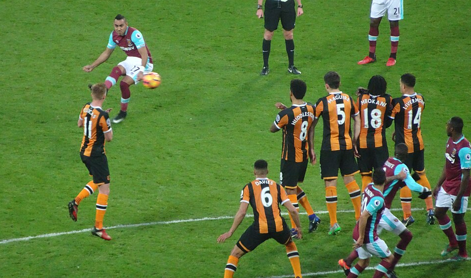
<em>Hull City's last venture into the top flight saw them relegated in 2016/17.</em>
:::

In last week's [article](https://johnknightstats.substack.com/p/which-statistics-best-predict-future) I looked at which statistics were the best predictors of future performance in the Premier League. One of the comments was from [porterhouse26](https://substack.com/@databetweenthelines) who asked about modelling **promoted teams**, so I thought I would take a look at that along with doing the same for **relegated teams** and the **Championship**.

Again we will start with a **correlation matrix** looking how each stat correlates with each other stat from one Championship season to the next; the black-outlined cells show how stats correlate with themselves.

::: {.centered-block}
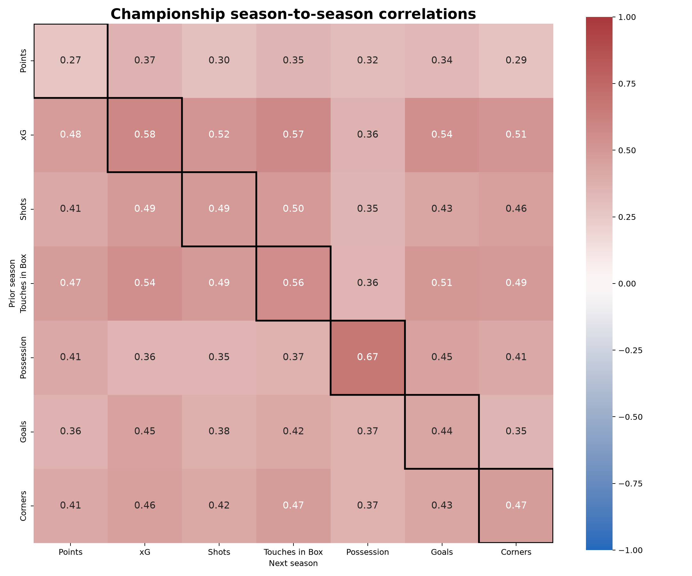
:::

We can immediately see that there is less correlation from one year to the next in the Championship than in the Premier League. The highest correlation is once again found in **possession**, but it is only 0.67 for Championship teams compared to 0.88 in the Premier League. In fact the lowest correlation anywhere in the Premier League grid was 0.68, showing that the Premier League is a lot more stable and predictable than the Championship is.

::: {.centered-block}
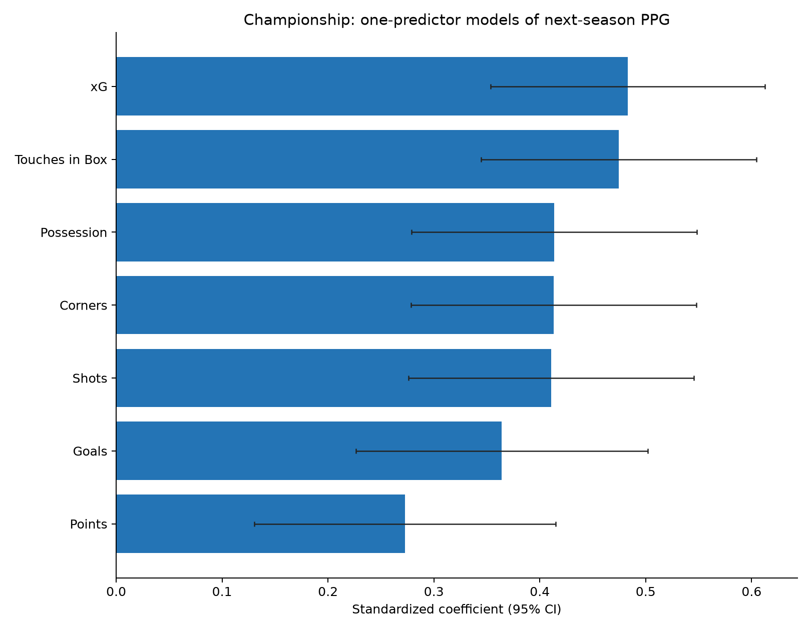
:::

Similar to the Premier League, the univariate regressions find **xG** and **touches in the box** to be the best predictors of the following year's points-per-game (PPG) in the Championship. However, in the three multivariable models shown below, **xG** and **possession** are the two strongest predictors.

I wouldn't read too much into this because there is a lot of overlap between the variables. As a general rule it seems like if you include some measure of shot quality (goals or xG) and some measure of dominance (touches in the box orpossession) then you are most of the way there. 

::: {.centered-block}
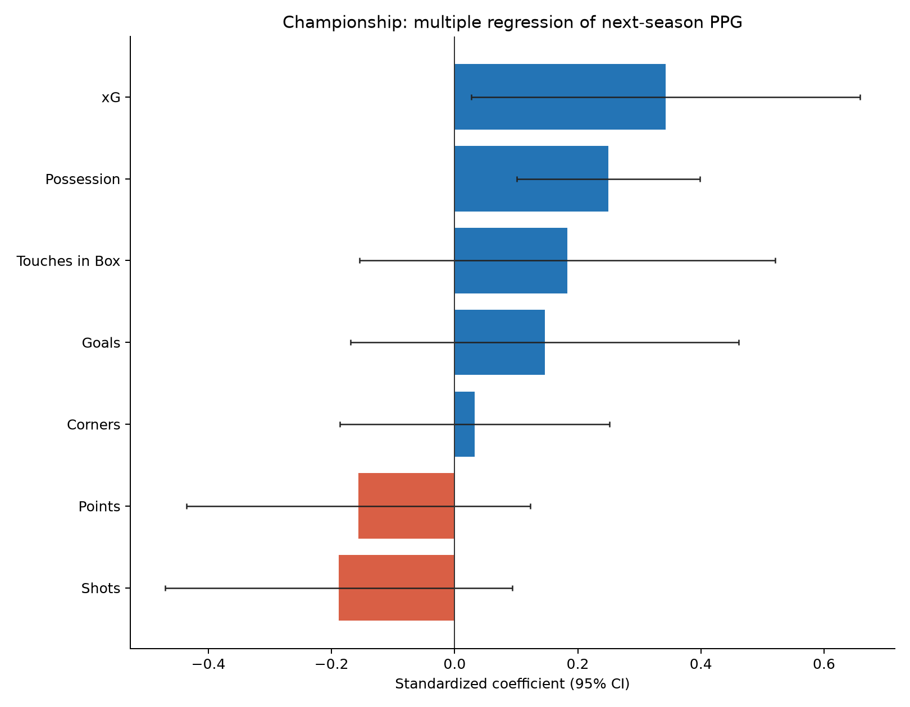
:::

::: {.centered-block}
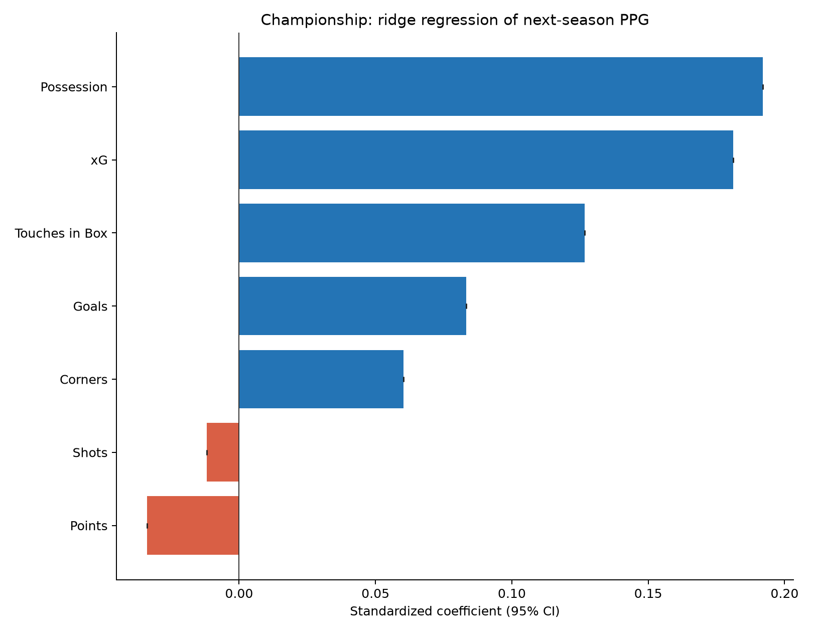
:::

::: {.centered-block}
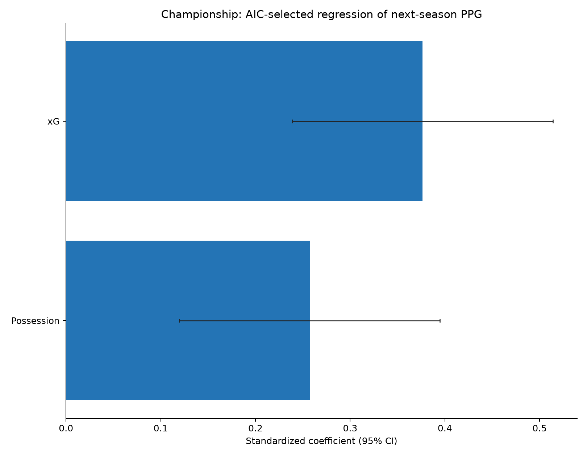
:::

Using an average of these three multivariable models, we can forecast the PPG for all Championship teams in previous seasons. Then, for those who got promoted, we can look at the difference between their PPG in the Premier League and the PPG forecast by the model, and calculate the average effect of promotion. We can also do the same for relegated Premier League teams using last week's models. The net result is that relegated teams are expected to improve by **0.71** PPG and promoted teams are expected to get worse by **0.77** PPG.

::: {.centered-block}
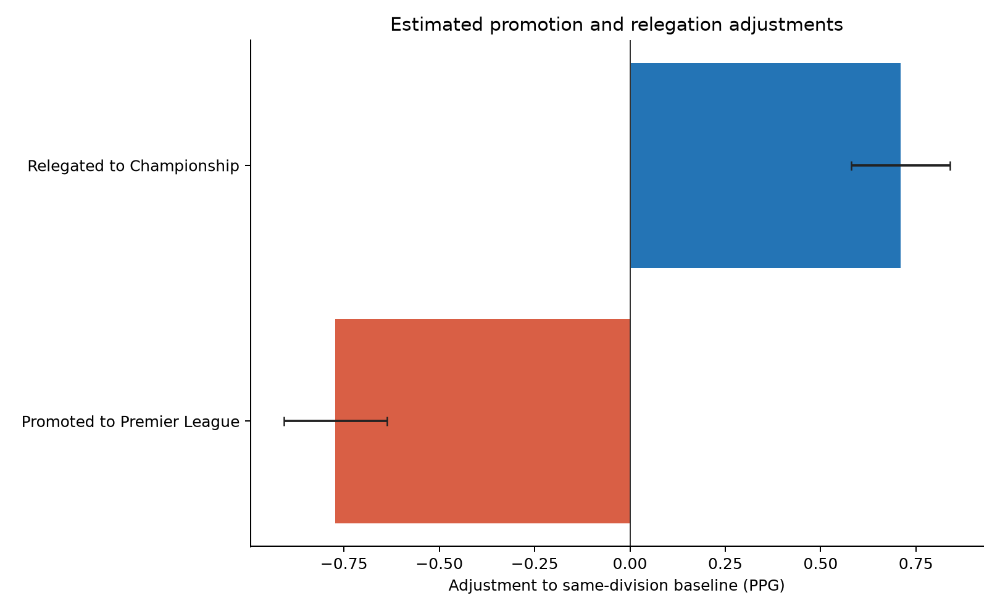
:::

Using these models and the baseline adjustments, we can forecast the number of points for the three promoted teams next season. **Hull City** fans may wish to look away now.

::: {.centered-block}
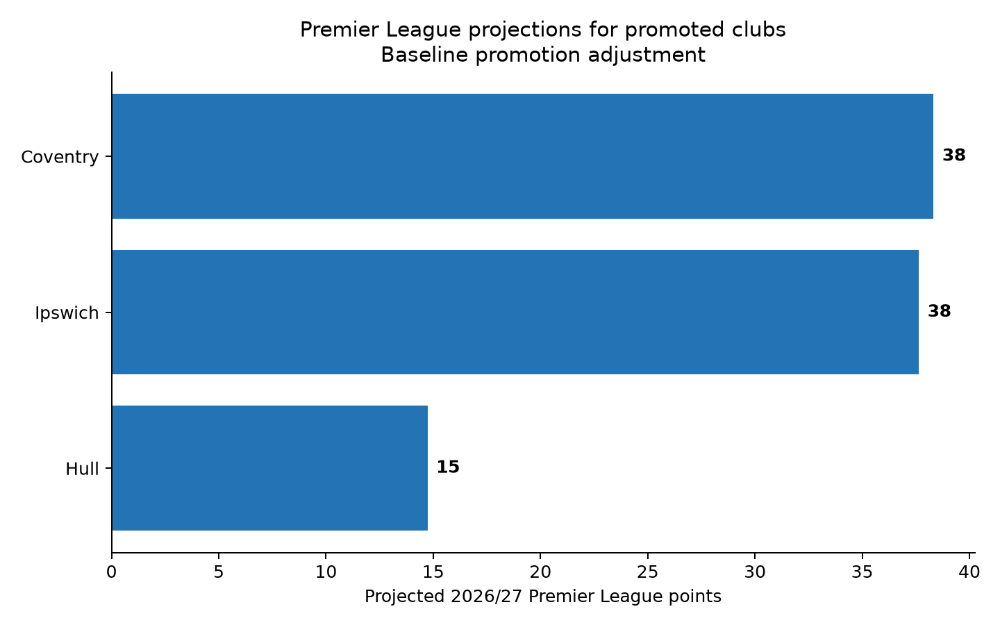
:::

Why are Hull (15 points) rated so much worse than **Coventry City** (38) and **Ipswich Town** (38)? Let's compare the stats of all the promoted Championship teams going back to 2016/17.


```{r}
#| echo: false
#| warning: false
#| message: false

library(readr)
library(dplyr)
library(gt)

read_csv(
  "promoted_premier_league_teams.csv",
  col_types = cols(
    season = col_character(),
    actual_points = col_character(),
    .default = col_guess()
  )
) |>
  arrange(desc(baseline_forecast_points)) |>
  select(
    season,
    team,
    championship_ppg,
    xg_differential_per_game,
    shot_differential_per_game,
    goal_differential_per_game,
    corner_differential_per_game,
    possession_percent,
    touches_in_box_percent,
    baseline_forecast_points,
    actual_points
  ) |>
  gt() |>
  cols_label(
    season = "Season",
    team = "Team",
    championship_ppg = "PPG",
    xg_differential_per_game = "xG Diff",
    shot_differential_per_game = "Shot Diff",
    goal_differential_per_game = "Goal Diff",
    corner_differential_per_game = "Corner Diff",
    possession_percent = "Possession %",
    touches_in_box_percent = "Box-touch %",
    baseline_forecast_points = "Forecast",
    actual_points = "Actual"
  ) |>
  fmt_number(
    columns = c(
      championship_ppg,
      xg_differential_per_game,
      shot_differential_per_game,
      goal_differential_per_game,
      corner_differential_per_game
    ),
    decimals = 2
  ) |>
  fmt_number(
    columns = c(
      possession_percent,
      touches_in_box_percent,
      baseline_forecast_points
    ),
    decimals = 1
  ) |>
  tab_options(
    table.width = pct(100),
    table.font.size = px(12),
    data_row.padding = px(3)
  )
```

Hull's stats really are astonishingly poor for a promoted side. They are the only team with a negative xG difference (-0.33 per game) and less than 50% of touches in the box in their games. This model forecasts them only **14.7 points**; the second-lowest projection was Cardiff City with 25.8 points in 2018/19. 

One question I raised in my reply to porterhouse26 was whether certain *types* of team are better-suited to doing well after promotion. I looked at four stats covering two characteristics:

1. How attack-minded is the team? (Total Goals, Total xG)
2. Do they like to dominate the ball & territory? (Possession %, Touches in the Box %)

Each of these variables was added on its own to the existing model to see how it changed the PPG forecast.

::: {.centered-block}
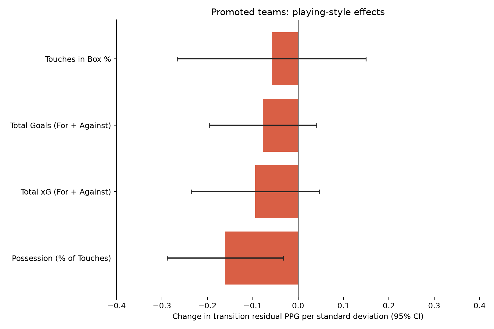
:::

All four variables were associated with a decrease in PPG. The largest decrease was in teams with high possession %, and this was the only variable that improved the existing forecast when added to the model. This result is intuitive, because a team that is built to dominate possession against inferior teams may have to learn a completely new playing style when facing superior opposition.

I'm always wary of overfitting, so I used a nested cross-validation to find a shrinkage-weighted coefficient to include this additional possession adjustment in an enhanced model version. Let's see how this adjustment affects the three teams' projections:

::: {.centered-block}
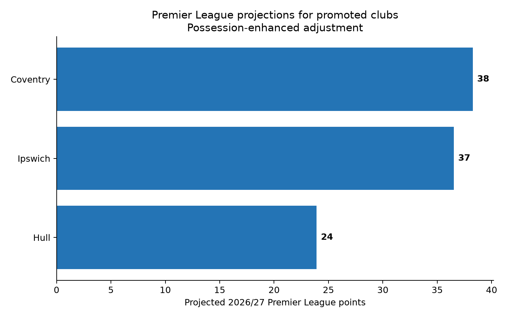
:::

The possession-enhanced model drastically boosts Hull's projection from 15 points up to 24, which is about where the betting markets have them. Ironically, the fact Hull were so bad last year may work in their favour to some extent because they are used to defending!

We can also see how the possession adjustment changes the forecasts for all the promoted teams in previous seasons:

```{r}
#| label: tbl-promoted-teams-enhanced
#| tbl-cap: "Promoted Premier League teams and their prior Championship statistics"
#| echo: false
#| warning: false
#| message: false

library(readr)
library(dplyr)
library(gt)

read_csv(
  "promoted_premier_league_teams.csv",
  col_types = cols(
    season = col_character(),
    actual_points = col_character(),
    .default = col_guess()
  )
) |>
  arrange(desc(possession_enhanced_forecast_points)) |>
  select(
    season,
    team,
    championship_ppg,
    xg_differential_per_game,
    shot_differential_per_game,
    goal_differential_per_game,
    corner_differential_per_game,
    possession_percent,
    touches_in_box_percent,
    baseline_forecast_points,
    possession_enhanced_forecast_points,
    actual_points
  ) |>
  gt() |>
  cols_label(
    season = "Season",
    team = "Team",
    championship_ppg = "PPG",
    xg_differential_per_game = "xG Diff",
    shot_differential_per_game = "Shot Diff",
    goal_differential_per_game = "Goal Diff",
    corner_differential_per_game = "Corner Diff",
    possession_percent = "Possession %",
    touches_in_box_percent = "Box-touch %",
    baseline_forecast_points = "Baseline Forecast",
    possession_enhanced_forecast_points = "New Forecast",
    actual_points = "Actual"
  ) |>
  fmt_number(
    columns = c(
      championship_ppg,
      xg_differential_per_game,
      shot_differential_per_game,
      goal_differential_per_game,
      corner_differential_per_game
    ),
    decimals = 2
  ) |>
  fmt_number(
    columns = c(
      possession_percent,
      touches_in_box_percent,
      baseline_forecast_points,
      possession_enhanced_forecast_points
    ),
    decimals = 1
  ) |>
  tab_options(
    table.width = pct(100),
    table.font.size = px(12),
    data_row.padding = px(3)
  )
```

It's clear that some of the most possession-heavy Championship teams had disappointing seasons after getting promoted. The two highest possession teams were Russell Martin's **Southampton** (61.9%) who got just 12 points, and Vincent Kompany's **Burnley** (61.1%) who got 24 points. In fact, of the top 10 promoted teams with the highest possession % in the Championship, only **Leeds** in 2020/21 and **Fulham** in 2022/23 outperformed their baseline forecast.

At the opposite end, recent evidence can point to **Sunderland** who got promoted through the playoffs with just **49.4%** average possession across the Championship season then stunned everyone by qualifying for the Europa League with 54 points. 

What about relegated teams? Is there a type of relegated team that tends to perform well in the Championship?

::: {.centered-block}
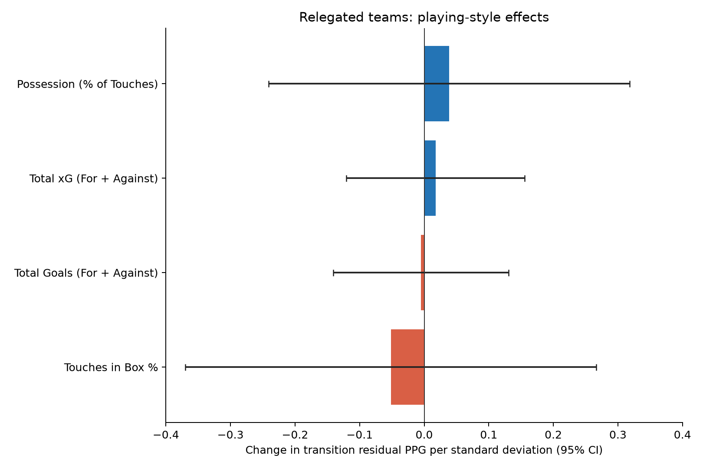
:::

The evidence would suggest not. The coefficients are much smaller than those for promoted teams, and none of these variables improves the model. This suggests that multiple playing styles can work well in the Championship. Or, more simply, it could be because relegated teams quite often change manager after a disappointing season so their style may be different anyway, whereas promoted teams generally stick with the same manager unless he is poached by a bigger club. 

Given that the playing style enhancements don't add any value, we can use our baseline model to project next year's Championship, including the three relegated teams. The teams promoted from League One are missing because I don't yet have League One in my database, but I'm working on that.

::: {.centered-block}
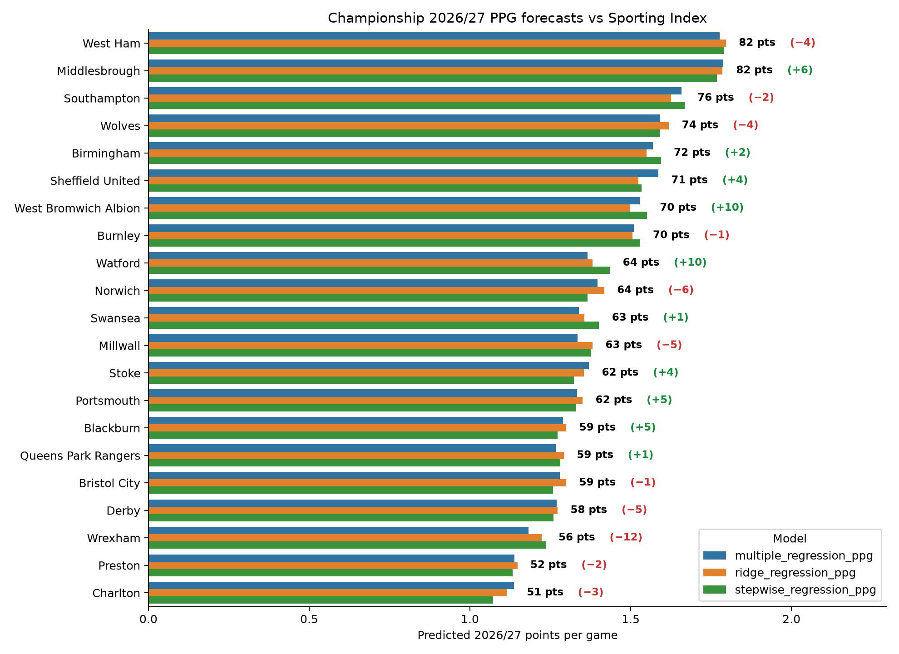
<em>*Note that neither the projection nor the Sporting Index spread account for Southampton's points deduction.</em>
:::

I don't follow the Championship as closely as I follow the Premier League, so I'm not going to get into the weeds of why some of these teams have a projection higher or lower than the betting markets. **Middlesbrough** immediately leap out; one might expect that any team that is overprojected by the model has perhaps been weakened in the summer transfer market, but in Boro's case it seems to be the opposite. According to [Transfermarkt](https://www.transfermarkt.us/championship/transfers/wettbewerb/GB2?saison_id=2026&s_w=s) they are the Championship's third-biggest biggest net spenders, headlined by the arrival of centre-forward **Will Lankshear** from Spurs. Boro seem like a solid buy at 76.5 points and decent value at 10/1 to win the division.

Two other teams where the model is bullish are **West Brom** and **Watford**. I'm not intending this newsletter to start being a tipping service, and I have no idea about these teams to be honest; I think it's just interesting to take note and look for reasons in the disparity. I'd be interested if anyone who follows the Championship more closely than me can explain why the markets might differ from my model on these two teams. 

Conversely, **Wrexham** are hugely underrated by the model relative to the spreads. This could be due to a public overrating of the Hollywood-owned club, but they have some wealthy backers and one of my maxims is you should try not to swim against the tide. It seems much more likely that Wrexham's next division change is upwards rather than downwards.

**West Ham** feel like a squad that are miles too good for this division but these can often be trappy mug bets and this is where a numeric model-driven projection is really good at giving you discipline. Are West Ham right to be sub-2/1 favourites for the Championship? Debatable. Could you justify backing them because you think they should be *even shorter* than that? It feels like a big leap, and while they have done well to clear up a large proportion of their financial deficit via the big-money sales of **Mateus Fernandes** and **Crysencio Summerville**, let's not ignore the fact that those two players may have been a large reason why West Ham's attack was pretty good in the latter half of last season. Not to mention, the window hasn't closed yet and it would be no surprise if the impressive **Taty Castellanos** has departed by the end of August.

The saying "all models are wrong, but some are useful" is often heard in statistical circles and it really is a phrase worth taking to heart. None of the projections in this article should be taken too literally because there are a ton of factors not accounted for (e.g. summer transfers). But often the most important part of modelling is not so much the projection but understanding how the model got to that projection, and then using your domain knowledge to assess whether or not that's something the wider market may have missed. That's what makes a model useful. 



© 2026 John Knight. All rights reserved.