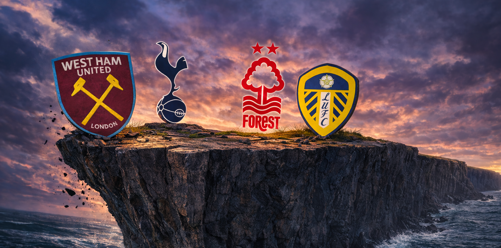

::: {.centered-block}

:::

The last two relegation battles in the Premier League have been dull. In both seasons, the three promoted teams have gone straight back down, and it wasn't especially close. This year looks far more interesting, and here I will take a look at the four teams vying for the final spot - **West Ham**, **Tottenham**, **Nottingham Forest** and **Leeds** - and assess the pros and cons for each of them.

Mathematically, Burnley and Wolves are both still in the race, but the task at hand looks unlikely given they have been comfortably the worst two teams in the league this season. So I will gloss over these two teams and assume they are down - if not, it would really throw a cat among the pigeons!

Ordinarily, if West Ham or Forest got relegated it would be a pretty big story given the money they have spent and the talent they have on the books. But of course, these stories have been dwarfed by the descent of Tottenham Hotspur into the relegation battle—potentially the biggest relegation in English football history given the financial muscle of the 'big six' clubs in the modern Premier League era.

### Current table, xG and bookmaker odds

```{r}
library(dplyr)
library(readr)
library(knitr)
library(kableExtra)

IN_CSV  <- path.expand("~/projects/johnknightstats.github.io/posts/relegation-candidates/table_summary.csv")
OUT_DIR <- path.expand("~/projects/johnknightstats.github.io/posts/relegation-candidates/datawrapper")
OUT_CSV <- file.path(OUT_DIR, "table_summary.csv")

dir.create(OUT_DIR, recursive=TRUE, showWarnings=FALSE)

tbl <- read_csv(IN_CSV, show_col_types=FALSE) %>%
  mutate(
    `Rel.%`=round(`Rel.%`, 1)
  ) %>%
  rename("xGD (Fotmob)" = "xGD Fotmob",
         "xGD (Understat)" = "xGD Understat")

write_csv(tbl, OUT_CSV)

tbl %>%
  kbl(
    align = c("l", rep("c", ncol(tbl)-1)),
    table.attr = 'style="width:auto; table-layout:auto;"'
  ) %>%
  kable_styling(
    full_width=FALSE,
    bootstrap_options=c("condensed"),
    position="left"
  ) %>%
  row_spec(0, bold=TRUE)
```

<br>Only one point separates Forest and West Ham from Spurs, with Leeds a further two points ahead. According to the xG on both Fotmob and Understat, as well as my [contexG](https://johnknightstats.substack.com/p/introducing-contexg) model, Leeds have been comfortably the best of the four teams over the season. Interestingly, the betting markets currently have Forest as only 23% to be relegated despite being on the same points as West Ham (35.5%) and one behind Spurs (35.1%). Why would this be the case? It can only really be two broad factors: Forest are better than the other teams, or Forest have an easier fixture list than the other teams. Let's dig into both of those possibilities.

```{r}
#| label: rolling-opponent-adjusted-contexg
#| warning: false
#| message: false
#| fig-width: 9
#| fig-height: 5.5

library(dplyr)
library(readr)
library(ggplot2)
library(zoo)
library(scales)

# --- input ---
in_csv <- path.expand("~/projects/johnknightstats.github.io/posts/relegation-candidates/contexg_attack_defence_team_by_match_premier_league.csv")

df <- read_csv(in_csv, show_col_types = FALSE) %>%
  mutate(
    date = as.Date(date),
    is_home = as.integer(is_home)
  )

# --- 1) mean home advantage across the season ---
home_advantage <- df %>%
  filter(is_home == 1) %>%
  summarise(home_advantage = mean(contexg_diff, na.rm = TRUE)) %>%
  pull(home_advantage)

# --- 2) home-adjust contexg_diff for each match ---
df_adj <- df %>%
  mutate(
    contexg_diff_home_adj = case_when(
      is_home == 1 ~ contexg_diff - home_advantage,
      is_home == 0 ~ contexg_diff + home_advantage,
      TRUE ~ NA_real_
    )
  )

# --- 3) mean home-adjusted contexg_diff for each team ---
team_means <- df_adj %>%
  group_by(team_name) %>%
  summarise(
    mean_contexg_diff_home_adj = mean(contexg_diff_home_adj, na.rm = TRUE),
    .groups = "drop"
  )

# --- 4) opponent-adjusted contexg_diff for each game ---
# interpreted as:
# opponent-adjusted match value = home-adjusted match contexg_diff
#                                 + opponent's overall mean home-adjusted contexg_diff
df_plot <- df_adj %>%
  left_join(
    team_means %>%
      rename(
        opponent_name = team_name,
        opponent_mean_contexg_diff = mean_contexg_diff_home_adj
      ),
    by = "opponent_name"
  ) %>%
  mutate(
    contexg_diff_opp_adj = contexg_diff_home_adj + opponent_mean_contexg_diff
  )

# --- 5) rolling 10-match mean for selected teams ---
plot_data <- df_plot %>%
  filter(team_name %in% c("Leeds", "Nottingham Forest", "Tottenham", "West Ham")) %>%
  arrange(team_name, date) %>%
  group_by(team_name) %>%
  mutate(
    match_num = row_number(),
    rolling_10_opp_adj = rollapply(
      contexg_diff_opp_adj,
      width = 10,
      FUN = mean,
      align = "right",
      fill = NA_real_,
      partial = 5,
      na.rm = TRUE
    ),
    rolling_10_opp_adj = if_else(match_num < 5, NA_real_, rolling_10_opp_adj)
  ) %>%
  ungroup()

ggplot(plot_data, aes(x = match_num, y = rolling_10_opp_adj, color = team_name)) +
  geom_hline(yintercept = 0, linewidth = 0.5, color = "grey60") +
  geom_line(linewidth = 1.1, na.rm = TRUE) +
  scale_color_manual(
    values = c(
      "Leeds" = "#FFCD00",              # yellow
      "Nottingham Forest" = "#DD0000", # red
      "Tottenham" = "#FFFFFF",         # white
      "West Ham" = "#7A263A"           # claret
    )
  ) +
  scale_x_continuous(
    breaks = pretty_breaks(),
    limits = c(1, NA)
  ) +
  scale_y_continuous(
    limits = c(-1.2,1)
  ) +
  labs(
    x = "match #",
    y = "contexG",
    color = NULL,
    title = "ContexG - Premier League 2025-26",
    subtitle = "10-match rolling average (opponent-adjusted)"
  ) +
  theme_minimal(base_size = 12) +
  theme(
    legend.position = "top",
    legend.text = element_text(face = "bold", size=12),
    panel.grid.major=element_line(color="grey85"),
    panel.grid.minor=element_blank(),
    panel.background=element_rect(fill="grey90", color=NA),
    plot.background=element_rect(fill="grey90", color=NA)
  )
```

The above chart shows a rolling 10-match contexG average for each team across the season so far. West Ham had been dreadful for most of the season, some distance behind the other three, but the upturn in form since the new year has been dramatic and they are trending towards being a mid-table calibre side.

Leeds started slowly with Daniel Farke's position in jeopardy, but since Farke switched to a back three system at half-time in the Manchester City away game they have consistently performed at a mid-table level or perhaps even better.

Thomas Frank fooled everyone when Spurs were desperately unlucky not to win the UEFA Super Cup against PSG, and then won their first two league games including a comfortable 2-0 victory at Man City. After that false dawn, Spurs have been bad, as in bad *for Spurs*. But more recently they have been bad by anyone's standards: new manager **Igor Tudor** has overseen awful performances in defeats to Arsenal and Fulham, while the latest defeat against Crystal Palace is harder to assess due to the decisive penalty & red card in the first half. 

Forest, with their third attempt of the season at getting a new manager bounce, showed some promised with a defeat at home to Liverpool that was widely considered unfortunate, but they followed that up with a limp defeat at Brighton and then a point at Man City after being heavily outplayed. Maybe Vitor Pereira will turn them around, but I don't think we have really seen the evidence so far.

```{r}
library(dplyr)
library(readr)
library(knitr)
library(kableExtra)

in_csv <- path.expand("~/projects/johnknightstats.github.io/posts/relegation-candidates/contexg_attack_defence_team_by_match_premier_league.csv")
out_dir <- path.expand("~/projects/johnknightstats.github.io/posts/relegation-candidates/datawrapper")
out_csv <- file.path(out_dir, "table_summary_contexg.csv")

dir.create(out_dir, recursive=TRUE, showWarnings=FALSE)

df <- read_csv(in_csv, show_col_types=FALSE) %>%
  mutate(
    date=as.Date(date),
    is_home=as.integer(is_home)
  )

teams_of_interest <- c("Leeds", "Nottingham Forest", "Tottenham", "West Ham")

manager_dates <- tibble(
  team_name=c("Leeds", "Nottingham Forest", "Tottenham", "West Ham"),
  manager_start=as.Date(c("2025-08-01", "2026-02-15", "2026-02-13", "2025-09-27"))
)

# --- mean home advantage across the season ---
home_advantage <- df %>%
  filter(is_home==1) %>%
  summarise(home_advantage=mean(contexg_diff, na.rm=TRUE)) %>%
  pull(home_advantage)

# --- home-adjusted match values ---
df1 <- df %>%
  mutate(
    contexg_home_adj=case_when(
      is_home==1 ~ contexg_diff - home_advantage,
      is_home==0 ~ contexg_diff + home_advantage,
      TRUE ~ NA_real_
    )
  )

# --- team means used for opponent adjustment ---
team_means_raw <- df1 %>%
  group_by(team_name) %>%
  summarise(team_mean_raw=mean(contexg_diff, na.rm=TRUE), .groups="drop")

team_means_home_adj <- df1 %>%
  group_by(team_name) %>%
  summarise(team_mean_home_adj=mean(contexg_home_adj, na.rm=TRUE), .groups="drop")

# --- opponent-adjusted values ---
df2 <- df1 %>%
  left_join(
    team_means_raw %>%
      rename(opponent_name=team_name, opp_mean_raw=team_mean_raw),
    by="opponent_name"
  ) %>%
  left_join(
    team_means_home_adj %>%
      rename(opponent_name=team_name, opp_mean_home_adj=team_mean_home_adj),
    by="opponent_name"
  ) %>%
  mutate(
    contexg_opp_adj_raw=contexg_diff + opp_mean_raw,
    contexg_opp_adj_home=contexg_home_adj + opp_mean_home_adj
  )

tbl <- df2 %>%
  filter(team_name %in% teams_of_interest) %>%
  left_join(manager_dates, by="team_name") %>%
  group_by(team_name) %>%
  summarise(
    `Season`=mean(contexg_opp_adj_home, na.rm=TRUE),
    `Home`=mean(contexg_opp_adj_raw[is_home==1], na.rm=TRUE),
    `Away`=mean(contexg_opp_adj_raw[is_home==0], na.rm=TRUE),
    `Since Jan 1st`=mean(contexg_opp_adj_home[date>=as.Date("2026-01-01")], na.rm=TRUE),
    `Current manager`=mean(contexg_opp_adj_home[date>=first(manager_start)], na.rm=TRUE),
    .groups="drop"
  ) %>%
  mutate(
    `Season`=round(`Season`, 2),
    `Home`=round(`Home`, 2),
    `Away`=round(`Away`, 2),
    `Since Jan 1st`=round(`Since Jan 1st`, 2),
    `Current manager`=round(`Current manager`, 2)
  ) %>%
  arrange(match(team_name, teams_of_interest)) %>%
  rename(Team=team_name)

write_csv(tbl, out_csv)

tbl %>%
  kbl(
    align=c("l", rep("c", ncol(tbl)-1)),
    col.names=colnames(tbl)
  ) %>%
  add_header_above(c("contexG Summary, Premier League 2025-26"=ncol(tbl))) %>%
  kable_styling(
    full_width=FALSE,
    bootstrap_options=c("condensed"),
    position="left"
  ) %>%
  row_spec(0, bold=TRUE)
```

<br>Recent form can also be seen in the above table via the average contexG since January 1st (this number is opponent-adjusted). Forest are the worst of the four teams (-0.53) although Spurs' woeful three games under Igor Tudor (-1.11) make them the worst team in terms of very-recent form. It is interesting to note that despite West Ham's dramatic improvement, Leeds still rate more highly since the new year (-0.02).

There are notable differences in the **home:away split** for each team across the season. This may not come as a huge surprise, but Forest (0.93 difference) and Leeds (0.75 difference) rely far more on their home support than Spurs (0.15) and West Ham (0.39).

The Hammers, of course, suffer from having the stands miles from the pitch at the London Stadium. I don't know to what extent that explains their poor home form, but I can confidently state that this will continue to be a handicap for the remainder of the season and beyond. 

Spurs are a more interesting case. The [new stadium effect](https://doi.org/10.1080/1612197X.2022.2078855) has been analysed elsewhere, but I think Spurs have mostly suffered from playing in front of a fanbase that is accustomed to watching much better football. Anything that goes wrong has been accompanied by groans, boos, and chants against the manager or the board. But at no point did Spurs fans consider the team to be in a relegation battle until very recently, and despite severe misgivings about the general direction of the club, there is surely a sense that they need to get behind the team now as they fight this unfamiliar relegation battle. So it's *possible* that Spurs' home advantage may increase a little for the crucial remaining home games.

### Which team has the worst injuries?

I have framed this section as a question, but you already know the answer of course. For the third season in a row, Spurs have experience a horrendous injury crisis. This has weakened the "it's because of Postecoglou's tactics" theory but strengthened those in the  "it's because of Tottenham's medical staff" camp.

As a statistician, I always start from a default position that it could be a fluke. But at this point, with respect to the relegation battle, it doesn't especially matter *why* Spurs have a lot of injuries. What matters is: who is currently out, and when are they due back?

```{r}
in_csv <- path.expand("~/projects/johnknightstats.github.io/posts/relegation-candidates/spurs_injuries.csv")
out_dir <- path.expand("~/projects/johnknightstats.github.io/posts/relegation-candidates/datawrapper")
out_csv <- file.path(out_dir, "spurs_injuries.csv")

dir.create(out_dir, recursive=TRUE, showWarnings=FALSE)

df <- read_csv(in_csv, show_col_types=FALSE)

write_csv(df, out_csv)

df %>%
  kbl(
    align=c("l", rep("c", ncol(df)-1)),
    col.names=colnames(df)
  ) %>%
  add_header_above(c("Tottenham unavailable players"=ncol(df))) %>%
  kable_styling(
    full_width=FALSE,
    bootstrap_options=c("condensed"),
    position="left"
  ) %>%
  row_spec(0, bold=TRUE)
```

<br>The injured players and estimated return dates are taken from [Premier Injuries](https://www.premierinjuries.com/injury-table.php). Following the Liverpool away game, and barring any new injuries, Spurs could have all of Romero, Van de Ven, Danso, Porro and Udogie available, which would be a huge upgrade over recent lineups. A few weeks later, the return of Mohammed Kudus would inject some dynamism into the forward line; Spurs haven't won a single game since Kudus went off injured on the 4th of January.

How do the other three teams compare? West Ham have no injury concerns as their only injured player (other than 40-year-old reserve keeper Lukasz Fabianski) was Pablo, who is now back in training. Likewise, Leeds are only mising one player, Noah Okafor, who is potentially due back for their next match.

Nottingham Forest have a few more players out. Goalkeeper John Victor and defender Nicolo Savona are both out for the season. Stefan Ortega missed the last two games with a minor injury and will compete with Matz Sels for the goalkeeper's jersey. 34-year-old striker Chris Wood has been out since October with a knee injury and is listed as possibly returning in April, while the veteran defender Will Boly has no return date and is a non-factor. But in terms of first-team players, they are basically all healthy.

There is also a word of caution for Spurs regarding suspensions. **Cristian Romero**, who has already missed six games this season through suspension, currently has eight yellow cards. If he gets to 10 yellow cards by game 32 (i.e. two bookings in the next three games), he would receive an additional two-game suspension. So Romero may need to rein in the tackling a bit, although that is like telling a cat not to chase mice.

### Remaining Fixtures, Premier League 2025-26

```{r}
#| warning: false
#| message: false

library(dplyr)
library(readr)
library(tidyr)
library(scales)
library(purrr)
library(knitr)
library(kableExtra)

# --- input files ---
season_csv <- path.expand("~/projects/johnknightstats.github.io/posts/relegation-candidates/contexg_attack_defence_team_by_match_premier_league.csv")
fixtures_csv <- path.expand("~/projects/johnknightstats.github.io/posts/relegation-candidates/remaining_fixtures.csv")

teams_of_interest <- c("Leeds","Nottingham Forest","Tottenham","West Ham")

# --- season data ---
season_df <- read_csv(season_csv, show_col_types=FALSE) %>%
  mutate(
    date=as.Date(date),
    is_home=as.integer(is_home)
  )

# mean home advantage across the season
home_advantage <- season_df %>%
  filter(is_home==1) %>%
  summarise(home_advantage=mean(contexg_diff, na.rm=TRUE)) %>%
  pull(home_advantage)

# opponent season-long contexg_diff
team_strength <- season_df %>%
  group_by(team_name) %>%
  summarise(
    season_contexg=mean(contexg_diff, na.rm=TRUE),
    .groups="drop"
  )

# --- abbreviation map ---
team_abbrev <- c(
  "Crystal Palace"="C Palace",
  "Nottingham Forest"="N Forest",
  "Aston Villa"="A Villa",
  "Manchester City"="Man City",
  "Manchester United"="Man Utd",
  "Newcastle United"="Newcastle",
  "Wolverhampton Wanderers"="Wolves"
)

# --- remaining fixtures ---
fixtures_df <- read_csv(fixtures_csv, show_col_types=FALSE) %>%
  mutate(match_date_utc=as.Date(match_date_utc))

home_rows <- fixtures_df %>%
  filter(home_team_name %in% teams_of_interest) %>%
  transmute(
    match_date_utc,
    team_name=home_team_name,
    opponent_name=away_team_name,
    is_home=1L
  )

away_rows <- fixtures_df %>%
  filter(away_team_name %in% teams_of_interest) %>%
  transmute(
    match_date_utc,
    team_name=away_team_name,
    opponent_name=home_team_name,
    is_home=0L
  )

remaining_long <- bind_rows(home_rows, away_rows) %>%
  left_join(
    team_strength %>%
      rename(opponent_name=team_name, opponent_season_contexg=season_contexg),
    by="opponent_name"
  ) %>%
  mutate(
    difficulty=if_else(
      is_home==1L,
      opponent_season_contexg - home_advantage,
      opponent_season_contexg + home_advantage
    ),
    opponent_label=recode(opponent_name, !!!team_abbrev, .default=opponent_name),
    opponent_label=paste0(opponent_label, if_else(is_home==1L, " (H)", " (A)"))
  ) %>%
  arrange(team_name, match_date_utc, opponent_name) %>%
  group_by(team_name) %>%
  mutate(match_num=row_number()+29L) %>%
  ungroup()

# --- wide display and numeric tables ---
display_wide <- remaining_long %>%
  select(match_num, team_name, opponent_label) %>%
  pivot_wider(names_from=team_name, values_from=opponent_label)

diff_wide <- remaining_long %>%
  select(match_num, team_name, difficulty) %>%
  pivot_wider(names_from=team_name, values_from=difficulty)

max_matches <- max(remaining_long$match_num, na.rm=TRUE)

display_wide <- tibble(`Match #`=30:max_matches) %>%
  left_join(display_wide, by=c("Match #"="match_num"))

diff_wide <- tibble(`Match #`=30:max_matches) %>%
  left_join(diff_wide, by=c("Match #"="match_num"))

# --- mean row ---
mean_display <- remaining_long %>%
  group_by(team_name) %>%
  summarise(mean_difficulty=mean(difficulty, na.rm=TRUE), .groups="drop") %>%
  mutate(label=sprintf("%.2f", mean_difficulty)) %>%
  select(team_name, label) %>%
  pivot_wider(names_from=team_name, values_from=label) %>%
  mutate(`Match #`="Average") %>%
  relocate(`Match #`)

mean_diff <- remaining_long %>%
  group_by(team_name) %>%
  summarise(mean_difficulty=mean(difficulty, na.rm=TRUE), .groups="drop") %>%
  select(team_name, mean_difficulty) %>%
  pivot_wider(names_from=team_name, values_from=mean_difficulty) %>%
  mutate(`Match #`="Average") %>%
  relocate(`Match #`)

display_tbl <- display_wide %>%
  mutate(`Match #`=as.character(`Match #`)) %>%
  bind_rows(mean_display) %>%
  select(`Match #`, all_of(teams_of_interest))

color_tbl <- diff_wide %>%
  mutate(`Match #`=as.character(`Match #`)) %>%
  bind_rows(mean_diff) %>%
  select(`Match #`, all_of(teams_of_interest))

# --- color function ---
all_vals <- unlist(color_tbl[,teams_of_interest], use.names=FALSE)
all_vals <- all_vals[is.finite(all_vals)]

fill_fn <- col_numeric(
  palette=c("#2E7D32", "#F7F7F7", "#C62828"),
  domain=c(-1.3, 1.3)
)

# --- helper to color cells ---
style_cell <- function(label, value, bold=FALSE) {
  if (is.na(label)) return("")
  bg <- if (is.na(value)) "#FFFFFF" else fill_fn(value)
  fw <- if (bold) "bold" else "normal"
  cell_spec(
    label,
    format="html",
    background=bg,
    color="black",
    bold=bold,
    extra_css=paste0(
      "display:block;",
      "padding:4px 6px;",
      "border-radius:4px;",
      "font-weight:", fw, ";"
    )
  )
}

# --- build styled table ---
styled_tbl <- display_tbl

for (team in teams_of_interest) {
  styled_tbl[[team]] <- map2_chr(
    display_tbl[[team]],
    color_tbl[[team]],
    ~ style_cell(.x, .y, bold=(display_tbl$`Match #`[which(display_tbl[[team]]==.x & color_tbl[[team]]==.y)[1]]=="Average"))
  )
}

# safer explicit mean-row restyle
mean_row_idx <- which(styled_tbl$`Match #`=="Average")

for (team in teams_of_interest) {
  styled_tbl[[team]][mean_row_idx] <- style_cell(
    display_tbl[[team]][mean_row_idx],
    color_tbl[[team]][mean_row_idx],
    bold=TRUE
  )
}

# --- render table ---
styled_tbl %>%
  kbl(
    escape=FALSE,
    align=c("c","c","c","c","c"),
    col.names=c("Match #","Leeds","Nottingham Forest","Tottenham","West Ham")
  ) %>%
  kable_styling(
    full_width=FALSE,
    bootstrap_options=c("condensed"),
    position="left"
  ) %>%
  row_spec(0, bold=TRUE) %>%
  column_spec(1, width = "70px")
```

<br>The colour scale and the average difficulties in the above table are calculated based on the season-long contexG ratings for each PL team. According to the numbers, West Ham have the most difficult fixtures (average opponent strength: +0.11) while Leeds have the easiest (-0.20). 

Of course, as the season reaches its conclusion, the difficulty of the last few fixtures can vary dramatically based on the **opposition's incentive** or lack thereof. With the European places likely to go down to 8th place it is hard to forecast who this may benefit. If Arsenal can wrap up the title with three games remaining, West Ham's game against them becomes a lot easier, especially coming off the back of the Champions League semi-final second leg. West Ham and Leeds play each other in the final game, a potential relegation showdown, but more likely than not one of them will be safe by that point.

An additional element to each team's fixture list is participation in **cup competitions** - Spurs and Forest are still in Europe, while Leeds and West Ham are still in the FA Cup.

It will be interesting to see how teams balance these competitions given the financial importance of maintaining Premier League status. The extra prestige and revenue associated with European competition, plus the fact it has two-legged ties, make that potentially a bigger distraction than the FA Cup. Spurs face Atletico Madrid in the **Champions League** and are rated around a 30% chance to qualify, in which case they would face Newcastle or Barcelona in the quarter finals. Forest's odds of progressing in the **Europa League** are much higher; they are 70% favourites to get past Midtjylland after which they would play Porto or Stuttgart, with teams like Roma and Aston Villa awaiting them in the semis.

In the **FA Cup**, Leeds are cruising past Norwich at the time of publishing, while West Ham are underdogs on Monday night at home to Brentford. The six teams already qualified for the quarter finals are a polarised set: big guns Arsenal, Man City, Liverpool and Chelsea, plus Southampton from the Championship and then Port Vale who are rock bottom of League One. So there is potential for a deep run with a kind draw.

Finally, there are three **head-to-head** fixtures between the relegation contenders. Spurs host Forest on the 22nd of March, then they host Leeds on the 9th of May. Although home advantage hasn't been strong for Spurs, Forest & Leeds have both been dramatically worse away than at home, so it should be an advantage to play both rivals in London. The other head-to-head is West Ham v Leeds on the final day, but it's hard to know how the table will look by then. 

### Summary of the outlook for each team

**Leeds United** appear to have comfortably the best outlook of the four teams. More points on the board, the easiest remaining fixtures, and arguably they have been the best of the teams this season.

**Tottenham Hotspur** probably have the most uncertainty over how good they are likely to be between now and the end of the season. If current form continues then they have no chance, but with players returning it seems plausible that Igor Tudor could mould them into a serviceable team, especially with the increased motivation of a very real relegation battle and the threat of [50% pay reductions](https://www.nytimes.com/athletic/7080564/2026/03/02/tottenham-relegation-clauses-player-contracts/) for all players. There is also the looming possibility of Spurs [rolling the dice again](https://www.telegraph.co.uk/football/2026/03/06/tottenham-weigh-up-second-manager-in-month-igor-tudor/) on a new manager bounce. 

Despite being the lowest of the four teams in the table, **West Ham United**'s outlook looks positive given the recent upturn in performances. The fact they were so dreadful earlier in the season now works as an advantage of sorts, as the vibes are good and momentum is behind them—the reverse of Spurs. The only lingering doubt is that the early season form still has to be factored in to an extent, and a return to those performances cannot be ruled out, especially if they cannot maintain the squad's recent impeccable injury record. They also have the toughest set of fixtures and may be heavily reliant on winning the three easier home games.

The most intriguing of the four teams are **Nottingham Forest**, whose relegation odds are significantly longer than those of West Ham and Spurs, but I am struggling to see how this is justified. On the face of it, this is a talented squad containing the likes of **Morgan Gibbs-White**, **Elliot Anderson** and **Murillo**, all of whom have been linked with moves to bigger clubs. But Anderson and Gibbs-White have played in every match this season, while Murillo has missed only eight games; and yet Forest have been pretty bad all season, begging the question of how good that trio really are, or whether the rest of the team is especially weak. The fact Forest are on their **fourth manager of the season** also implies it is less likely that there is some sort of untapped potential that Pereira may be able to bring to life. They additionally face the possible burden of up to seven Europa League matches, and like West Ham, they have a fairly clean injury record that isn't guaranteed to continue.

If I hadn't looked at the market I would probably make Forest favourites to go down. Have I missed something obvious? I would love to hear your thoughts if you disagree with my analysis. But it should be an interesting relegation battle with plenty of twists & turns, and the drama will be magnified given Spurs' involvement. 



© 2026 John Knight. All rights reserved.