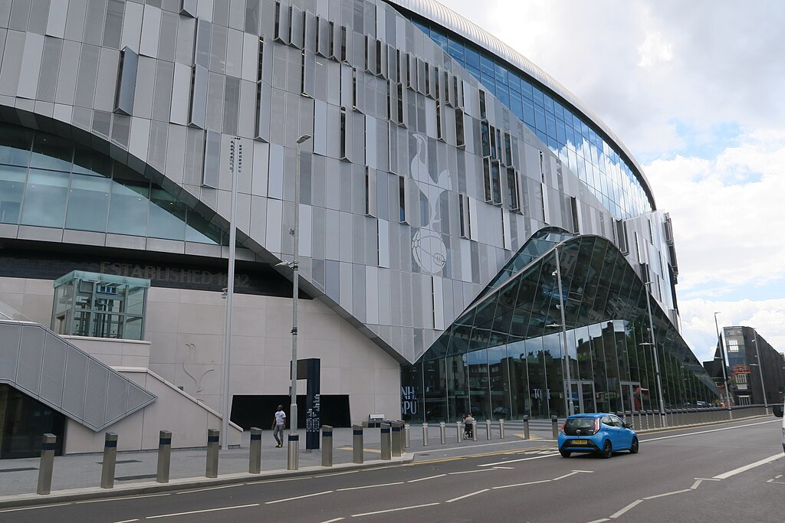
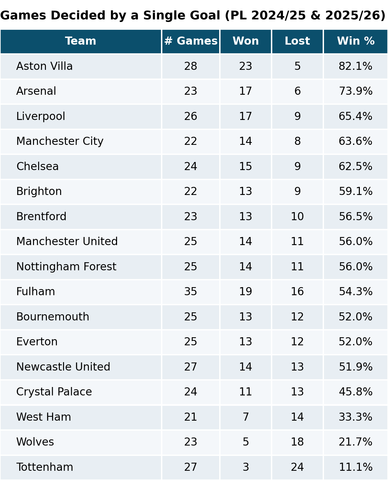

::: {.centered-block}

<em>Arguably the best in Britain, Tottenham Hotspur stadium could this year be hosting two NFL games, Bad Bunny, and...Preston North End?</em>
:::

Tottenham Hotspur are in a fairly dire state at the moment. Following yesterday's 2-1 defeat at Fulham, which extended a run of 10 league games without a win, they find themselves only four points above the relegation zone. At time of writing, betting exchange midpoints give them an 18.3% probability of going down.

```{r}
# --- PL table on 2 Mar, 2026 ---
library(dplyr)
library(readr)
library(gt)

IN_CSV  <- path.expand("~/projects/johnknightstats.github.io/posts/spurs-relegation/table_20260302.csv")
OUT_DIR <- path.expand("~/projects/johnknightstats.github.io/posts/spurs-relegation/datawrapper")
OUT_CSV <- file.path(OUT_DIR, "table_20260302.csv")

dir.create(OUT_DIR, recursive = TRUE, showWarnings = FALSE)

tbl <- read_csv(IN_CSV, show_col_types = FALSE)

write_csv(tbl, OUT_CSV)

n_rows <- nrow(tbl)
third_from_bottom <- n_rows - 2  # 3rd-from-bottom row index

tbl %>%
  gt() %>%
  
  # Remove any row striping by forcing white background
  tab_style(
    style = cell_fill(color = "white"),
    locations = cells_body(rows = everything(), columns = everything())
  ) %>%
  
  # Bold column labels
  tab_style(
    style = cell_text(weight = "bold"),
    locations = cells_column_labels(columns = everything())
  ) %>%
  
  # Center numeric columns
  cols_align(
    align = "center",
    columns = c(Posn, P, Pts, GD, `Relegation %`)
  ) %>%
  
  # Style Tottenham row
  tab_style(
    style = list(
      cell_text(weight = "bold", color = "navyblue")
    ),
    locations = cells_body(
      rows = Team == "Tottenham"
    )
  ) %>%
  
  # Thicker line above 3rd-from-bottom row
  tab_style(
    style = cell_borders(
      sides = "top",
      color = "darkred",
      weight = px(3),
      style = "dashed"
    ),
    locations = cells_body(
      rows = third_from_bottom
    )
  ) %>%
  
  tab_header(
    title = "Premier League Table",
    subtitle = "2 Mar, 2026"
  ) %>%
  tab_options(
    row.striping.include_table_body = FALSE,
    row.striping.include_stub = FALSE
  )
```

One thing in Spurs' favour is their superior goal difference of -5 compared to Nottingham Forest (-15) and West Ham (-20). It's striking that teams could be so close together in the table with vastly different goal differences; the reason for this is Spurs' astonishingly poor record in games decided by a single goal. Since the start of the 2024-25 season, Spurs have won only three games by a single goal, and **lost 24**. 

::: {.centered-block .max-70}

:::

Typically, goal or point difference is viewed as a reasonable indicator of team strength in various sports, and teams that lose a lot of close games can be considered unfortunate. On the other hand, the habit of continually losing by the odd goal could be viewed as evidence of mental weakness in the Spurs squad. It's probably some combination of the two.

A big problem for Spurs is that the team in 18th place, **West Ham**, seem to have dramatically improved their form in the last couple of months. Below is a chart showing West Ham's [contexG](https://substack.com/home/post/p-189499113) in each game across the season, with the black line indicating a 5-game rolling average. They've been a genuinely awful team for most of the season, but are now playing more like a mid-table side.

::: {.centered-block}

:::

Tottenham it seems, are trending in the opposite direction. They've been disappointing by Spurs standards, and the style of football has been fairly miserable. But they were still playing football of a higher calibre than relegation contenders...until recently. Ominously, rather than inspiring the fabled "new manager bounce", the arrival of Igor Tudor has seen Spurs produce two of their worst performances all season: the home spanking by local rivals Arsenal, and the limp defeat at Fulham. 

::: {.centered-block}

:::

The third team in the thick of the battle are Forest who, aside from a couple of glimpses, have been pretty bad all season.

::: {.centered-block}

:::

It's not very often a club the size of Spurs gets into the relegation mix. The last time they dropped out of the top flight was 1977, and they bounced back at the first time of asking. Since then, there have been three seasons where Spurs flirted with the relegation zone to varying degrees - all in the 1990s.

I made an R Shiny app that calculates the league table on any given date, so I looked for the date in each season where Spurs were in the most danger.

## 1992: No Gazza, no glory

```{r}
# --- PL table on 21 March, 1992  ---
library(dplyr)
library(readr)
library(gt)

IN_CSV  <- path.expand("~/projects/johnknightstats.github.io/posts/spurs-relegation/table_19920321.csv")
OUT_DIR <- path.expand("~/projects/johnknightstats.github.io/posts/spurs-relegation/datawrapper")
OUT_CSV <- file.path(OUT_DIR, "table_19920321.csv")

dir.create(OUT_DIR, recursive = TRUE, showWarnings = FALSE)

tbl <- read_csv(IN_CSV, show_col_types = FALSE)

write_csv(tbl, OUT_CSV)

n_rows <- nrow(tbl)
third_from_bottom <- n_rows - 2  # 3rd-from-bottom row index

tbl %>%
  gt() %>%
  
  # Remove any row striping by forcing white background
  tab_style(
    style = cell_fill(color = "white"),
    locations = cells_body(rows = everything(), columns = everything())
  ) %>%
  
  # Bold column labels
  tab_style(
    style = cell_text(weight = "bold"),
    locations = cells_column_labels(columns = everything())
  ) %>%
  
  # Center numeric columns
  cols_align(
    align = "center",
    columns = c(Posn, P, Pts, GD)
  ) %>%
  
  # Style Tottenham row
  tab_style(
    style = list(
      cell_text(weight = "bold", color = "navyblue")
    ),
    locations = cells_body(
      rows = Team == "Tottenham"
    )
  ) %>%
  
  # Thicker line above 3rd-from-bottom row
  tab_style(
    style = cell_borders(
      sides = "top",
      color = "darkred",
      weight = px(3),
      style = "dashed"
    ),
    locations = cells_body(
      rows = third_from_bottom
    )
  ) %>%
  
  tab_header(
    title = "Premier League Table",
    subtitle = "21 Mar, 1992"
  ) %>%
  tab_options(
    row.striping.include_table_body = FALSE,
    row.striping.include_stub = FALSE
  )
```

I'm not sure Tottenham were ever in massive danger of relegation in 1992. It was a 42-game season then, and the worst position they got into was still four points ahead of Luton with three games in hand. It was a tough season for Spurs as Paul Gascoigne had suffered a season-long injury in the previous year's FA Cup final; the pre-agreed transfer to Lazio still went ahead, but only after his recovery, and Spurs desperately needed the money to patch over some serious financial issues.

In typical Spurs fashion, they had Gary Lineker up front who won the footballer of the year award, but the defence was of a much lower calibre. They ended up in 15th, 10 points clear of the drop, as English football entered the new Premier League era.

## 1994: Big win at Oldham

```{r}
# --- PL table on 4 May 1994 ---
library(dplyr)
library(readr)
library(gt)

IN_CSV  <- path.expand("~/projects/johnknightstats.github.io/posts/spurs-relegation/table_19940504.csv")
OUT_DIR <- path.expand("~/projects/johnknightstats.github.io/posts/spurs-relegation/datawrapper")
OUT_CSV <- file.path(OUT_DIR, "table_19940504.csv")

dir.create(OUT_DIR, recursive = TRUE, showWarnings = FALSE)

tbl <- read_csv(IN_CSV, show_col_types = FALSE)

write_csv(tbl, OUT_CSV)

n_rows <- nrow(tbl)
third_from_bottom <- n_rows - 2  # 3rd-from-bottom row index

tbl %>%
  gt() %>%
  
  # Remove any row striping by forcing white background
  tab_style(
    style = cell_fill(color = "white"),
    locations = cells_body(rows = everything(), columns = everything())
  ) %>%
  
  # Bold column labels
  tab_style(
    style = cell_text(weight = "bold"),
    locations = cells_column_labels(columns = everything())
  ) %>%
  
  # Center numeric columns
  cols_align(
    align = "center",
    columns = c(Posn, P, Pts, GD)
  ) %>%
  
  # Style Tottenham row
  tab_style(
    style = list(
      cell_text(weight = "bold", color = "navyblue")
    ),
    locations = cells_body(
      rows = Team == "Tottenham"
    )
  ) %>%
  
  # Thicker line above 3rd-from-bottom row
  tab_style(
    style = cell_borders(
      sides = "top",
      color = "darkred",
      weight = px(3),
      style = "dashed"
    ),
    locations = cells_body(
      rows = third_from_bottom
    )
  ) %>%
  
  tab_header(
    title = "Premier League Table",
    subtitle = "4 May, 1994"
  ) %>%
  tab_options(
    row.striping.include_table_body = FALSE,
    row.striping.include_stub = FALSE
  )
```

1994 was one of the most dramatic final days I can remember in the relegation battle, with numerous teams in the mix. Everton survived thanks to a miraculous comeback at home to Wimbledon and some, let's just say questionable goalkeeping from Hans Segers. Sheffield United were relegated after they conceded a last-minute goal at Chelsea.

It was an injury-ravaged season for Spurs under new manager Ossie Ardiles, most notably Teddy Sheringham missing several months, and they had a dismal second half of the season that included a seven-match losing streak.

Spurs were in amongst it with two games left and faced a penultimate match on Thursday night away to fellow strugglers Oldham Athletic on their plastic pitch. Goals from Vinny Samways and David Howells gave Spurs a 2-0 win and assured them of safety going into the last game - a good thing, because they lost that one at home to QPR. They ended up in 15th, only three points clear of the drop. 

## 1998: Klinsmann to the rescue

```{r}
# --- PL table on 18 April, 1998 ---
library(dplyr)
library(readr)
library(gt)

IN_CSV  <- path.expand("~/projects/johnknightstats.github.io/posts/spurs-relegation/table_19980418.csv")
OUT_DIR <- path.expand("~/projects/johnknightstats.github.io/posts/spurs-relegation/datawrapper")
OUT_CSV <- file.path(OUT_DIR, "table_19980418.csv")

dir.create(OUT_DIR, recursive = TRUE, showWarnings = FALSE)

tbl <- read_csv(IN_CSV, show_col_types = FALSE)

write_csv(tbl, OUT_CSV)

n_rows <- nrow(tbl)
third_from_bottom <- n_rows - 2  # 3rd-from-bottom row index

tbl %>%
  gt() %>%
  
  # Remove any row striping by forcing white background
  tab_style(
    style = cell_fill(color = "white"),
    locations = cells_body(rows = everything(), columns = everything())
  ) %>%
  
  # Bold column labels
  tab_style(
    style = cell_text(weight = "bold"),
    locations = cells_column_labels(columns = everything())
  ) %>%
  
  # Center numeric columns
  cols_align(
    align = "center",
    columns = c(Posn, P, Pts, GD)
  ) %>%
  
  # Style Tottenham row
  tab_style(
    style = list(
      cell_text(weight = "bold", color = "navyblue")
    ),
    locations = cells_body(
      rows = Team == "Tottenham"
    )
  ) %>%
  
  # Thicker line above 3rd-from-bottom row
  tab_style(
    style = cell_borders(
      sides = "top",
      color = "darkred",
      weight = px(3),
      style = "dashed"
    ),
    locations = cells_body(
      rows = third_from_bottom
    )
  ) %>%
  
  tab_header(
    title = "Premier League Table",
    subtitle = "18 Apr, 1998"
  ) %>%
  tab_options(
    row.striping.include_table_body = FALSE,
    row.striping.include_stub = FALSE
  )
```

Tottenham's poor start to the 1997-98 season saw the end of Gerry Francis, and chairman Alan Sugar decided to hop on the emerging trend of looking overseas for a new manager. Not a bad plan overall, but in typical Sugar fashion he didn't quite get it right, bringing in Christian Gross from Switzerland who memorably waved around a tube ticket in his first press conference to emphasise his "man of the people" credentials. It was all a bit forced, and Gross just never had the personality to win over the fans or the players.

Famously, Spurs legend **Jurgen Klinsmann** was persuaded to rejoin the club in the twilight of his career to help save them from relegation. With three games to go, Spurs were only two points ahead of safety, but they beat Newcastle 2-0 at White Hart Lane, Klinsmann scoring the opener, before he grabbed four goals in a 6-2 win at Wimbledon that ensured them of beating the drop. Klinsmann cemented his status as a club legend, and Spurs finished up in 14th place, four points clear of the relegation zone.

## Final thoughts

If Tottenham Hotspur do end up going down, it would probably be considered the biggest relegation in English football history. While Manchester United were relegated in 1974 only six years after winning the European Cup, there was more parity in English football back then. The financial advantage enjoyed by the Premier League's "big six" clubs would seemingly immunise them from the spectre of relegation, and Spurs in particular would have expected the income from their spectacular new stadium would make the struggles of the 1990s a thing of the past. Evidently not.

The Premier League just gets more and more competitive. English clubs are taken over by wealthy foreign benefactors - Chelsea, Manchester City, Aston Villa, Newcastle - who pump in billions to fast-track their team up the table. In addition you have traditional minnows like Brighton and Brentford, who clearly have an enormous edge in the transfer market thanks to their sharp owners' analytic prowess, forged over many years in the gambling markets. 

That just leaves less and less room for the dross that would form a large chunk of the division 20 years ago, and there isn't as much wiggle room for a team that parlays bad recruitment, plus an injury crisis, plus some dice rolls going the wrong way. Even if Spurs do manage to stay up, both West Ham and Forest have expensively-assembled squads and plenty of players that would get picked up by big clubs in the summer. It's a tough league!

Next for Spurs is Thursday night at home to Crystal Palace. It could be described as a must-win, or maybe a must-not-lose, and certainly a must-not-play-as-badly-as-the-last-two-games. It's incredible to think Igor Tudor's position could already be in jeopardy, but if Spurs think another managerial change would slightly improve their odds of avoiding a catastrophic relegation, then they would surely consider it. I wonder if Jurgen Klinsmann is available?