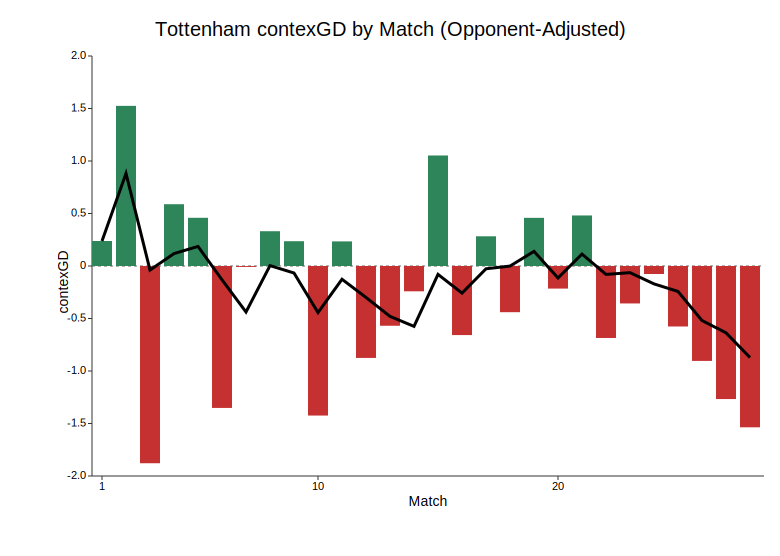

Tottenham Hotspur are in a fairly dire state at the moment. Following yesterday's 2-1 defeat at Fulham, which extended a run of 10 league games without a win, they find themselves only four points above the relegation zone. At current exchange midpoints, they are given an 18.3% probability of going down.

```{r}
# --- PL table on 2 Mar, 2026 ---
library(dplyr)
library(readr)
library(gt)

IN_CSV  <- path.expand("~/projects/johnknightstats.github.io/posts/spurs-relegation/table_20260302.csv")
OUT_DIR <- path.expand("~/projects/johnknightstats.github.io/posts/spurs-relegation/datawrapper")
OUT_CSV <- file.path(OUT_DIR, "table_20260302.csv")

dir.create(OUT_DIR, recursive = TRUE, showWarnings = FALSE)

tbl <- read_csv(IN_CSV, show_col_types = FALSE)

write_csv(tbl, OUT_CSV)

n_rows <- nrow(tbl)
third_from_bottom <- n_rows - 2  # 3rd-from-bottom row index

tbl %>%
  gt() %>%
  
  # Remove any row striping by forcing white background
  tab_style(
    style = cell_fill(color = "white"),
    locations = cells_body(rows = everything(), columns = everything())
  ) %>%
  
  # Bold column labels
  tab_style(
    style = cell_text(weight = "bold"),
    locations = cells_column_labels(columns = everything())
  ) %>%
  
  # Center numeric columns
  cols_align(
    align = "center",
    columns = c(Posn, P, Pts, GD, `Relegation %`)
  ) %>%
  
  # Style Tottenham row
  tab_style(
    style = list(
      cell_text(weight = "bold", color = "navyblue")
    ),
    locations = cells_body(
      rows = Team == "Tottenham"
    )
  ) %>%
  
  # Thicker line above 3rd-from-bottom row
  tab_style(
    style = cell_borders(
      sides = "top",
      color = "darkred",
      weight = px(3),
      style = "dashed"
    ),
    locations = cells_body(
      rows = third_from_bottom
    )
  ) %>%
  
  tab_header(
    title = "Premier League Table",
    subtitle = "2 Mar, 2026"
  ) %>%
  tab_options(
    row.striping.include_table_body = FALSE,
    row.striping.include_stub = FALSE
  )
```

One thing in Spurs' favour is their superior goal difference of -5 compared to Nottingham Forest (-15) and West Ham (-20). It's striking that teams could be so close together in the table with vastly different goal differences; the reason for this is Spurs' astonishingly poor record in games decided by a single goal. Since the start of the 2024-25 season, Spurs have *enter stat here*. 

*Show one-goal table*

Typically, goal or point difference is viewed as a reasonable indicator in various sports, and teams that lose a lot of close games are considered unfortunate. On the other hand, the habit of continually losing by the odd goal could be viewed as evidence of mental weakness in the Spurs squad. It's probably some combination of the two.

A big problem for Spurs is that the team in 18th place, West Ham, seem to have dramatically improved their form in the last couple of months. 

::: {.centered-block}

:::

::: {.centered-block}

:::

::: {.centered-block}

:::

*Injuries & suspensions - compare players currently unavailable and their transfermarkt value*

*Mention R Shiny tool*

*1991-92*

```{r}
# --- PL table on 21 March, 1992  ---
library(dplyr)
library(readr)
library(gt)

IN_CSV  <- path.expand("~/projects/johnknightstats.github.io/posts/spurs-relegation/table_19920321.csv")
OUT_DIR <- path.expand("~/projects/johnknightstats.github.io/posts/spurs-relegation/datawrapper")
OUT_CSV <- file.path(OUT_DIR, "table_19920321.csv")

dir.create(OUT_DIR, recursive = TRUE, showWarnings = FALSE)

tbl <- read_csv(IN_CSV, show_col_types = FALSE)

write_csv(tbl, OUT_CSV)

n_rows <- nrow(tbl)
third_from_bottom <- n_rows - 2  # 3rd-from-bottom row index

tbl %>%
  gt() %>%
  
  # Remove any row striping by forcing white background
  tab_style(
    style = cell_fill(color = "white"),
    locations = cells_body(rows = everything(), columns = everything())
  ) %>%
  
  # Bold column labels
  tab_style(
    style = cell_text(weight = "bold"),
    locations = cells_column_labels(columns = everything())
  ) %>%
  
  # Center numeric columns
  cols_align(
    align = "center",
    columns = c(Posn, P, Pts, GD)
  ) %>%
  
  # Style Tottenham row
  tab_style(
    style = list(
      cell_text(weight = "bold", color = "navyblue")
    ),
    locations = cells_body(
      rows = Team == "Tottenham"
    )
  ) %>%
  
  # Thicker line above 3rd-from-bottom row
  tab_style(
    style = cell_borders(
      sides = "top",
      color = "darkred",
      weight = px(3),
      style = "dashed"
    ),
    locations = cells_body(
      rows = third_from_bottom
    )
  ) %>%
  
  tab_header(
    title = "Premier League Table",
    subtitle = "21 Mar, 1992"
  ) %>%
  tab_options(
    row.striping.include_table_body = FALSE,
    row.striping.include_stub = FALSE
  )
```

*1993-94*

```{r}
# --- PL table on 4 May 1994 ---
library(dplyr)
library(readr)
library(gt)

IN_CSV  <- path.expand("~/projects/johnknightstats.github.io/posts/spurs-relegation/table_19940504.csv")
OUT_DIR <- path.expand("~/projects/johnknightstats.github.io/posts/spurs-relegation/datawrapper")
OUT_CSV <- file.path(OUT_DIR, "table_19940504.csv")

dir.create(OUT_DIR, recursive = TRUE, showWarnings = FALSE)

tbl <- read_csv(IN_CSV, show_col_types = FALSE)

write_csv(tbl, OUT_CSV)

n_rows <- nrow(tbl)
third_from_bottom <- n_rows - 2  # 3rd-from-bottom row index

tbl %>%
  gt() %>%
  
  # Remove any row striping by forcing white background
  tab_style(
    style = cell_fill(color = "white"),
    locations = cells_body(rows = everything(), columns = everything())
  ) %>%
  
  # Bold column labels
  tab_style(
    style = cell_text(weight = "bold"),
    locations = cells_column_labels(columns = everything())
  ) %>%
  
  # Center numeric columns
  cols_align(
    align = "center",
    columns = c(Posn, P, Pts, GD)
  ) %>%
  
  # Style Tottenham row
  tab_style(
    style = list(
      cell_text(weight = "bold", color = "navyblue")
    ),
    locations = cells_body(
      rows = Team == "Tottenham"
    )
  ) %>%
  
  # Thicker line above 3rd-from-bottom row
  tab_style(
    style = cell_borders(
      sides = "top",
      color = "darkred",
      weight = px(3),
      style = "dashed"
    ),
    locations = cells_body(
      rows = third_from_bottom
    )
  ) %>%
  
  tab_header(
    title = "Premier League Table",
    subtitle = "4 May, 1994"
  ) %>%
  tab_options(
    row.striping.include_table_body = FALSE,
    row.striping.include_stub = FALSE
  )
```

*1997-98*


```{r}
# --- PL table on 18 April, 1998 ---
library(dplyr)
library(readr)
library(gt)

IN_CSV  <- path.expand("~/projects/johnknightstats.github.io/posts/spurs-relegation/table_19980418.csv")
OUT_DIR <- path.expand("~/projects/johnknightstats.github.io/posts/spurs-relegation/datawrapper")
OUT_CSV <- file.path(OUT_DIR, "table_19980418.csv")

dir.create(OUT_DIR, recursive = TRUE, showWarnings = FALSE)

tbl <- read_csv(IN_CSV, show_col_types = FALSE)

write_csv(tbl, OUT_CSV)

n_rows <- nrow(tbl)
third_from_bottom <- n_rows - 2  # 3rd-from-bottom row index

tbl %>%
  gt() %>%
  
  # Remove any row striping by forcing white background
  tab_style(
    style = cell_fill(color = "white"),
    locations = cells_body(rows = everything(), columns = everything())
  ) %>%
  
  # Bold column labels
  tab_style(
    style = cell_text(weight = "bold"),
    locations = cells_column_labels(columns = everything())
  ) %>%
  
  # Center numeric columns
  cols_align(
    align = "center",
    columns = c(Posn, P, Pts, GD)
  ) %>%
  
  # Style Tottenham row
  tab_style(
    style = list(
      cell_text(weight = "bold", color = "navyblue")
    ),
    locations = cells_body(
      rows = Team == "Tottenham"
    )
  ) %>%
  
  # Thicker line above 3rd-from-bottom row
  tab_style(
    style = cell_borders(
      sides = "top",
      color = "darkred",
      weight = px(3),
      style = "dashed"
    ),
    locations = cells_body(
      rows = third_from_bottom
    )
  ) %>%
  
  tab_header(
    title = "Premier League Table",
    subtitle = "18 Apr, 1998"
  ) %>%
  tab_options(
    row.striping.include_table_body = FALSE,
    row.striping.include_stub = FALSE
  )
```

If Tottenham Hotspur do end up going down, it would probably be considered the biggest relegation in English football history. While Manchester United were relegated in 1974, only six years after winning the European Cup, there was more parity in English football back then. The financial advantage enjoyed by the Premier League's "big six" clubs would seemingly immunise them from the spectre of relegation, and Spurs in particular would have expected the income from their spectacular new stadium would make the struggles of the 1990s a thing of the past. Evidently not.

The Premier League just gets more and more competitive. English clubs are taken over by wealthy foreign benefactors - Chelsea, Manchester City, Aston Villa, Newcastle - who pump in billions to fast-track their team up the table. In addition you have traditional minnows like Brighton and Brentford, who clearly have an enormous edge in the transfer market thanks to their sharp owners' analytic prowess, forged over many years in the gambling markets. That just leaves less and less room for the dross that would form a large chunk of the division 20 years ago, and there isn't as much wiggle room for a team that parlays bad recruitment, an injury crisis, and some dice rolls going the wrong way. Even if Spurs do manage to stay up, both West Ham and Forest have expensively-assembled squads and plenty of players that would get picked up by big clubs in the summer. It's a tough league!

Next up for Spurs is Thursday night at home to Crystal Palace. It could be described as a must-win, or maybe a must-not-lose, and certainly a must-not-play-as-badly-as-the-last-two-games. It's incredible to think Igor Tudor could already be in jeopardy, but if Spurs think another managerial change would slightly improve their odds of avoiding a catastrophic relegation, then they would surely consider it. I wonder if Jurgen Klinsmann is available?