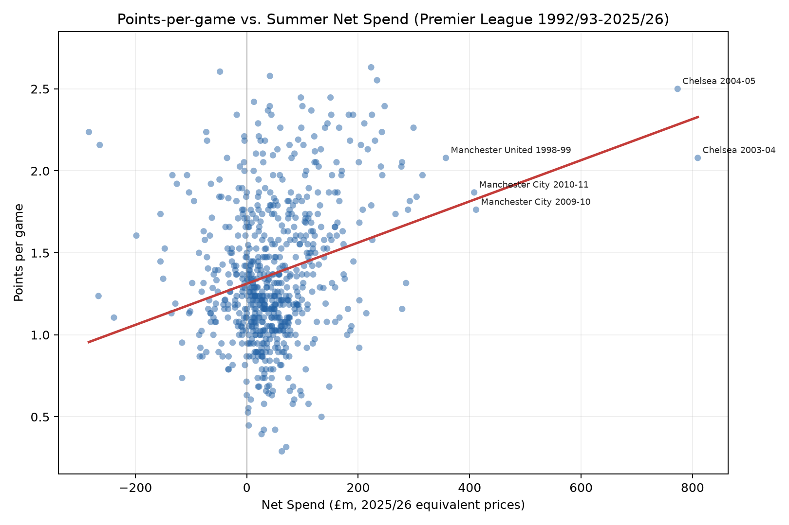
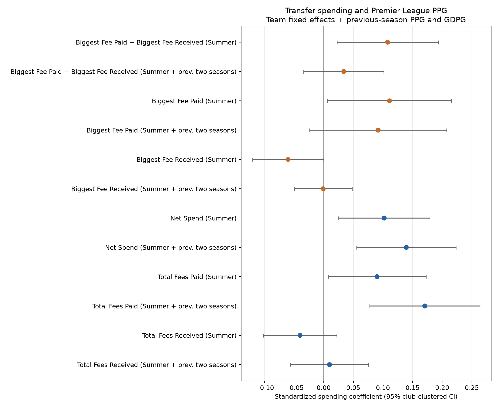
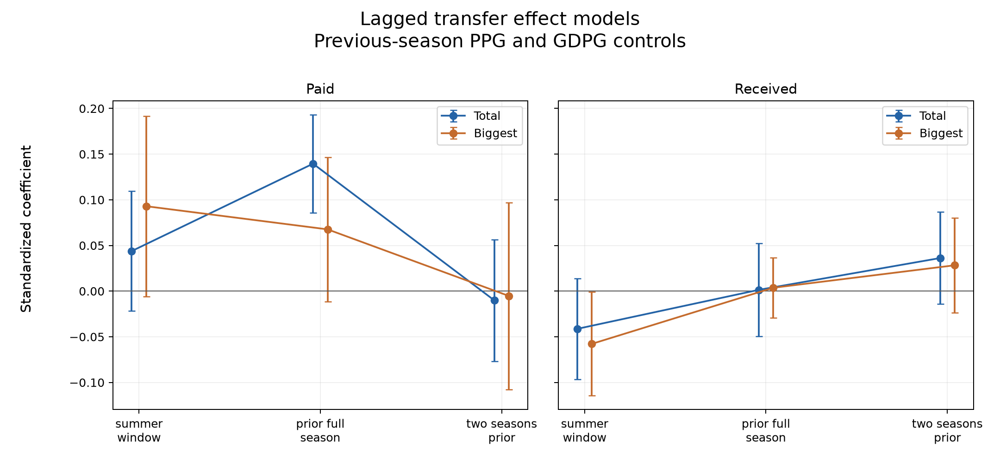

::: {.centered-block}

<em>Fernando Torres made an acrimonious move from Liverpool to Chelsea for £50 million in January 2011. (Wikimedia Commons)</em>
:::


**"Here we go!"** You've got to admit it's a good catchphrase. Transfers are big business in modern football, and transfer news and rumours have become entire careers for some personalities. But how much do transfers really affect future performance? And what is the best way to measure that?

I looked at data from the fantastic website [Transfermarkt](https://www.transfermarkt.co.uk) to compare all transfers in the Premier League since 1992/93. The first challenge was to adjust all transfers for **inflation**. There are different ways to approach this, and they are all fairly arbitrary, but I normalized each transfer as a proportion of the total Premier League signings in that season and then added some smoothing in case there were outlier seasons that skewed the results. The top 10 biggest inflation-adjusted signings by Premier League clubs were as follows:

```{r}
#| echo: false
#| warning: false
#| message: false

library(readr)
library(dplyr)
library(gt)

biggest_signings <- read_csv(
  "premier_league_top10_player_transfers.csv",
  show_col_types = FALSE
)

team_abbreviations <- c(
  # English clubs
  "AFC Bournemouth" = "Bournemouth",
  "Arsenal FC" = "Arsenal",
  "Aston Villa" = "Aston Villa",
  "Barnsley FC" = "Barnsley",
  "Birmingham City" = "Birmingham",
  "Blackburn Rovers" = "Blackburn",
  "Blackpool FC" = "Blackpool",
  "Bolton Wanderers" = "Bolton",
  "Bradford City" = "Bradford",
  "Brentford FC" = "Brentford",
  "Brighton & Hove Albion" = "Brighton",
  "Burnley FC" = "Burnley",
  "Cardiff City" = "Cardiff",
  "Charlton Athletic" = "Charlton",
  "Chelsea FC" = "Chelsea",
  "Colchester United" = "Colchester",
  "Coventry City" = "Coventry",
  "Crewe Alexandra" = "Crewe",
  "Crystal Palace" = "Crystal Palace",
  "Derby County" = "Derby",
  "Everton FC" = "Everton",
  "Fulham FC" = "Fulham",
  "Huddersfield Town" = "Huddersfield",
  "Hull City" = "Hull",
  "Ipswich Town" = "Ipswich",
  "Leeds United" = "Leeds",
  "Leicester City" = "Leicester",
  "Liverpool FC" = "Liverpool",
  "Liverpool FC Reserves" = "Liverpool",
  "Luton Town" = "Luton",
  "Manchester City" = "Man City",
  "Manchester United" = "Man Utd",
  "Middlesbrough FC" = "Middlesbrough",
  "Newcastle United" = "Newcastle",
  "Norwich City" = "Norwich",
  "Nottingham Forest" = "Nott'm Forest",
  "Oldham Athletic" = "Oldham",
  "Portsmouth FC" = "Portsmouth",
  "Queens Park Rangers" = "QPR",
  "Reading FC" = "Reading",
  "Sheffield United" = "Sheff Utd",
  "Sheffield Wednesday" = "Sheff Wed",
  "Southampton FC" = "Southampton",
  "Stoke City" = "Stoke",
  "Sunderland AFC" = "Sunderland",
  "Swansea City" = "Swansea",
  "Swindon Town" = "Swindon",
  "Tottenham Hotspur" = "Tottenham",
  "Watford FC" = "Watford",
  "West Bromwich Albion" = "West Brom",
  "West Ham United" = "West Ham",
  "Wigan Athletic" = "Wigan",
  "Wimbledon FC (- 2004)" = "Wimbledon",
  "Wolverhampton Wanderers" = "Wolves",

  # Other European clubs appearing in the file
  "Ajax Amsterdam" = "Ajax",
  "Anzhi Makhachkala" = "Anzhi",
  "AS Monaco" = "Monaco",
  "Atlético de Madrid" = "Atl. Madrid",
  "Celtic FC" = "Celtic",
  "Club Brugge KV" = "Club Bruges",
  "Dynamo Kyiv" = "Dynamo Kiev",
  "Eintracht Frankfurt" = "Ein. Frankfurt",
  "FC Porto" = "Porto",
  "FK Partizan Belgrade" = "Partizan",
  "Inter Milan" = "Inter",
  "Juventus FC" = "Juventus",
  "Levante UD" = "Levante",
  "Olympique Lyon" = "Lyon",
  "Olympique Marseille" = "Marseille",
  "Rangers FC" = "Rangers",
  "Stade Rennais FC" = "Rennes",
  "Sevilla FC" = "Sevilla",
  "SS Lazio" = "Lazio",
  "SV Austria Salzburg" = "Salzburg",
  "US Palermo" = "Palermo",
  "Vitesse Arnhem" = "Vitesse"
)

abbreviate_team <- function(x) {
  abbreviated <- unname(team_abbreviations[x])
  if_else(is.na(abbreviated), x, abbreviated)
}

biggest_signings |>
  transmute(
    Player = player_name,
    Season = season,
    From = abbreviate_team(from_club),
    To = abbreviate_team(to_club),
    `Adjusted Fee` = method1_adjusted_fee_gbp_2025_26
  ) |>
  gt() |>
  fmt_currency(
    columns = `Adjusted Fee`,
    currency = "GBP",
    decimals = 0
  ) |>
  cols_align(
    align = "left",
    columns = c(Season, Player, From, To)
  ) |>
  cols_align(
    align = "right",
    columns = `Adjusted Fee`
  ) |>
  tab_header(title = "Most Expensive Premier League Signings",
             subtitle = "1992/93 to 2025/26 (inflation-adjusted to 2025/26 prices)")
```

It's surprising for **Rio Ferdinand** (£228m adjusted for inflation) to come out on top, not least because he is a defender. I remember thinking at the time it was a crazy fee (£29m from Leeds in 2002, rising to £33m with add-ons) but he spent the following decade as a mainstay of the Manchester United and England defence, so I think we can safely say Alex Ferguson is a better judge of a player than I am. 

Despite the huge volumes flying around the Premier League in recent years, it is notable that only one transfer in the last 15 seasons (Paul Pogba to Man Utd for inflation-adjusted £160m) makes the top 10. Why is this? I think it's fair to say there haven't been any *seismic* transfers for quite a while. The last couple of summers are a good example: big-money moves have seen Alexander Isak join Liverpool, Elliot Anderson join Manchester City and Morgan Rogers join Chelsea. But these are all typical moves: the best player from a moderate-sized club to a bigger one. 

To imagine a modern equivalent of **Fernando Torres** joining Chelsea (£200m inflation-adjusted), you would have to consider a star forward from a Big Six club forcing a move to another Big Six club. Perhaps Bukayo Saka to Man City — how much would that transfer fee be? And Alan Shearer (£185m inflation-adjusted) was unquestionably the league's best goalscorer when he moved to Newcastle at age 26. What price Erling Haaland if he moved to another Premier League club this summer? 

I'm sure many of you are curious how other big signings stack up when adjusted for inflation. Below is a table showing the biggest adjusted fee paid by each of the 51 clubs who have competed in the Premier League. This will be a head-in-hands moment for fans of certain teams.


```{r}
#| echo: false
#| warning: false
#| message: false

library(readr)
library(dplyr)
library(gt)

biggest_signings <- read_csv(
  "premier_league_biggest_inflation_adjusted_signing_by_club.csv",
  show_col_types = FALSE
)

team_abbreviations <- c(
  # English clubs
  "AFC Bournemouth" = "Bournemouth",
  "Arsenal FC" = "Arsenal",
  "Aston Villa" = "Aston Villa",
  "Barnsley FC" = "Barnsley",
  "Birmingham City" = "Birmingham",
  "Blackburn Rovers" = "Blackburn",
  "Blackpool FC" = "Blackpool",
  "Bolton Wanderers" = "Bolton",
  "Bradford City" = "Bradford",
  "Brentford FC" = "Brentford",
  "Brighton & Hove Albion" = "Brighton",
  "Burnley FC" = "Burnley",
  "Cardiff City" = "Cardiff",
  "Charlton Athletic" = "Charlton",
  "Chelsea FC" = "Chelsea",
  "Colchester United" = "Colchester",
  "Coventry City" = "Coventry",
  "Crewe Alexandra" = "Crewe",
  "Crystal Palace" = "Crystal Palace",
  "Derby County" = "Derby",
  "Everton FC" = "Everton",
  "Fulham FC" = "Fulham",
  "Huddersfield Town" = "Huddersfield",
  "Hull City" = "Hull",
  "Ipswich Town" = "Ipswich",
  "Leeds United" = "Leeds",
  "Leicester City" = "Leicester",
  "Liverpool FC" = "Liverpool",
  "Liverpool FC Reserves" = "Liverpool",
  "Luton Town" = "Luton",
  "Manchester City" = "Man City",
  "Manchester United" = "Man Utd",
  "Middlesbrough FC" = "Middlesbrough",
  "Newcastle United" = "Newcastle",
  "Norwich City" = "Norwich",
  "Nottingham Forest" = "Nott'm Forest",
  "Oldham Athletic" = "Oldham",
  "Portsmouth FC" = "Portsmouth",
  "Queens Park Rangers" = "QPR",
  "Reading FC" = "Reading",
  "Sheffield United" = "Sheff Utd",
  "Sheffield Wednesday" = "Sheff Wed",
  "Southampton FC" = "Southampton",
  "Stoke City" = "Stoke",
  "Sunderland AFC" = "Sunderland",
  "Swansea City" = "Swansea",
  "Swindon Town" = "Swindon",
  "Tottenham Hotspur" = "Tottenham",
  "Watford FC" = "Watford",
  "West Bromwich Albion" = "West Brom",
  "West Ham United" = "West Ham",
  "Wigan Athletic" = "Wigan",
  "Wimbledon FC (- 2004)" = "Wimbledon",
  "Wolverhampton Wanderers" = "Wolves",

  # Other European clubs appearing in the file
  "Ajax Amsterdam" = "Ajax",
  "Anzhi Makhachkala" = "Anzhi",
  "AS Monaco" = "Monaco",
  "Atlético de Madrid" = "Atl. Madrid",
  "Celtic FC" = "Celtic",
  "Club Brugge KV" = "Club Bruges",
  "Dynamo Kyiv" = "Dynamo Kiev",
  "Eintracht Frankfurt" = "Ein. Frankfurt",
  "FC Porto" = "Porto",
  "FK Partizan Belgrade" = "Partizan",
  "Inter Milan" = "Inter",
  "Juventus FC" = "Juventus",
  "Levante UD" = "Levante",
  "Olympique Lyon" = "Lyon",
  "Rangers FC" = "Rangers",
  "Stade Rennais FC" = "Rennes",
  "Sevilla FC" = "Sevilla",
  "SV Austria Salzburg" = "Salzburg",
  "US Palermo" = "Palermo",
  "Vitesse Arnhem" = "Vitesse"
)

abbreviate_team <- function(x) {
  abbreviated <- unname(team_abbreviations[x])
  if_else(is.na(abbreviated), x, abbreviated)
}

biggest_signings |>
  transmute(
    Team = abbreviate_team(to_club),
    Player = player_name,
    Season = season,
    From = abbreviate_team(from_club),
    `Adjusted Fee` = method1_adjusted_fee_gbp_2025_26
  ) |>
  gt() |>
  fmt_currency(
    columns = `Adjusted Fee`,
    currency = "GBP",
    decimals = 0
  ) |>
  cols_align(
    align = "left",
    columns = c(Season, Player, From, Team)
  ) |>
  cols_align(
    align = "right",
    columns = `Adjusted Fee`
  ) |>
  tab_header(title = "Most Expensive Premier League Signing by Club",
             subtitle = "1992/93 to 2025/26 (inflation-adjusted to 2025/26 prices)")
```

I mentioned **Roman Abramovich** above, and his arrival into English football truly was a game-changer. In Abramovich's first two seasons, Chelsea's net spend was equivalent to about £1.5 billion today. The table below shows the top 10 net-spend seasons by Premier League clubs, with Chelsea & Abu Dhabi-owned Manchester City occupying all of the top 8 spots.

```{r}
#| echo: false
#| warning: false
#| message: false

library(readr)
library(dplyr)
library(gt)

biggest_signings <- read_csv(
  "premier_league_top10_single_season_team_totals.csv",
  show_col_types = FALSE
)

team_abbreviations <- c(
  # English clubs
  "AFC Bournemouth" = "Bournemouth",
  "Arsenal FC" = "Arsenal",
  "Aston Villa" = "Aston Villa",
  "Barnsley FC" = "Barnsley",
  "Birmingham City" = "Birmingham",
  "Blackburn Rovers" = "Blackburn",
  "Blackpool FC" = "Blackpool",
  "Bolton Wanderers" = "Bolton",
  "Bradford City" = "Bradford",
  "Brentford FC" = "Brentford",
  "Brighton & Hove Albion" = "Brighton",
  "Burnley FC" = "Burnley",
  "Cardiff City" = "Cardiff",
  "Charlton Athletic" = "Charlton",
  "Chelsea FC" = "Chelsea",
  "Colchester United" = "Colchester",
  "Coventry City" = "Coventry",
  "Crewe Alexandra" = "Crewe",
  "Crystal Palace" = "Crystal Palace",
  "Derby County" = "Derby",
  "Everton FC" = "Everton",
  "Fulham FC" = "Fulham",
  "Huddersfield Town" = "Huddersfield",
  "Hull City" = "Hull",
  "Ipswich Town" = "Ipswich",
  "Leeds United" = "Leeds",
  "Leicester City" = "Leicester",
  "Liverpool FC" = "Liverpool",
  "Liverpool FC Reserves" = "Liverpool",
  "Luton Town" = "Luton",
  "Manchester City" = "Man City",
  "Manchester United" = "Man Utd",
  "Middlesbrough FC" = "Middlesbrough",
  "Newcastle United" = "Newcastle",
  "Norwich City" = "Norwich",
  "Nottingham Forest" = "Nott'm Forest",
  "Oldham Athletic" = "Oldham",
  "Portsmouth FC" = "Portsmouth",
  "Queens Park Rangers" = "QPR",
  "Reading FC" = "Reading",
  "Sheffield United" = "Sheff Utd",
  "Sheffield Wednesday" = "Sheff Wed",
  "Southampton FC" = "Southampton",
  "Stoke City" = "Stoke",
  "Sunderland AFC" = "Sunderland",
  "Swansea City" = "Swansea",
  "Swindon Town" = "Swindon",
  "Tottenham Hotspur" = "Tottenham",
  "Watford FC" = "Watford",
  "West Bromwich Albion" = "West Brom",
  "West Ham United" = "West Ham",
  "Wigan Athletic" = "Wigan",
  "Wimbledon FC (- 2004)" = "Wimbledon",
  "Wolverhampton Wanderers" = "Wolves",

  # Other European clubs appearing in the file
  "Ajax Amsterdam" = "Ajax",
  "Anzhi Makhachkala" = "Anzhi",
  "AS Monaco" = "Monaco",
  "Atlético de Madrid" = "Atl. Madrid",
  "Celtic FC" = "Celtic",
  "Club Brugge KV" = "Club Bruges",
  "Dynamo Kyiv" = "Dynamo Kiev",
  "Eintracht Frankfurt" = "Ein. Frankfurt",
  "FC Porto" = "Porto",
  "FK Partizan Belgrade" = "Partizan",
  "Inter Milan" = "Inter",
  "Juventus FC" = "Juventus",
  "Levante UD" = "Levante",
  "Olympique Lyon" = "Lyon",
  "Olympique Marseille" = "Marseille",
  "Rangers FC" = "Rangers",
  "Stade Rennais FC" = "Rennes",
  "Sevilla FC" = "Sevilla",
  "SS Lazio" = "Lazio",
  "SV Austria Salzburg" = "Salzburg",
  "US Palermo" = "Palermo",
  "Vitesse Arnhem" = "Vitesse"
)

abbreviate_team <- function(x) {
  abbreviated <- unname(team_abbreviations[x])
  if_else(is.na(abbreviated), x, abbreviated)
}

biggest_signings |>
  filter(category == "net_spend") |>
  transmute(
    Team = abbreviate_team(team),
    Season = season,
    `Net Spend (2025/26 Equivalent)` = amount_gbp_2025_26
  ) |>
  gt() |>
  fmt_currency(
    columns = `Net Spend (2025/26 Equivalent)`,
    currency = "GBP",
    decimals = 0
  ) |>
  cols_align(
    align = "left",
    columns = c(Season, Team)
  ) |>
  cols_align(
    align = "right",
    columns = `Net Spend (2025/26 Equivalent)`
  ) |>
  tab_header(title = "Biggest Single-Season Net Spend",
             subtitle = "Premier League 1992/93 to 2025/26 (inflation-adjusted to 2025/26 prices)")
```

Given the obscene levels of spending, it's no surprise that Chelsea and Man City have hoovered up a lot of trophies. I'm not going to pull up any trees by concluding that spending leads to success, but let's try drilling down a bit to see how strongly various spending measures correlate with future team performance.

## Is net spend the best measure? 

An obvious starting point is comparing each team's **net spend** in the summer transfer window with their performance that season, as measured by points-per-game (PPG). Prior to the window's introduction in 2002, I have used the 1st of September as the cut-off.

::: {.centered-block}

:::

As expected, higher net spend is associated with higher PPG, with a Pearson correlation coefficient of 0.26. But is net spend a useful metric? What if we take a separate look at the total fees paid and received by each club? Also, rather than just looking at summer spending, I considered the summer window *plus* the previous two seasons' transfer activity to account for the overall investment in the team rather than just the most recent window. The correlation coefficients for the six combinations of these two variables can be seen below. 

```{r}
#| echo: false
#| warning: false
#| message: false

library(readr)
library(dplyr)
library(gt)

correlations <- read_csv(
  "scatterplot_summary_statistics.csv",
  show_col_types = FALSE
) |>
  mutate(pearson_r = round(pearson_r, 2))

correlations[correlations == "fees_paid"] <- "Total Fees Paid"
correlations[correlations == "fees_received"] <- "Total Fees Received"
correlations[correlations == "net_spend"] <- "Net Spend"
correlations[correlations == "summer"] <- "Summer"
correlations[correlations == "summer_plus_previous2"] <- "Summer + prev. two seasons"


correlations |>
  filter(window != "following_season") |>
  transmute(
    Metric = metric,
    Window = window,
    Correlation = pearson_r
  ) |>
  gt() |>
  cols_align(
    align = "left",
    columns = c(Metric, Window)
  ) |>
  cols_align(
    align = "right",
    columns = Correlation
  ) 
```

Unsurprisingly, correlation was improved by including the previous two seasons. But we can also see that net spend isn't necessarily the best metric; the strongest correlation was found using **total transfer fees paid**, disregarding fees received altogether.

There is also the question of whether the cumulative sum of fees is the best metric; it is possible to sign a large quantity of players who don't improve the team. What if we instead look at the biggest fee paid?

```{r}
#| echo: false
#| warning: false
#| message: false

library(readr)
library(dplyr)
library(gt)

correlations <- read_csv(
  "scatterplot_summary_statistics_biggest.csv",
  show_col_types = FALSE
) |>
  mutate(pearson_r = round(pearson_r, 2))

correlations[correlations == "biggest_paid"] <- "Biggest Fee Paid"
correlations[correlations == "biggest_received"] <- "Biggest Fee Received"
correlations[correlations == "biggest_net"] <- "Biggest Paid - Biggest Received"
correlations[correlations == "summer"] <- "Summer"
correlations[correlations == "summer_plus_previous2"] <- "Summer + prev. two seasons"


correlations |>
  filter(window != "following_season") |>
  transmute(
    Metric = metric,
    Window = window,
    Correlation = pearson_r
  ) |>
  gt() |>
  cols_align(
    align = "left",
    columns = c(Metric, Window)
  ) |>
  cols_align(
    align = "right",
    columns = Correlation
  ) 
```

That's an interesting result. The strongest correlation (r = 0.64) to teams' performance is found by using the **biggest transfer fee paid** in the summer and the prior two seasons -- a larger corelation than with total fees paid. There is some intuition to this result: at any point in time, the biggest transfer fees will generally be paid by the biggest clubs. Whereas, total fees paid and received can be confounded by other aspects of team performance. For example, a team buying a lot of players may be doing so because they have been underperforming and need upgrades, while a team making one or two expensive sales may be doing so off the back of good team performance. So it's not clear which direction the causal arrow would point.

## Controlling for team effects

Of course, looking at overall relationships between transfer spending and performance just leads to a conclusion that a seven-year-old could figure out: rich clubs like Manchester City spend more on players than small clubs like Luton, and therefore they get better results. In addition, clubs go through good and bad cycles, so we can't just assume each season's performance is entirely down to recent transfer activity.

To control for these factors, I trained multiple linear regression models with the original transfer features and additional features containing the **team** as a categorical variable, plus their prior season PPG and goal difference per game (GDPG).

I accounted for promoted teams by training a separate model for the effect of going from the Championship to the Premier League which also included a time variable; as hypothesized, the time variable had a negative slope because the gulf between the Championship and Premier League has increased through the years.

The coefficients from the multiple linear regressons are shown below. The farther the dot is to the right, the more PPG increases as that variable increases.

::: {.centered-block}

:::

The strongest predictor of PPG was total fees paid over that summer and the two previous seasons, followed by net spend over the same period. Both the total fees received in the summer window, as well as the size of the biggest fee received in the summer window, had a small negative correlation with the next season's PPG.

Finally, we can deconstruct the *summer window plus two previous seasons* into its constituent parts to see how each correlates with PPG (see below). When it comes to fees paid (the plot on the left), in the current summer the biggest fee carries more weight than the cumulative total, whereas it's the opposite the season before: the total spent is more important. In fact, the total amount of fees spent across the previous season seems to be the most powerful single measure. Going back two seasons, the effects are close to zero.

::: {.centered-block}

:::

As for transfer fees received (the plot on the right), the effects for both the cumulative total and the biggest fee are similar. In the current season's summer window, larger player sales have a small negative correlation with PPG. One season prior, the effect is close to zero, and two seasons prior it is a small positive effect. It seems like selling players for decent fees isn't an especially bad thing, but perhaps it is some short-term pain for long-term gain, which makes sense.

## Conclusions & limitations

To summarize the main findings:

- Total fees paid are a better predictor of performance than net spend, with total fees paid over the summer plus the previous two seasons the strongest overall predictor.
- Fees received in the current summer window have a small negative correlation with performance.
- Total fees paid in the previous season are a better predictor of performance than fees paid in the summer window. 

This study has some obvious limitations. **Wages** are not included, because frankly I don't know an easy and reliable source for tracking historical player wages. Transfer fees on Transfermarkt are not gospel -- some fees are undisclosed, estimated, or may include add-ons. In the modern era the **loan-to-buy** deal is becoming more commonplace, which means the value on the books may relate to a player who was already at the club the season before. My **inflation** measure is arbitrary; different methods may produce different results. Fees paid by promoted teams in a lower division may be falsely low because of the **Premier League premium** paid by top flight teams. And lastly, because spending and performance are interrelated, **causality** is hard to assess.

That said, I think there are some interesting high-level results and we can see how they pertain to teams in this year's Premier League. **Chelsea** are comfortably the biggest spenders over the summer plus the last two seasons with £860m invested, while **Liverpool** fans will be hoping that the one-year lag benefits them this season after their massive £412m outlay on players last year. 

As for negative indicators, both **Newcastle** and **Aston Villa** have received north of £200m in player sales, each with a single player going for £100m or more. The good news is, if they can withstand the short-term hit this season, their long-term prognosis may not be too bad.



© 2026 John Knight. All rights reserved.