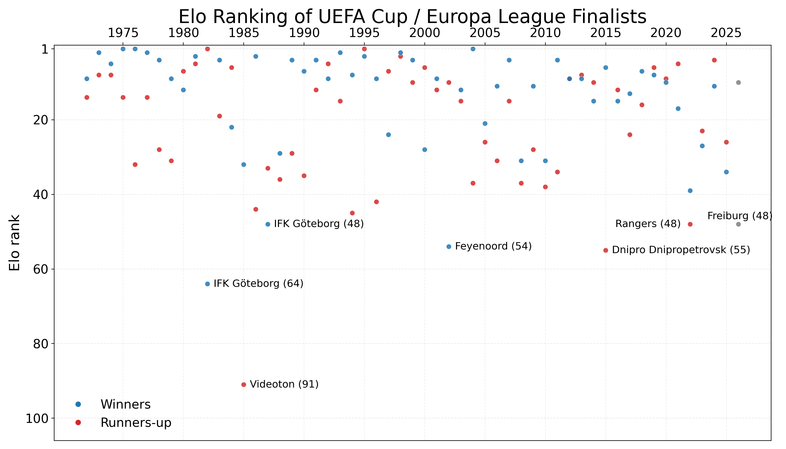
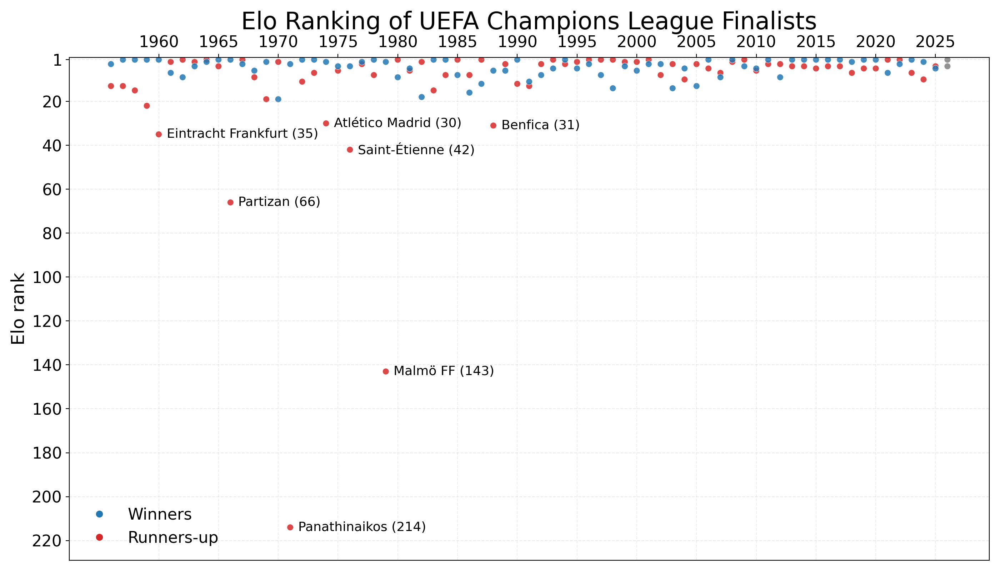
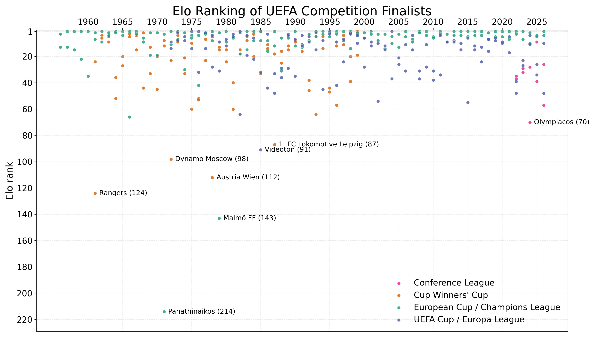

::: {.centered-block}

<em>1971 European Cup Final Ajax - Panathinaikos. Nationaal Archief / Anefo, via Wikimedia Commons (CC BY-SA 3.0 NL).</em>
:::

On Wednesday night, **Aston Villa** face **Freiburg** in the 2026 Europa League final. This follows last year's final where Tottenham (17th in the Premier League) beat Manchester United (16th), prompting many to ask whether the Europa League has been weakened since the revised format.

Below is a plot comparing the [Club Elo](https://clubelo.com) ranking for the finalists of every UEFA Cup and Europa League iteration, with Freiburg currently ranked 48th in Europe. How far back do you have to go to find another finalist ranked as low as 48th? In fact you only have to go back four years to find **Rangers**, who lost on penalties to Eintracht Frankfurt in 2022.

::: {.centered-block}

:::

The Rangers-Frankfurt final followed a relatively strong decade of Europa League finals from 2012-2021 where 90% of teams were ranked in the top 20 of the Elo ratings. A notable exception was **Dnipro Dnipetrovsk** (55th) in 2015 who scraped through the group stage despite losing 3 of 6 games, then surprisingly reached the final before losing 3-2 to **Unai Emery**'s Sevilla. Incidentally, this was also the first season where the winners were rewarded with a place in the following season's Champions League.

From 1999 to 2024, the strength of the UEFA Cup (rebranded as the Europa League in 2009) was boosted by the addition of teams that finished 3rd in the group stages of the Champions League. Across these 25 seasons, 19 Europa League finalists had dropped down into the competition via this method, with 9 of them lifting the trophy.

Prior to 1997 the European Cup was literally just for the champions of each country, plus the previous year's holders. This left room for many elite teams to be playing in the UEFA Cup, and it was not unusual for the team ranked #1 in Europe to be playing in the UEFA Cup final rather than the European Cup final. The thin divide between the two competitions is well illustrated by **Borussia Monchengladbach** (1975) and **Liverpool** (1976) who both won the UEFA Cup as the #1-ranked team in Europe, before playing against one another in the 1977 European Cup final, which Liverpool won 3-1.

One occasion when the top-ranked side did not win the UEFA Cup final was in 1982 when **Sven-Goran Eriksson**'s IFK Gothenburg side (ranked 64th) caused a big upset over that season's Bundesliga champions Hamburg. Meanwhile, the lowest ever ranked team to make a UEFA Cup final were Hungary's Videoton (91st) who lost to Real Madrid in the 1985 final, having knocked out Manchester United along the way.

Since the expansion of the Champions League in 1997 to include non-champions from the strongest domestic leagues, it has become far less likely that the #1 ranked team in Europe could make the final of the Europa League. In fact, the only time this has happened was in 2004 when Valencia romped to the La Liga title under Rafael Benitez before beating Marseille 2-0 in the UEFA Cup final. Since then, no finalists have ranked higher than 4th in the Elo ratings.

When we look at the same plot for Champions League finalists, the difference between the European Cup era and the Champions League era is stark. When it was a straight knockout featuring only the champions of each country, there was a chance that rank outsiders such as Panathinaikos, Malmo or Partizan Belgrade could get to a final. But there currently haven't been any teams from outside the top 10 to reach the final since Liverpool in 2005.

::: {.centered-block}

:::

That's partly a self-fulfilling prophecy, of course, because the strength and format of the modern competition dictates that any team reaching the final will have picked up a lot of Elo points by virtue of their results along the way! Nonetheless, it is hard to argue against the fact that Europe's showpiece final is now more likely to feature two of its best teams.

For more context, we can plot all the UEFA finals on one chart, including the newly-introduced Conference League and the defunct Cup Winners' Cup.

::: {.centered-block}

:::

**Panathinaikos** are rated as the weakest team ever to play in a UEFA final, ranked a lowly 214th in 1971. At the time, Greece really had no European pedigree—prior to that season, Greek teams had got past the first round only once in 12 attempts in the European Cup, and only twice in the Cup Winners' Cup where Olympiacos had lost in the second round to West Ham and Dunfermline. Panathinaikos reached the final thanks to away-goals victories over Everton and Red Star, before losing 2-0 to Ajax at Wembley. 

Since the introduction of the **Conference League** in 2021-22 it would appear that the quality of Europa League finals declined—even when third-placed teams were still dropping down from the Champions League. This suggests UEFA may have turned one stronger competition into two weaker ones, but it is still a small sample.

So to revisit the original question: have Europa League finals become weaker? Possibly a little bit compared to very recent history, but I think we also tend to forget some of the less glamorous finals from the past. Rangers v Eintracht Frankfurt and Sevila v Dnipro were two examples but there was also Atletico Madrid v Fulham (2010) and Rangers v Zenit St. Petersburg (2008), while Feyenoord (ranked 54th) upset Borussia Dortmund in 2002. 

It's important to add that I have only looked at the finalists here. When Eintracht Frankfurt reached the Europa League final, for example, they had knocked out Barcelona along the way. In contrast, this year Aston Villa have played Lille, Bologna and Nottingham Forest—and that was the difficult half of the draw! 

I plan to develop this analysis further in a future article where I will take a more mathematical approach and compare the probabilities of winning the whole competition. An important aspect of this is the difficulty of getting into the competition in the first place! Strong clubs in weak leagues, such as Celtic and Rangers, have benefitted from being in Europe basically every season. On the other hand, the champions of England or Germany had a great chance of winning the old European Cup once they were in it, but it was very hard to win the league in the first place. 

There will always be the debate between the old European Cup and the modern Champions League. It's impossible to say that one is objectively harder than the other—there is only one champion each season, after all—but the probabilities will shift based on which perspective you are considering. And when it comes to football, it's funny how supporters' views will often align with the one that puts their own team in a good light.



© 2026 John Knight. All rights reserved.