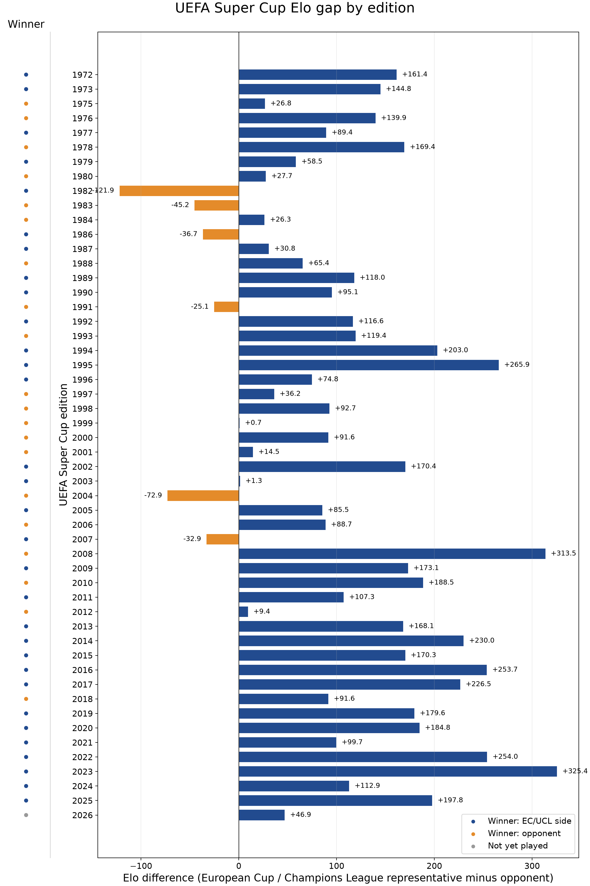
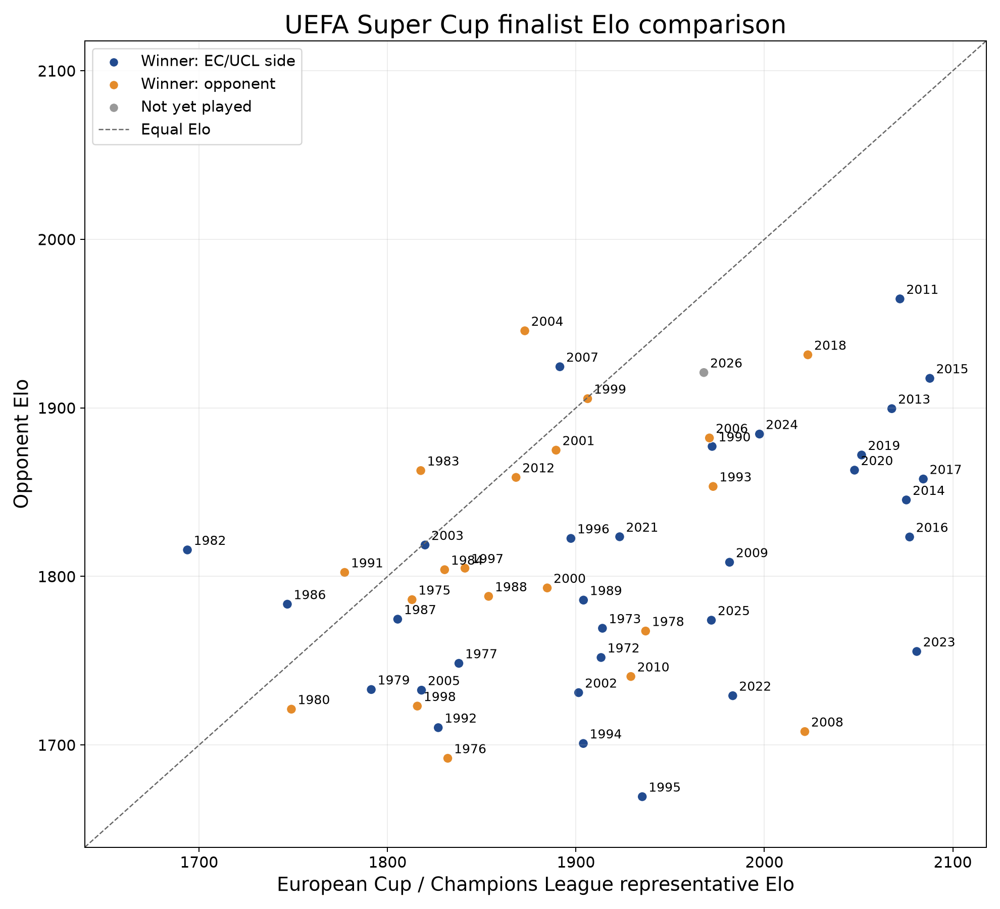

The new Premier League season is still a couple of weeks away but on Wednesday night we have an hors d'oeuvre as **Paris Saint-Germain** take on **Aston Villa** in the **UEFA Super Cup** at the Red Bull Arena in Salzburg.

Does anyone care about the Super Cup? It's obviously nice to be in it by virtue of having won a European competition, and it's similar to the Community Shield: if you win then it's important, if you lose it's just a glorified friendly; and if you are absolutely desperate to win an argument about trophy counts then you will chuck it in as a proper trophy.

Originally the Super Cup was between the winners of the **European Cup** and the **European Cup Winners' Cup**, prior to the demise of the latter when it was replaced by the winners of the **UEFA Cup**. Until 1998 the Super Cup was contested over two legs, although due to scheduling difficulties it was occasionally played over a single leg (1984, 1986, 1991) and sometimes not at all (1974, 1981, 1985).

The below chart shows for each iteration of the Super Cup the difference in [Elo rating ](https://clubelo.com) between the European Cup/Champions League winners and their opponents (the winners of the Cup Winners' Cup/UEFA Cup/Europa League).

::: {.centered-block}

:::

It is clear from this chart that the Super Cup has become more one-sided over time. The last time the Champions League winner was the underdog according to Elo ratings was in **2007** when European champions **AC Milan** played **Sevilla**. It may seem strange that the Milan side of this era were rated lower than Sevilla, but Milan had only finished 4th in Serie A which was without Juventus who had been relegated due to the [Calciopoli](https://en.wikipedia.org/wiki/Calciopoli) scandal. Sevilla, meanwhile, had finished third behind Real Madrid and Barcelona, and only five points off the La Liga title.

Although PSG are considered strong favourites over Aston Villa, according to Elo this is actually the closest matchup in a Super Cup since **2012** when fortuitous Champions League winners **Chelsea** were thumped 4-1 by **Atletico Madrid**.

Ironically, the year that the European champions were the biggest-ever underdogs was **1982** when it was **Aston Villa** themselves who were rated 121.9 points worse than **Barcelona** — nonetheless, Villa prevailed in extra time after a 1-1 aggregate score over two legs.

Of course, the difference between the two Super Cup teams only tells part of the story. The following scatterplot compares the ratings of the teams in each iteration so we can see the strongest and weakest sides down the years.

::: {.centered-block}

:::

As you can see, the Aston Villa side of 1982 are the lowest-rated European champions to play in the Super Cup. Villa had only finished 10th in the previous season's English Division One, still a record low position for any European champions. The lowest combined rating was in **1980** when **Nottingham Forest**, 5th in Division One, faced Copa Del Rey winners **Valencia** who had finished 6th in La Liga.

The nine strongest European champions according to Elo ratings are all since 2011, demonstrating the increased concentration of resources among a small number of elite clubs. The **2011** clash between **Barcelona** and **Porto** is rated as the strongest-ever Super Cup in terms of the combined Elo rating, while the worst-ever Elo rating for a Super Cup team was 1995's **Real Zaragoza** who famously won the Cup Winners' Cup against **Arsenal** with a last-minute goal from near the half-way line scored by former Spurs midfielder Nayim.

Only two English teams have won the Super Cup more than once (**Liverpool** four times; **Chelsea** twice) and Villa will be looking to join that company this week. Unai Emery's prowess in European competition is well-documented, with an astonishing five Europa League triumphs. Unfortunately he is so far winless in three attempts at the Super Cup but after a gruelling World Cup and still another 10 days until the season starts, it would be no great surprise if this game is a bigger priority for Villa than for PSG and Emery finally gets off the mark in this competition.



© 2026 John Knight. All rights reserved.
