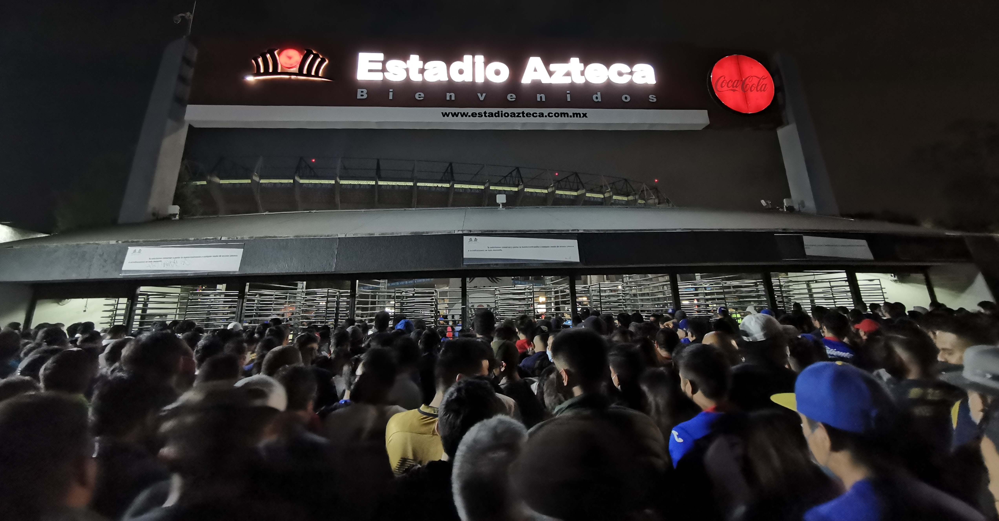

::: {.centered-block}

<em>Puerta 30 del Estadio Azteca. Source: ProtoplasmaKid, via Wikimedia Commons, licensed under CC BY-SA 4.0.</em>
:::

This is the third in a series of articles looking at home advantage in the World Cup. In [part one](https://substack.com/home/post/p-193417159) I looked at the huge migration of players to Europe from the 1980s onward. Having been at least 87% in every World Cup from 1930 to 1978, the overall proportion of home-based players hit a low of just **21.8%** in 2018.

In the [second part](https://substack.com/home/post/p-194979658) I looked at home advantage in international football across various competitions including the World Cup. I found that the three largest home advantages are enjoyed by teams who play at high altitude (Bolivia, Ecuador and Mexico) while UEFA teams seem to benefit the least from home advantage. I also found that there is a possible "continental home advantage" for teams playing a World Cup hosted by their own confederation.

Today, I want to drill down on that advantage and see if I can identify which factors are most important. Is it travel distance? Climate? Time zones? And which teams might benefit the most in 2026?

*Without looking at the existing analysis, think how YOU would analyse each of the below factors (descriptive and inferential).*

*Descriptive: travel distance. Show distance bin bar chart..*

*Descriptive: time zones. Show time zone bin chart. Claude says monotonic but is it?*

*Descriptive: climate. Climate buckets.*

*Inferential analysis. May need to review techniques used. Regression coefficient plot.*

*Compare by competition.*

*Show examples from previous World Cups of most significant feature (timezone?) plotted versus performance.*

*How will this apply to 2026? Show effect on each team based on models. Beware of closed roofs! Roofs are at Atlanta, Dallas, Houston, Vancouver.*

*Temperature of other venues (high in F June):*

*Mexico City 77*
*East Rutherford 81*
*Kansas City 85*
*Santa Clara 78*
*Los Angeles 72*
*Philadelphia 82*
*Seattle 72*
*Boston 76*
*Miami 88*
*Monterrey 93*
*Guadalajara 84*
*Toronto 72*

*Show England path. Mexico City and Miami 5 p.m. quarter final!*



© 2026 John Knight. All rights reserved.