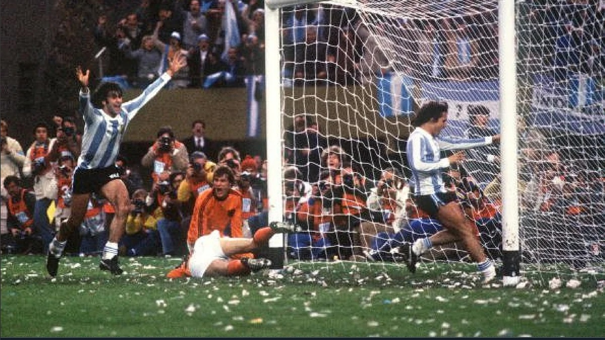
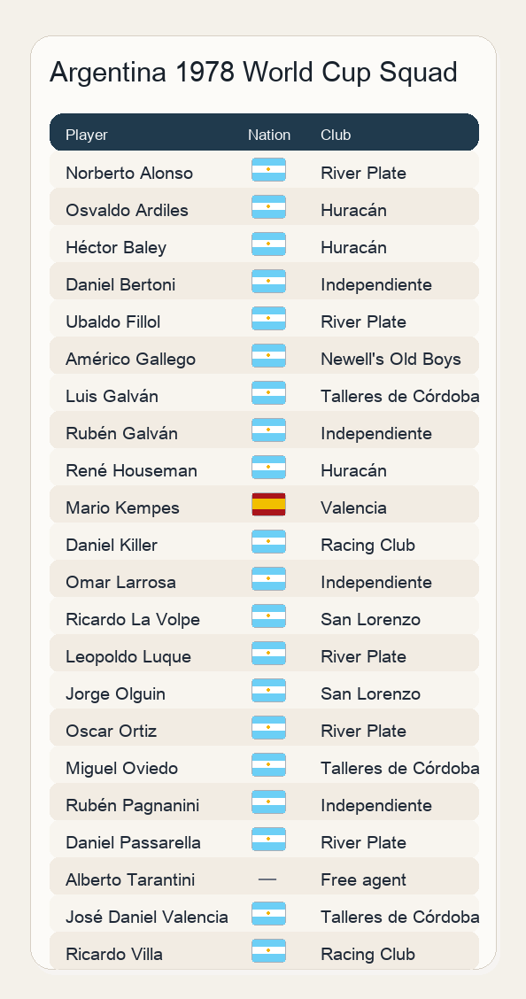
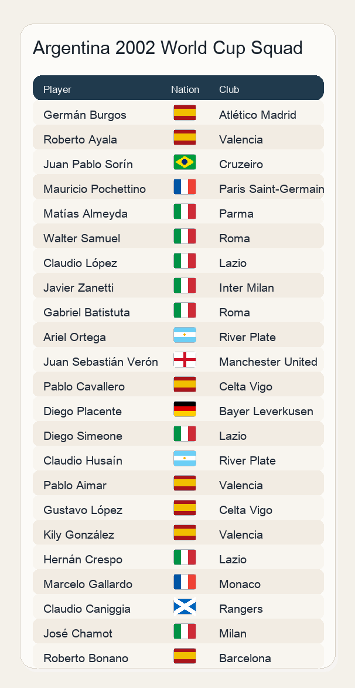
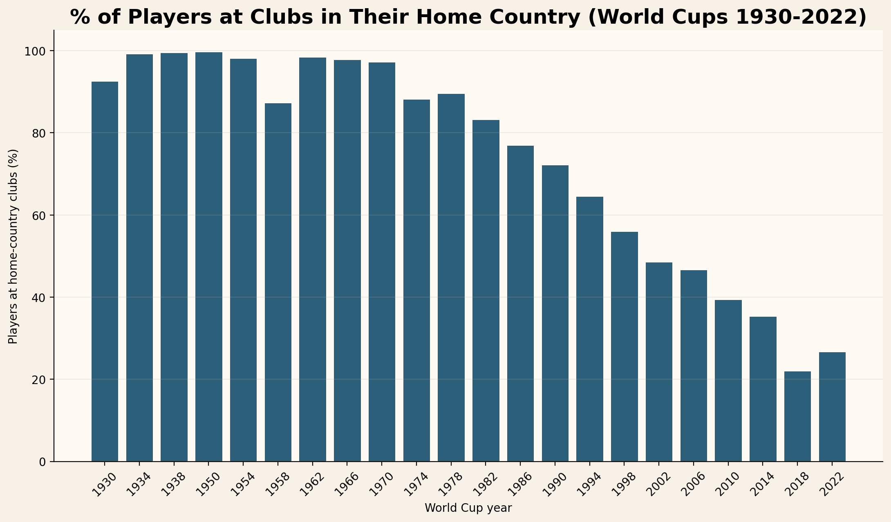
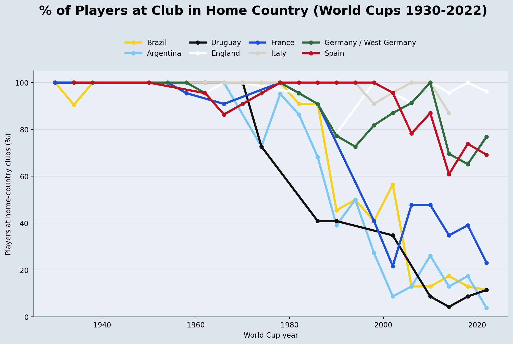
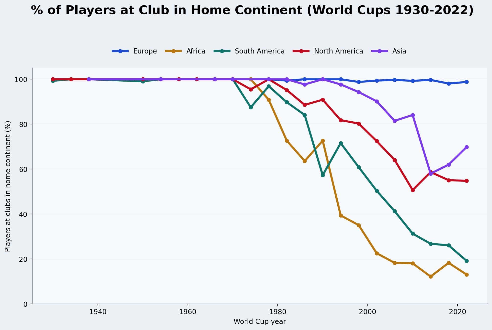
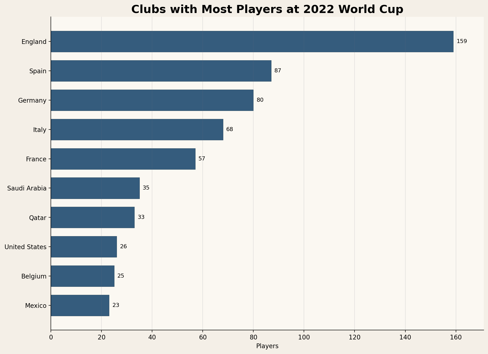

::: {.centered-block}

:::

To many people, the **1978** World Cup is among the most iconic in the history of the competition. It was the first ever win for Argentina, in front of their home fans amid a murky political backdrop and a huge amount of ticker tape. One aspect of 1978 that is almost unthinkable in today's game is that the Argentinian squad **all played for Argentinean clubs** with the exception of star striker Mario Kempes who played for Valencia in Spain.

::: {.centered-block .max-70}

:::

This was largely how football had always been. Other than the occasional superstar like John Charles, Ferenc Puskas or Jimmy Greaves, players stayed in their own country. When Tottenham Hotspur signed Osvaldo Ardiles and Ricardo Villa shortly after their 1978 triumph it was a [stunning transfer](https://www.mirror.co.uk/sport/football/news/ossie-ardiles-joining-tottenham-ricky-13218137),
but this was the beginning of a trend. The mass migration over the next few decades can be illustrated by the fact that the **2002** Argentina squad contained only **two home-based players**.

::: {.centered-block}

:::

And it wasn't just Argentinian players on the move. The overall percentage of home-based players was at least **87%** in every World Cup from 1930 to 1978. Then it started dropping consistently, hitting a low of just **21.8%** in 2018.

::: {.centered-block}

:::

The movement of players was pretty much in one direction: towards Europe. The below chart shows the home player percentage for each of the eight nations who have won a World Cup. The three South American teams - Argentina, Brazil, and Uruguay - had a total of just *seven* home-based players *combined* at the last World Cup. Aside from France, the major European nations have all retained at least 60% of their squad playing at home in every edition.

::: {.centered-block}

:::

## Why did this happen? Money, laws and television

So why the abrupt change? For a long time, there were several barriers to player migration and no massive incentive for them to relocate. Today a move to Europe is generally seen as a step up in a footballer's career, but that wasn't always the case. When South American clubs could retain their native players they had formidable teams and could more than hold their own against Europe's best in the Intercontinental Cup. Not to mention, Latin American teams drew huge crowds and with gate receipts the primary driver of club revenue, the wages on offer were not drastically higher in Europe.

From the clubs' perspectives, signing players from another continent was difficult. Travel costs and the lack of global media coverage made scouting a challenge, and language barriers and the lack of established international links made it hard to negotiate deals. And even if a team could somehow navigate all these barriers to sign a player from overseas, European leagues placed strict limits on foreign players.

Several factors precipitated the mass migration of players to Europe starting in the late 1970s and 1980s. In February 1978, the European Community (EC) ruled that the football associations of its member states [could no longer deny access to players based on nationality](https://www.fourfourtwo.com/features/ossie-ardiles-ricky-villa-tottenham-british-footballs-first-foreign-footballers). Economic and political crises saw rampant inflation in South America while TV coverage and commercialization in Europe led to higher wages on offer for players willing to make the move. 

In the 1990s, European commercialization accelerated with the rise of satellite TV and the rebranding of competitions such as England's Division One as the Premier League and the European Cup as the Champions League. Furthermore, the landmark **Bosman** ruling in 1995 allowed free movement of EU citizens which meant clubs could sign unlimited EU nationals, while non-EU players were still limited. This created a loophole for Spanish, Italian and Portuguese clubs who could secure EU passports for Latin American players such as Juan Sebastian Veron via their European ancestry. Pipelines and scouting networks were established allowing clubs such as Benfica, Porto and Real Madrid to recruit some of the world's best young talent.

There was a snowball effect as Europe now had almost all the best players in the world and had become the "NBA of football"—without question it was where footballers moved to maximise their potential.

It wasn't just South American players who moved to Europe, of course. The below chart compares the percentage of players from each **continent** who played for clubs in their home continent at each World Cup. European players have rarely left Europe, but all the other continents saw players relocate from the 1980s onwards.

::: {.centered-block}

:::

While the number of South American and African players staying at home has dropped below 20%, the proportion for Asian and North American players has remained higher. Broadly speaking, this reflects a talent-to-wealth ratio as nations such as Japan, South Korea, United States and Mexico produce fewer superstars than the South American giants, and they are able to offer competitive enough salaries to retain their more modestly-talented players. Meanwhile, oil-rich Qatar and Saudi Arabia are extreme examples of nations with a lot of money and little talent—they both selected entirely home-based squads at the most recent World Cup.

Finally, English football's current financial dominance is reflected by the fact they had almost double the number of players at the 2022 World Cup compared to the next country Spain: 

::: {.centered-block}

:::

## The future: will the trend continue? 

The increased global interest in football along with rising economies in Asia have ironically led to more money pouring into Europe as international fans tune into the Premier League and Champions League. But will there be a tipping point? Interest in "soccer" has skyrocketed in the wealthy United States, and Major League Soccer's recruitment of late-career superstars such as **Lionel Messi** and Son Heung-Min mirrors the Premier League signings of the 1990s such as Ruud Gullit, Jurgen Klinsmann and Gianfranco Zola. Over time, this grew to the point where England could attract the best players in their prime, and it feels likely that the US will continue on the same path. It is also notable that Brazilian club Flamengo have been flirting with the top 30 of recent Deloitte Football Money League rankings, which still leaves them some way behind the Premier League clubs but it is questionable whether the other European leagues will continue to be able to outmuscle the South American clubs.

I am also interested to see whether the globalisation of football has affected the home advantage factor at World Cups through the years. Despite all the best players moving to Europe, the World Cups on European soil have still been dominated by the home continent with only 2 non-UEFA teams out of the 20 semi-finalists on European soil since 1982. Tournaments held on other countinents have been more balanced, so it does feel like home continent advantage is a thing, but why? Is it travel? Climate? The number of each team's fans in attendance? This is something I will look into as I continue my analysis in the build up to the tournament.



© 2026 John Knight. All rights reserved.